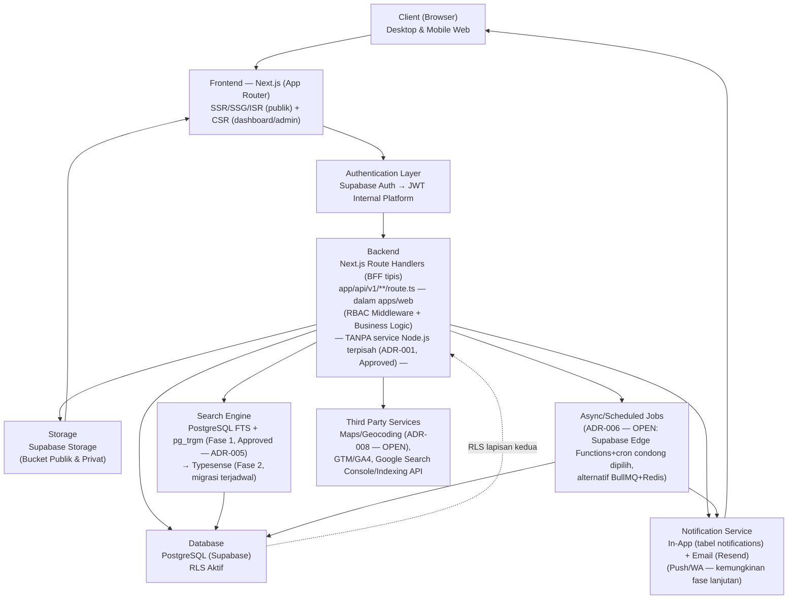
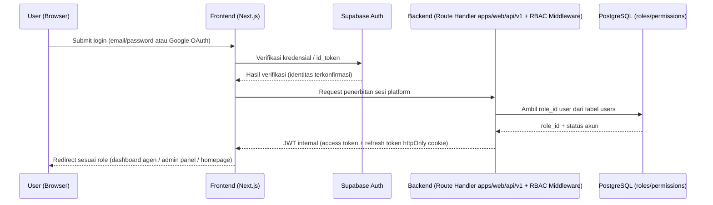
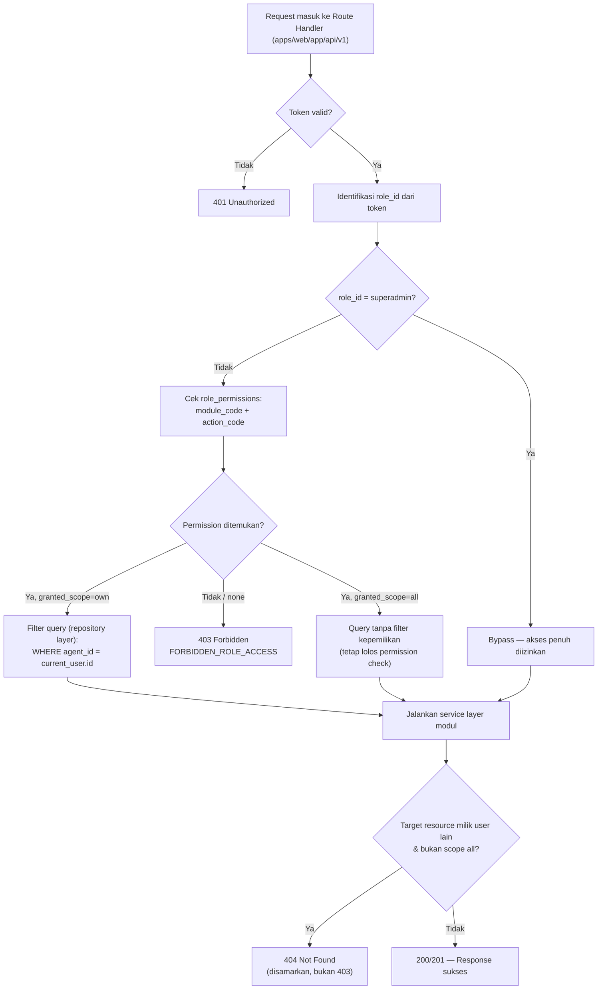
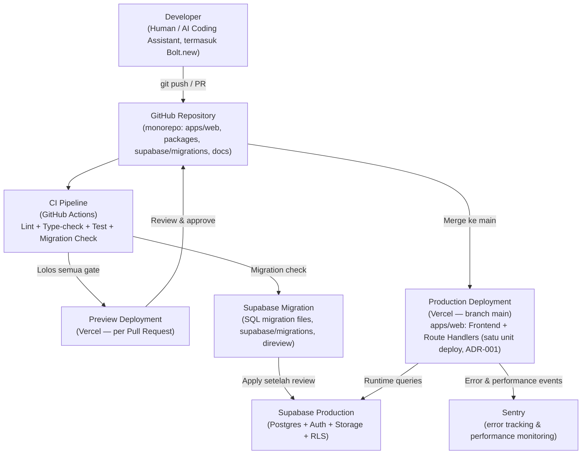

# SYSTEM ARCHITECTURE
## Platform Web Real Estate Agency

**Versi:** 1.2
**Tanggal:** 28 Juli 2026 — direvisi (v1.1 → v1.2) untuk menyinkronkan seluruh isi dokumen dengan `architecture-decision-records.md` (ADR, versi Approved ADR-001 & ADR-005) dan `technology-decisions.md` v1.2
**Disusun oleh:** Principal Software Architect / Enterprise Solution Architect / Senior Full Stack Engineer / Technical Lead / Cloud Architect
**Status:** Referensi teknis utama — mengikat seluruh proses development, baik oleh AI Coding Assistant (Bolt.new, Claude, ChatGPT, Cursor, GitHub Copilot) maupun developer manusia. **Approved, sinkron penuh dengan ADR** — belum berstatus Baseline formal (menunggu pengesahan nama individu Reviewer/Approver, lihat `document-governance-baseline-register.md` §9–10).
**Dokumen sumber:** `PROJECT-CONSTITUTION.md`, `architecture-decision-records.md` (ADR — sumber kebenaran keputusan arsitektur), `technology-decisions.md` v1.2, `PRD-Real-Estate-Agency-Platform-v1.1.md`, `ERD-Skema-Database-Real-Estate-Agency-v1.1.md`, `ERD-Diagram-v1.1.mermaid`, `API-Specification-Real-Estate-Agency-Platform-v1.1.md`, `User-Flow-Real-Estate-Agency-Platform-v1.1.md`, `SEO-Analytics-Specification-Real-Estate-Agency-Platform-v1.1.md`, `AI-DEVELOPMENT-BLUEPRINT.md`, `AI-CONTEXT-PACK.md`, `dependency-manifest.md`.

> **Catatan hierarki dokumen (diperbarui v1.2).** Untuk **keputusan arsitektur/teknis** yang sudah tercatat sebagai ADR, urutan kemenangan yang berlaku terhadap isi dokumen ini adalah:
> ```
> architecture-decision-records.md (ADR berstatus Approved)
>    ↓
> technology-decisions.md (v1.2)
>    ↓
> SYSTEM-ARCHITECTURE.md (dokumen ini)
> ```
> Setiap kali ADR berstatus **Approved** ada, dokumen ini **wajib** mencerminkannya secara final — tidak ada lagi opsi bercabang untuk topik yang sudah Approved. Untuk ADR berstatus **OPEN**, dokumen ini **wajib** menyatakan status "belum final" secara eksplisit, bukan memilih salah satu opsi sepihak. Untuk **keputusan bisnis/non-teknis** dan governance dokumen secara umum, `PROJECT-CONSTITUTION.md` tetap otoritas tertinggi sesuai `document-governance-baseline-register.md` §7 & §13 — jika ditemukan ketidaksesuaian dengan Constitution, Constitution yang berlaku dan dicatat sebagai temuan governance, bukan diselesaikan sepihak di dokumen ini.

---

# TUJUAN DOKUMEN

- Menjelaskan arsitektur sistem secara lengkap, dari client hingga infrastruktur.
- Menjadi referensi teknis tunggal bagi seluruh tim (manusia maupun AI Coding Assistant).
- Mengurangi risiko perubahan arsitektur di tengah development dengan mengunci keputusan mahal sejak awal.
- Menjadi acuan implementasi seluruh modul, pola kode, dan standar teknis proyek.
- **(Baru di v1.1)** Menghilangkan seluruh percabangan opsi arsitektur yang sudah diselesaikan via ADR, agar tidak ada dua asumsi arsitektur berbeda yang beredar di sesi AI Coding Assistant mana pun.
- **(Baru di v1.2)** Mengunci strategi Search Engine (ADR-005, Approved) — menghilangkan status "belum ditentukan" pada mesin pencari `/properties/search` & `/properties/autocomplete`, menyisakan 3 dari 25 ADR yang masih OPEN.

---

## Daftar Isi

1. Executive Summary
2. Architecture Principles
3. High Level Architecture
4. Technology Stack
5. Module Architecture
6. Folder Structure Recommendation
7. Database Architecture
8. Authentication & Authorization Architecture
9. API Architecture
10. Frontend Architecture
11. Backend Architecture
12. File Storage Architecture
13. Notification Architecture
14. Security Architecture
15. Performance Strategy
16. Scalability Strategy
17. Error Handling Strategy
18. Deployment Architecture
19. Development Standards
20. Future Architecture
21. Risks
22. AI Development Notes
23. Open Questions & Assumptions
24. ADR Cross-Reference Matrix *(baru di v1.1)*

---

# 1. EXECUTIVE SUMMARY

### Ringkasan Sistem
Platform Web Real Estate Agency adalah sistem **PropTech SaaS bermodel B2B2C** yang mendigitalisasi operasional agensi properti Indonesia — mulai dari onboarding & administrasi agen, manajemen listing properti, edukasi agen (Learning Center), kolaborasi dengan developer properti, hingga alat bantu pre-screening kelayakan KPR (DBR Scoring). Sistem dipakai secara internal oleh tim agensi & agennya, sekaligus dikonsumsi publik oleh calon pembeli/penyewa properti.

### Tujuan Aplikasi
1. Mendigitalkan rekrutmen & administrasi agen properti secara mandiri (self-service).
2. Menyediakan sarana pengelolaan profil profesional dan listing properti per-agen.
3. Meningkatkan kapabilitas jual agen lewat Learning Center gratis.
4. Memfasilitasi kolaborasi bisnis agen–developer melalui katalog proyek.
5. Membantu agen melakukan kualifikasi awal kelayakan KPR calon pembeli.
6. Memastikan seluruh halaman publik terindeks mesin pencari secepat & seakurat mungkin sejak hari pertama rilis.

### Target Pengguna
- **Internal:** Superadmin, Manager, Admin, Instructor, Agen.
- **Eksternal:** Developer Partner (login opsional), Buyer (akun ringan opsional).
- **Publik tanpa akun:** Guest/Lead (calon pembeli/penyewa).

> **Catatan role (ADR-024, Approved):** Jumlah role **dengan akun** adalah **7** (superadmin, manager, admin, instructor, agent, developer_partner, buyer), ditambah Guest yang tidak memiliki baris `roles`. Angka "8" yang pernah muncul di beberapa dokumen turunan (`DEVELOPMENT-ROADMAP.md`, `CHANGELOG.md`, `CURRENT-PROJECT-STATE.md`, `decision-log.md`) adalah gap penghitungan lintas dokumen, bukan ambiguitas pada model role itu sendiri — lihat `architecture-decision-records.md` ADR-024 Notes dan Governance Notes poin 2.

### Ruang Lingkup Sistem
Sistem mencakup **11 modul fungsional**: Authentication, Profil Agen, Listing, Learning Center, Kalender Event, Direktori Developer, DBR Scoring, Dashboard & Notifikasi, Admin Panel/CMS, RBAC, serta SEO & Analytics. Sistem **tidak** mencakup pemrosesan transaksi jual-beli properti (bukan payment gateway untuk closing) — nilai jual utama adalah *lead generation* (CTA WhatsApp) dan *tooling* operasional agen. Model monetisasi platform belum final (lihat Bagian 23).

Pengembangan dibagi dalam **4 fase**: Fase 1 (fondasi — Auth, Profil, Listing dasar, Admin dasar, RBAC dasar, fondasi SEO), Fase 2 (Developer, DBR), Fase 3 (Learning Center, Event), Fase 4 (dashboard analitik lanjutan, gamifikasi, integrasi SLIK/BI Checking, payment/komisi otomatis).

### Ringkasan Status Keputusan Arsitektur (v1.2)
Sejak sesi Architecture Review Board 27–28 Juli 2026, **backend/API** proyek terkunci final (ADR-001, Approved): **Next.js Route Handlers sebagai BFF tipis, terintegrasi langsung dengan Supabase, tanpa service backend Node.js terpisah.** Menyusul itu, **strategi Search Engine** juga terkunci final (ADR-005, Approved): **PostgreSQL Full-Text Search + pg_trgm untuk Fase 1 (MVP), migrasi terjadwal ke Typesense di Fase 2** berdasarkan kriteria ambang eksplisit (volume listing, latensi p95, keluhan relevansi). Ini menghilangkan seluruh percabangan arsitektur backend dan search yang sebelumnya tercatat di versi dokumen ini (v1.0/v1.1). **22 dari 25 ADR** kini berstatus **Approved**; **3 ADR masih OPEN** (ADR-006 Job Queue Strategy, ADR-008 Maps Provider, ADR-018 Caching Strategy) — lihat Bagian 23 dan Bagian 24 untuk detail lengkap.

---

# 2. ARCHITECTURE PRINCIPLES

| Prinsip | Penerapan di Proyek Ini |
|---|---|
| **API First** | Kontrak API (`API-Specification.md`) didefinisikan lebih dulu sebagai sumber kebenaran — frontend & backend (Route Handlers) dikembangkan terhadap kontrak yang sama. |
| **Modular Architecture** | 11 modul fungsional dengan batas tanggung jawab jelas dan dependency eksplisit (lihat Bagian 5), memungkinkan pengembangan bertahap per fase tanpa merombak modul lain — seluruhnya berada dalam satu aplikasi `apps/web` (ADR-001). |
| **Separation of Concerns** | UI (komponen React) terpisah dari business logic (`lib/services/`) terpisah dari data access (repository layer) terpisah dari skema data (ERD) — dijaga melalui disiplin folder, bukan melalui pemisahan proses/deployment (ADR-001). |
| **Single Source of Truth** | Satu definisi tipe data (`packages/shared-types`), satu skema validasi Zod (ADR-025), satu dokumen ERD/API Spec sebagai rujukan tunggal. |
| **Ownership as Hard Boundary** | `agent_id` adalah batas kepemilikan data yang ditegakkan di kode (repository layer), tidak bisa dilewati oleh konfigurasi permission apa pun (ADR-003). |
| **Security First** | RBAC berlapis (middleware + RLS, ADR-003), enkripsi data sensitif at-rest, tidak ada trust terhadap input client (ADR-017) — diterapkan sejak desain awal. |
| **SEO First** | Strategi rendering SSR/SSG/ISR (ADR-021), struktur URL/slug, dan structured data diselesaikan di Fase 1. |
| **Performance First** | Target Core Web Vitals (LCP < 2.5s, CLS < 0.1, INP < 200ms, TTFB < 600ms) menjadi syarat desain. |
| **Reusable Components** | Komponen UI dasar (`components/ui/`, shadcn/ui — ADR-021/technology-decisions §4.3) dan pola service/repository backend dipakai ulang lintas modul. |
| **Configuration over Hard-code** | Parameter bisnis yang bisa berubah (threshold DBR, masa expired listing, passing grade) selalu configurable via Admin Panel (`system_configs`/`dbr_config`). |
| **Scalability** | Arsitektur mendukung pertumbuhan horizontal pada layer stateless (frontend + Route Handlers dalam satu aplikasi, ADR-001) dan pertumbuhan data terkelola pada database. |
| **Maintainability** | Konvensi penamaan konsisten FE↔BE↔DB (ADR-022), dokumentasi selalu sinkron dengan implementasi, komentar wajib pada hard rule keamanan/RBAC. |
| **Clean Code** | TypeScript `strict: true` tanpa `any` implisit (ADR-025), lint/format seragam sebagai CI gate, tidak ada duplikasi logic. |
| **Mobile First & PWA-Aware** | Agen bekerja di lapangan — form listing, kalkulator DBR, dan dashboard dirancang nyaman dipakai di layar kecil/koneksi tidak stabil. |
| **Graceful Degradation** | CTA WhatsApp adalah jalur komunikasi utama Buyer↔Agen di MVP; sistem tidak berasumsi kanal komunikasi lain (chat in-app) sudah tersedia. |
| **Serverless-Aware Design** *(baru v1.1)* | Karena backend terkunci ke Route Handlers di atas Vercel (ADR-001), seluruh business logic wajib dirancang agar selesai dalam batas eksekusi fungsi serverless (~10–60 detik tergantung paket) — proses berat/panjang wajib diarahkan ke job asinkron (ADR-006), tidak dipaksakan ke Route Handler. |

---

# 3. HIGH LEVEL ARCHITECTURE

### Component Diagram



**Penjelasan alur:**
1. **Client** mengakses via browser (desktop/mobile) — tidak ada aplikasi mobile native di scope saat ini (lihat Bagian 20).
2. **Frontend (Next.js App Router, ADR-021)** merender halaman sesuai tipe: SSR/SSG/ISR untuk halaman publik (SEO-kritis), CSR untuk dashboard/admin (privat, `noindex`).
3. **Authentication Layer (ADR-002)** memverifikasi identitas via Supabase Auth, hasil akhir berupa JWT internal platform — seluruh layer di bawahnya tidak perlu tahu metode login (password/OTP/Google).
4. **Backend (ADR-001, Approved)** adalah **Route Handlers** di dalam aplikasi `apps/web` yang sama dengan frontend — **bukan** proses/deployment terpisah. Menjalankan RBAC middleware (ADR-003) sebelum menjalankan business logic modul terkait.
5. **Database (PostgreSQL via Supabase, ADR-004)** dengan RLS aktif sebagai lapisan pertahanan kedua.
6. **Storage (Supabase Storage, ADR-009)** terpisah bucket publik (foto listing) vs privat (dokumen legalitas), diakses lewat CDN atau signed URL.
7. **Notification Service (ADR-020)** mengirim notifikasi personal per user berdasarkan event bisnis (approval, expiry, sertifikat, lead baru) — channel in-app selalu aktif, email via Resend (ADR-007).
8. **Async/Scheduled Jobs** menangani proses yang tidak boleh berjalan sinkron di Route Handler (regenerasi sitemap, reminder, sinkronisasi counter) — mekanisme konkretnya masih **ADR-006 (OPEN)**, namun arahnya condong ke Supabase Edge Functions + cron mengingat ADR-001 sudah terkunci ke Supabase.
9. **Search Engine (ADR-005, Approved)** dijalankan sepenuhnya di dalam Postgres (kolom generated `search_vector` + index GIN, ekstensi `pg_trgm`) untuk Fase 1 — dipanggil langsung dari Route Handlers tanpa komponen infrastruktur tambahan; migrasi ke Typesense terjadwal di Fase 2 begitu kriteria ambang tercapai.
10. **Third Party Services** dipanggil dari Route Handlers (server-side, menggunakan server-key rahasia) untuk Maps/Geocoding (**ADR-008, OPEN**), Analytics, dan Search Console/Indexing API.

---

# 4. TECHNOLOGY STACK

> Stack berikut diambil dari `technology-decisions.md` v1.1 Bagian 3 (Official Technology Stack), yang pada gilirannya menaungi setiap barisnya ke satu ADR di `architecture-decision-records.md`. Kolom **ADR** menandai status kepastian arsitektural setiap baris — **tidak ada lagi baris "pilih salah satu"**; baris yang statusnya masih terbuka ditandai eksplisit **OPEN**, bukan disamarkan sebagai opsi ganda.

| Layer | Technology | ADR | Status |
|---|---|---|---|
| Frontend | Next.js (App Router) | ADR-021 | **Approved** |
| UI Framework / Library | React (via Next.js) | ADR-021 | **Approved** |
| Language | TypeScript (`strict: true`) | ADR-025 | **Approved** |
| CSS Framework | Tailwind CSS | ADR-021 (technology-decisions §4.4) | **Approved** |
| Component Library | shadcn/ui | ADR-021 (technology-decisions §4.3) | **Approved** |
| Icons | Lucide React | technology-decisions §3 | **Approved** |
| Server State | TanStack Query (khusus route group CSR) | ADR-011 | **Approved** — SWR **dilarang eksplisit** |
| UI State | Zustand (satu store per domain) | ADR-011 | **Approved** — Redux/Redux Toolkit **dilarang eksplisit** |
| Forms | React Hook Form | ADR-025 (technology-decisions §4.19) | **Approved** — Formik **dilarang eksplisit** |
| Validation | Zod (`z.infer` untuk tipe otomatis) | ADR-025 | **Approved** |
| Backend/API | **Next.js Route Handlers (BFF tipis)** di dalam `apps/web`, terintegrasi langsung Supabase — **tanpa** service Node.js terpisah | **ADR-001** | **Approved (27 Jul 2026)** |
| Database | PostgreSQL (via Supabase) | ADR-004 | **Approved** |
| Migration/Query Layer | Migration murni SQL bernomor urut (Supabase CLI), repository pattern — bukan ORM auto-sync | ADR-004, ADR-022 | **Approved** |
| Authentication | Supabase Auth (email/password, OTP, Google OAuth2) dibungkus JWT internal platform | ADR-002 | **Approved** |
| Authorization | RBAC kustom aplikasi (`granted_scope`) + Supabase RLS (dua lapis) | ADR-003 | **Approved** |
| Storage | Supabase Storage (bucket publik vs privat terpisah tegas) | ADR-009 | **Approved** |
| Search Engine | **PostgreSQL Full-Text Search + pg_trgm (Fase 1)** → Typesense (Fase 2, migrasi terjadwal berdasarkan kriteria ambang) | **ADR-005** | **Approved (28 Jul 2026)** untuk Fase 1 |
| Cache/Rate Limit (level aplikasi) | **Belum ditentukan** — caching edge/CDN halaman publik sudah tercakup inheren via ADR-021/ADR-010; Redis hanya untuk kebutuhan aplikasi tambahan (rate limit endpoint sensitif) | **ADR-018** | **OPEN** — prioritas rendah, tidak memblokir Sprint S0–S1 |
| Job Queue / Scheduled Job | **Belum ditentukan** — condong ke Supabase Edge Functions + cron pasca ADR-001; alternatif BullMQ (butuh Redis) | **ADR-006** | **OPEN** — wajib diselesaikan sebelum Sprint S6/S13 |
| Maps/Geocoding | **Belum final** — condong Google Maps Platform, menunggu konfirmasi biaya bisnis; Mapbox tetap alternatif valid | **ADR-008** | **OPEN** — wajib diselesaikan sebelum Sprint S4/S9 |
| Transactional Email | Resend + React Email | ADR-007 | **Approved** |
| Monitoring | Sentry (`@sentry/nextjs`) | ADR-015 | **Approved** |
| Logging | Structured logging (JSON), audit log bisnis terpisah | ADR-014 | **Approved** |
| Unit Testing | Vitest | ADR-016 | **Approved** |
| Component Testing | React Testing Library | ADR-016 | **Approved** |
| E2E Testing | Playwright (terhadap `next build && next start`) | ADR-016 | **Approved** |
| Hosting | Vercel | ADR-010 | **Approved** |
| Repository | GitHub | ADR-010 | **Approved** |
| CI/CD | GitHub Actions (lint, type-check, test, migration check) | ADR-010 | **Approved** |
| Image Compression (client) | browser-image-compression | ADR-019 | **Approved** |
| Charts | Recharts | technology-decisions §3 | **Approved** |
| Table | TanStack Table | technology-decisions §3 | **Approved** |
| Drag & Drop | dnd-kit | technology-decisions §3 (react-beautiful-dnd **dilarang**, deprecated) | **Approved** |
| Date Library | date-fns | technology-decisions §3 (Moment.js **dilarang**) | **Approved** |
| PDF | pdf-lib | technology-decisions §3 | **Approved** |

**Toolchain pengembangan (catatan tambahan ADR-001):** **Bolt.new** dikonfirmasi sebagai bagian toolchain resmi pengembangan proyek lintas sesi AI Coding Assistant — direkomendasikan Architecture Review Board untuk dicatat eksplisit di `technology-decisions.md`/`dependency-manifest.md` (tindak lanjut governance, bukan keputusan arsitektur baru).

**Architecture Constraints (technology-decisions.md §6) yang relevan bagi dokumen ini:** dilarang menggunakan Redux, MUI, Ant Design, Formik, SWR, Moment.js, react-beautiful-dnd, CSS-in-JS runtime, Axios, atau **menambahkan backend service Node.js terpisah** — pelanggaran atas larangan terakhir berarti melanggar ADR-001 (Approved) dan hanya sah diubah lewat ADR baru yang secara eksplisit men-supersede-nya.

---

# 5. MODULE ARCHITECTURE

### 5.1 Authentication
- **Purpose:** Mengelola identitas seluruh jenis akun (agent, buyer, internal roles) dan sesi login.
- **Responsibilities:** Registrasi (email/HP + OTP), login password/Google OAuth2, refresh token, logout (single/all device), forgot/reset password, upload dokumen legalitas agen.
- **Dependencies:** RBAC (untuk penerbitan role saat registrasi), Referensi Wilayah (tidak langsung).
- **Main Features:** `POST /auth/register`, `/auth/verify-otp`, `/auth/login`, `/auth/oauth/google`, `/auth/refresh`, `/auth/logout(-all)`, `/auth/forgot-password`, `/auth/reset-password`.
- **ADR terkait:** ADR-002 (Authentication Strategy), ADR-003 (RBAC — penerbitan `role_id`).

### 5.2 Profil Agen
- **Purpose:** Halaman publik & privat sebagai "kartu nama digital" agen.
- **Responsibilities:** Kelola bio/spesialisasi/area, statistik listing terjual/tersewa (denormalisasi), badge sertifikasi (relasi ke Learning Center), review/rating (moderasi wajib).
- **Dependencies:** Authentication (identitas), Learning Center (badge), Listing (statistik).
- **Main Features:** `GET/PUT /users/profile`, `GET /agents/{id}`, `GET/POST /agents/{id}/reviews`, moderasi review Admin.

### 5.3 Listing
- **Purpose:** Inti transaksi platform — pengelolaan listing properti per-agen dan pencarian publik.
- **Responsibilities:** CRUD listing (kategori Primary/Secondary, tujuan Jual/Sewa), lifecycle status, upload media, CTA WhatsApp + pencatatan lead, pencarian & filter, moderasi.
- **Dependencies:** Authentication, Profil Agen (WA default), Referensi Wilayah (lokasi cascading), Direktori Developer (untuk listing Primary), RBAC (moderasi).
- **Main Features:** `POST/GET/PUT /listings`, `POST /listings/{id}/media`, `/properties/search`, `/properties/autocomplete`, pencatatan `listing_leads`.
- **ADR terkait:** ADR-005 (Search Strategy — **Approved**, PostgreSQL FTS + pg_trgm Fase 1 menjalankan langsung implementasi `/properties/search`/`/properties/autocomplete`), ADR-008 (Maps Provider — **OPEN**, form lokasi).

### 5.4 Learning Center
- **Purpose:** Portal edukasi & sertifikasi gratis untuk agen.
- **Responsibilities:** Katalog kursus, self-enroll, konten video/PDF/kuis, sertifikat otomatis, progress tracking.
- **Dependencies:** Authentication (Agen/Instructor), Profil Agen (badge), Kalender Event (kelas live), RBAC.
- **Main Features:** CRUD `courses`/`course_lessons`/`quizzes`, `enrollments`, `quiz_attempts`, `certificates`.

### 5.5 Kalender Event
- **Purpose:** Manajemen event training, launching proyek, open house, gathering.
- **Responsibilities:** CRUD event, RSVP agen, pengajuan event oleh Developer Partner (butuh approval).
- **Dependencies:** Authentication, Learning Center (event = kelas live), Direktori Developer (event launching proyek), RBAC.
- **Main Features:** CRUD `events`, `event_registrations`.
- **ADR terkait:** ADR-006 (Job Queue — **OPEN**, reminder event H-1).

### 5.6 Direktori Kerjasama Developer
- **Purpose:** Katalog proyek developer untuk dipasarkan agen.
- **Responsibilities:** CRUD proyek (data resmi harga/unit), klaim proyek oleh agen (non-eksklusif kecuali dikonfigurasi), sinkronisasi data ke listing turunan.
- **Dependencies:** Referensi Wilayah (`city_id`), Listing (listing Primary), RBAC (hanya Admin/Manager/Superadmin CRUD data resmi).
- **Main Features:** CRUD `developer_partners`/`developer_projects`/`developer_project_media`, `agent_project_claims`.
- **ADR terkait:** ADR-008 (Maps Provider — **OPEN**, peta proyek).

### 5.7 DBR Scoring (Kalkulator KPR)
- **Purpose:** Pre-screening kelayakan KPR calon pembeli berdasarkan standar DBR/DSR perbankan Indonesia.
- **Responsibilities:** Kalkulasi anuitas & DBR%, simulasi what-if, export PDF, riwayat simulasi per agen.
- **Dependencies:** Authentication (Agen), Listing (opsional auto-fill harga), Admin Panel (parameter `dbr_config`), RBAC (akses data sensitif terbatas).
- **Main Features:** `POST /calculator/dbr`, riwayat `dbr_simulations`, konfigurasi `dbr_config` (Superadmin only).

### 5.8 Dashboard & Notifikasi
- **Purpose:** Ringkasan lintas modul per role, dan pengiriman notifikasi personal.
- **Responsibilities:** Agregasi data dari Listing/Learning/Event/DBR (dashboard tidak menyimpan data sendiri); pengiriman notifikasi in-app/email/(push opsional).
- **Dependencies:** Listing, Learning Center, Kalender Event, DBR Scoring, RBAC (cakupan data per role).
- **Main Features:** Ringkasan dashboard per role, `notifications` (CRUD, mark-as-read).
- **ADR terkait:** ADR-007 (Email Provider), ADR-020 (Notification Strategy).

### 5.9 Admin Panel / CMS
- **Purpose:** Pusat operasional internal — moderasi, konfigurasi, laporan.
- **Responsibilities:** Manajemen user, moderasi listing/review/event, kelola konten Learning Center & Developer, konfigurasi parameter sistem, laporan & export.
- **Dependencies:** RBAC (gating akses seluruh sub-menu), seluruh modul lain (sebagai objek moderasi/konfigurasi).
- **Main Features:** `GET/PUT /admin/agents/*`, `/admin/agent-reviews/*`, konfigurasi `system_configs`/`dbr_config`.

### 5.10 RBAC (Manajemen Role & Hak Akses)
- **Purpose:** Fondasi kontrol akses seluruh sistem.
- **Responsibilities:** Definisi role/permission, Permission Matrix Editor (Superadmin), Permission Editor terbatas (Manager, khusus Agen), Assign Role, audit trail.
- **Dependencies:** Tidak bergantung pada modul lain — **modul fondasi** yang dibutuhkan semua modul lain.
- **Main Features:** CRUD `roles`/`permissions`/`role_permissions`, resolusi `granted_scope`, middleware RBAC.
- **ADR terkait:** ADR-003 (Authorization & RBAC Strategy), ADR-024 (RBAC Role Model Scope).

### 5.11 SEO & Analytics
- **Purpose:** Memastikan seluruh halaman publik terindeks optimal sejak awal.
- **Responsibilities:** Strategi rendering, slug & redirect, meta tag & structured data, sitemap, GTM/GA4, Search Console/Indexing API.
- **Dependencies:** Listing, Profil Agen, Direktori Developer (sebagai sumber halaman publik yang di-SEO-kan).
- **Main Features:** `url_redirects`, sitemap generator, helper `/lib/seo/`.
- **ADR terkait:** ADR-006 (Job Queue — **OPEN**, regenerasi sitemap event-driven), ADR-021 (Frontend Framework/Rendering).

### Tabel Dependency Antar Modul

| Modul | Bergantung Pada | Dibutuhkan Oleh |
|---|---|---|
| RBAC | — (fondasi) | Semua modul |
| Authentication | RBAC | Profil Agen, Listing, Learning Center, Event, DBR, Dashboard, Admin Panel |
| Profil Agen | Authentication | Listing (WA default), Dashboard, SEO |
| Listing | Authentication, Profil Agen, Referensi Wilayah, Direktori Developer | Dashboard, SEO, DBR (opsional) |
| Direktori Developer | Authentication, Referensi Wilayah | Listing (Primary), Kalender Event |
| Learning Center | Authentication | Profil Agen (badge), Kalender Event (kelas live), Dashboard |
| Kalender Event | Authentication, Learning Center, Direktori Developer | Dashboard |
| DBR Scoring | Authentication, Listing (opsional), Admin Panel | Dashboard |
| Dashboard | Listing, Learning Center, Kalender Event, DBR Scoring | — (titik agregasi akhir) |
| Admin Panel | RBAC | Semua modul (sebagai objek moderasi/konfigurasi) |
| SEO & Analytics | Listing, Profil Agen, Direktori Developer | — (lintas modul publik) |

---

# 6. FOLDER STRUCTURE RECOMMENDATION

> **Perubahan v1.1 (ADR-001, Approved):** Struktur di bawah **tidak lagi** mencantumkan `/apps/api` sebagai opsi backend terpisah. Seluruh implementasi Route Handlers berada **di dalam** `apps/web`. Ini bukan penyederhanaan sementara — ini adalah struktur final yang mengikat, konsisten dengan larangan eksplisit menambahkan service Node.js terpisah (`technology-decisions.md` §6 poin 10).

```
/apps
  /web                        # Satu-satunya aplikasi — Next.js (publik + dashboard + admin + API)
    /app
      /(public)/               # SSR/SSG/ISR — homepage, search, listing detail, agent profile
      /(auth)/                 # login, register, forgot-password, verify-otp
      /(dashboard)/            # CSR privat — dashboard agen, noindex
      /(admin)/                # CSR privat — admin panel, noindex, role-gated
      /api/v1/                 # Route Handlers — BFF tipis, SATU-SATUNYA lapisan backend (ADR-001)
        /{modul}/route.ts       # auth, agents, listings, learning-center, events,
                                 # developer-projects, calculator (dbr), notifications, rbac, seo
    /components
      /ui/                     # komponen dasar reusable — tanpa business logic (shadcn/ui)
      /features/{module}/      # komponen spesifik per modul
    /lib
      /api-client/             # wrapper fetch ke Route Handlers, typed (TanStack Query)
      /supabase/                # supabase client (browser + server, terpisah tegas)
      /services/                # business logic murni per modul (dipanggil dari Route Handler)
      /repositories/            # akses data terparameterisasi ke Postgres/Supabase (satu-satunya penyusun query)
      /middleware/               # auth.middleware, rbac.middleware, rate-limit.middleware
      /jobs/                     # trigger/consumer job asinkron (lihat ADR-006 — OPEN)
      /seo/                     # helper meta tag, JSON-LD, sitemap
      /validation/              # skema Zod — satu sumber kebenaran form + API (ADR-025)
      /errors/                  # error class & kode error terpusat (ADR-013)
    /hooks                      # custom hooks domain (useListingForm, useDbrCalculator)
    /styles
    /public

/supabase
  /migrations                   # SQL migration murni bernomor urut, sinkron ERD (ADR-004, ADR-022)
                                 # termasuk kolom generated search_vector + index GIN pada listings (ADR-005, Approved)

/packages
  /shared-types/                 # TypeScript types/interfaces — single source of truth FE↔BE
  /region-data/                  # seed data wilayah Indonesia

/docs                            # seluruh dokumen sumber & turunan (Constitution, PRD, ERD, ADR, dsb.)
```

### Fungsi Masing-Masing Folder

| Folder | Fungsi |
|---|---|
| `app/(public)/` | Halaman yang wajib SSR/SSG/ISR — homepage, pencarian, detail listing, profil agen, detail proyek developer. Sumber data utama harus lewat Server Component. |
| `app/(auth)/` | Halaman otentikasi (login, register, verifikasi OTP, forgot/reset password). |
| `app/(dashboard)/` | Area privat agen — CSR, `noindex, nofollow`. |
| `app/(admin)/` | Area privat internal (Admin/Manager/Superadmin/Instructor) — CSR, `noindex, nofollow`, role-gated. |
| `app/api/v1/` | **Satu-satunya** lapisan backend — Route Handlers BFF tipis (ADR-001, Approved). Tidak ada lagi kondisi "jika arsitektur ini dipilih". |
| `components/ui/` | Komponen dasar reusable (Button, Input, Card, Modal) — tidak tahu domain bisnis (shadcn/ui). |
| `components/features/{module}/` | Komponen spesifik domain (ListingForm, DbrCalculator, AgentReviewCard). |
| `lib/api-client/` | Wrapper terhadap Route Handlers, typed sesuai `shared-types`, dikonsumsi TanStack Query (ADR-011). |
| `lib/supabase/` | Klien Supabase — terpisah tegas untuk browser (anon key) vs server (service role key, hanya dipakai di Route Handlers/Server Components). |
| `lib/services/` | Business logic murni (formula DBR, resolusi lifecycle status listing, validasi ownership) — dapat diuji unit tanpa HTTP layer. |
| `lib/repositories/` | Satu-satunya layer yang menyusun query — filter `granted_scope` (ownership) diterapkan konsisten di sini (ADR-003). |
| `lib/middleware/` | Auth → RBAC → rate-limit, dijalankan sebelum handler modul (lihat Bagian 8 & 11). |
| `lib/jobs/` | Trigger/consumer untuk proses asinkron — regenerasi sitemap, sync counter, notifikasi terjadwal. Mekanisme eksekusi konkret menunggu resolusi ADR-006 (OPEN). |
| `lib/seo/` | Helper generate meta tag, JSON-LD structured data, sitemap. |
| `lib/validation/` | Skema Zod — satu sumber kebenaran, dipakai form client & validasi server (ADR-025). |
| `lib/errors/` | Kelas error & kode error `SCREAMING_SNAKE_CASE` terpusat (ADR-013). |
| `hooks/` | Custom hooks domain — memisahkan logic dari presentasi komponen. |
| `supabase/migrations/` | File migrasi SQL bernomor urut, direview, reversible (ADR-004). |
| `packages/shared-types/` | Definisi tipe entitas tunggal — **dilarang** didefinisikan ulang di tempat lain. |

### Konvensi Modul Route Handler

Setiap modul di `app/api/v1/{modul}/` mengikuti pembagian tanggung jawab yang sama seperti pola backend konvensional, hanya lokasi fisiknya kini disatukan dalam `apps/web` (ADR-001):
- `route.ts` — menerima request HTTP, memanggil service, mengembalikan response envelope (setara "controller tipis").
- `lib/services/{modul}.service.ts` — business logic murni.
- `lib/repositories/{modul}.repository.ts` — akses data.
- `lib/validation/{modul}.schema.ts` — skema Zod untuk validasi input.
- Tipe spesifik modul merujuk `packages/shared-types` untuk entitas bersama.

---

# 7. DATABASE ARCHITECTURE

### Prinsip Utama (ADR-004, ADR-022 — Approved)
- **PostgreSQL** (di-host via Supabase) sebagai database relasional utama.
- **UUID sebagai primary key** di seluruh tabel (bukan auto-increment).
- **Soft delete** (`deleted_at`) wajib untuk `listings`, `users`, `developer_projects` — perluasan ke entitas lain masih gap implementasi-lanjutan (dicatat di ADR-004 Notes, bukan keputusan terbuka).
- **Migration murni SQL** bernomor urut via Supabase CLI, tanpa ORM auto-sync ke production.
- **Konvensi penamaan (ADR-022):** `snake_case` untuk tabel (jamak)/kolom/enum; FK `{referenced_table_singular}_id`; index wajib sejak migrasi awal; UNIQUE index untuk seluruh kolom `slug`.

### Struktur Relasi Kunci
- **`roles` → `permissions` → `role_permissions`** membentuk model RBAC pivot — `role_permissions.granted_scope` menentukan apakah suatu role melihat data `own`, `all`, atau `none` (ADR-003).
- **Referensi wilayah** (`ref_provinces → ref_cities → ref_districts → ref_villages`) membentuk hierarki cascading yang dirujuk oleh `listings` dan `developer_projects` — **satu-satunya** pola lokasi yang diizinkan di sistem (kecuali `area_keyword` freetext terbatas).
- **`listings`** adalah entitas inti — terhubung ke `agent_id` (ownership), `developer_project_id` (nullable, untuk listing Primary), serta memiliki tabel anak 1:N (`listing_photos`, `listing_videos`, `listing_price_history`, `listing_leads`, `listing_views`) dan pivot N:N (`listing_amenities`). **(Baru v1.2, ADR-005 Approved)** `listings` juga memiliki kolom generated `search_vector` (tipe `tsvector`, digabung dari `title`/`description`/`area_keyword`) dengan index GIN, plus ekstensi `pg_trgm` aktif untuk fuzzy-match pada autocomplete — seluruhnya native Postgres, tanpa tabel/index eksternal.
- **`developer_projects`** terhubung ke `developer_partners` (N:1) dan `ref_cities` (N:1), serta menjadi sumber `agent_project_claims` (N:N dengan `users`).
- **`agent_reviews`** menghubungkan `users` (sebagai agen yang direview & buyer yang mereview) dengan alur moderasi `pending → approved/rejected`.
- **`courses`** menjadi induk `course_lessons`, `quizzes` (dan turunannya), serta terhubung ke agen lewat pivot `enrollments` dan `certificates`.
- **`dbr_simulations`** terhubung ke `agent_id` dan opsional `listing_id`, dengan parameter global terpisah di `dbr_config`.
- **`url_redirects`** bersifat generik (`entity_type` + `entity_id`) untuk menaungi redirect dari `listings` maupun `developer_projects`.
- **Multi-tenancy (ADR-023):** skema saat ini **single-tenant** secara implisit — tidak ada kolom `tenant_id` di manapun. Kebutuhan multi-tenant dicatat sebagai Future Decision, bukan kebutuhan aktif (lihat Bagian 20).

### Data Flow (Alur Data Tipikal)
```
Input form (client, validasi Zod — ADR-025)
   → Request ke Route Handler apps/web/app/api/v1/**/route.ts (ADR-001)
   → auth.middleware → rbac.middleware → rate-limit.middleware (Bagian 8 & 11)
   → Service layer (business rule: ownership, status lifecycle) — lib/services/
   → Repository layer (query terparameterisasi ke Postgres via Supabase client) — lib/repositories/
   → [khusus listings] kolom search_vector diperbarui otomatis oleh Postgres (generated column, ADR-005 Approved) — tidak melalui job asinkron terpisah
   → Trigger/job asinkron (jika menyentuh counter denormalisasi atau slug → url_redirects; mekanisme ADR-006 — OPEN)
   → Response envelope standar ke client (ADR-012, ADR-013)
```

**Alur khusus pencarian (`GET /properties/search`, `GET /properties/autocomplete`, ADR-005 Approved):**
```
Request query (filter kombinasi + keyword) → Route Handler apps/web/app/api/v1/properties/search/route.ts
   → rate-limit.middleware (endpoint publik)
   → Service layer menyusun query gabungan: filter kolom terindeks (kategori/harga/lokasi) + to_tsquery()/similarity() terhadap search_vector
   → Repository layer mengeksekusi query tunggal ke Postgres (index GIN search_vector + index komposit filter)
   → Response envelope standar (paginated, ADR-012)
```
Tidak ada langkah sinkronisasi index eksternal di Fase 1 — seluruh proses berada dalam satu roundtrip Postgres. Migrasi Fase 2 (Typesense) akan menambah langkah sinkronisasi index yang mekanismenya bergantung pada resolusi ADR-006.

### Normalisasi
Skema mengikuti **normalisasi standar (3NF)** untuk entitas transaksional (listings, users, courses, dsb.), dengan **denormalisasi terkontrol** hanya pada kolom counter agregat (`listings.cta_click_count`, `agent_profiles.total_listings_sold/rented`) demi performa dashboard — diperbarui via trigger/scheduled job, bukan dihitung on-the-fly. Pengecualian: `agent_reviews.rating` rata-rata dihitung on-the-fly (volume kecil di Fase 1).

### Naming Convention Database
- Tabel: `snake_case`, bentuk jamak (`listings`, `agent_verification_documents`).
- Kolom: `snake_case` (`whatsapp_number`, `created_at`).
- Enum value: `snake_case` huruf kecil (`pending_review`, `fully_furnished`).
- Primary key: `id` (UUID) di seluruh tabel — bukan auto-increment integer.
- Foreign key: `{referenced_table_singular}_id` (`agent_id`, `listing_id`, `province_id`).

### Prinsip Arsitektural Tambahan
- **Migration murni SQL**, bukan ORM auto-sync di production.
- **Soft delete** (`deleted_at`) wajib untuk `listings`, `users`, `developer_projects`.
- **Index wajib sejak migrasi awal** pada kolom filter utama (status/kategori/lokasi/harga listing, komposit lead & simulasi DBR, unique index slug).
- **Enkripsi at-rest** untuk dokumen legalitas & field finansial DBR.
- **RLS aktif** di seluruh tabel ber-scope kepemilikan sebagai lapisan kedua setelah RBAC middleware.

---

# 8. AUTHENTICATION & AUTHORIZATION ARCHITECTURE

> **ADR terkait:** ADR-002 (Authentication Strategy), ADR-003 (Authorization & RBAC Strategy), ADR-024 (RBAC Role Model Scope) — seluruhnya **Approved**.

### Login Flow



> Login via Google untuk role `agent` **tetap** melalui alur `pending_review` (wajib upload dokumen legalitas) — OAuth tidak melewati approval manual. Untuk role `buyer`, akun langsung `active` setelah verifikasi.

### Session Management
- **Access token**: umur pendek (15–60 menit), dikirim via header `Authorization: Bearer`.
- **Refresh token**: umur panjang (30 hari), disimpan sebagai **httpOnly secure cookie** (bukan localStorage) untuk mitigasi XSS.
- **Logout** (`/auth/logout`) menginvalidasi 1 device; **logout-all** (`/auth/logout-all`) menginvalidasi seluruh sesi. **Catatan v1.1:** mekanisme blocklist refresh token lintas-instance bergantung resolusi **ADR-018 (Caching Strategy, OPEN)** — sampai diputuskan, implementasi awal dapat memakai penyimpanan status di Postgres sebagai fallback, ditandai `// TODO: migrasi ke Redis jika ADR-018 memilih Redis`.

### Token Strategy
JWT internal platform diterbitkan **setelah** verifikasi identitas berhasil (baik via password/OTP maupun Google OAuth) — payload token membawa `user_id` dan `role_id`; **role/permission tidak disimpan statis di token** secara permanen — setiap request tetap dicek ulang ke `role_permissions` di backend (memungkinkan perubahan permission berlaku real-time tanpa perlu re-login).

### Role Based Access Control (RBAC)



### Permission Model
- **Struktur:** `roles` → `permissions` (`module_code + action_code`, unik) → `role_permissions` (pivot dengan `granted_scope`: `own`/`all`/`none`, dan `editable_by_role_code`).
- **Role bernama (ADR-024):** 7 role dengan akun — `superadmin`, `manager`, `admin`, `instructor`, `agent`, `developer_partner`, `buyer` — ditambah `guest` tanpa baris `roles`.
- **Superadmin** selalu bypass (short-circuit `true`) — tidak bergantung pada data `role_permissions` yang mungkin salah konfigurasi.
- **Manager** selalu `granted_scope = 'all'` untuk modul relevan — **tidak ada** mode scoped tim/wilayah (final, ADR-024).
- **Manager** hanya boleh `UPDATE` baris `role_permissions` di mana `editable_by_role_code` memuat kode role-nya (hanya berlaku untuk baris `role_id = agent`).
- **Hard rule ownership Agen** diterapkan **terpisah** dari matriks permission, di layer repository — bahkan jika `granted_scope` salah konfigurasi menjadi `all` untuk Agen, backend tetap menolak (403) `UPDATE`/`DELETE` terhadap data bukan miliknya.

### Protected Routes
- `(dashboard)` — hanya diakses user terautentikasi dengan role `agent` (atau internal roles untuk keperluan tertentu); `noindex, nofollow`.
- `(admin)` — hanya diakses `superadmin`/`manager`/`admin`/`instructor` (Instructor terbatas ke sub-menu Learning Center); role-gated per sub-menu, menu tidak relevan **disembunyikan penuh**.
- `(public)` — dapat diakses siapa pun (Guest), tanpa proteksi.

### Middleware
Urutan middleware untuk setiap Route Handler terproteksi (`app/api/v1/**/route.ts`), dijalankan **di dalam aplikasi yang sama** (ADR-001):
1. **auth.middleware** — validasi JWT, tolak jika invalid/expired (401).
2. **rbac.middleware** — cek permission `module_code+action_code`, resolusi `granted_scope`, terapkan filter ownership otomatis.
3. **rate-limit.middleware** — terapkan batas request sesuai kategori endpoint (publik/authenticated/sensitif). Mekanisme penyimpanan state lintas-instance final menunggu ADR-018 (OPEN).
4. **Handler modul (route.ts → service → repository)** — dijalankan hanya setelah ketiga middleware di atas lolos.

---

# 9. API ARCHITECTURE

> **ADR terkait:** ADR-012 (API Architecture) — **Approved**, lokasi eksekusi terkunci final ke Route Handlers via ADR-001 (Approved).

### API Design Standard
- **Base URL & versioning:** `https://<domain>.id/api/v1` — diimplementasikan sebagai Route Handlers di `apps/web` (bukan subdomain/service terpisah); breaking change wajib naik versi (`/v2`), kontrak `/v1` yang live tidak boleh diubah.
- **Style:** REST murni dengan autentikasi JWT Bearer.

### REST Convention
- Resource dalam bentuk jamak, `kebab-case` (`/developer-projects`, `/agents/{id}/reviews`).
- Method HTTP standar: `GET` (read), `POST` (create/aksi), `PUT`/`PATCH` (update), tidak ada `DELETE` fisik untuk entitas ber-soft-delete (gunakan endpoint status/aksi, mis. `PUT /listings/{id}/archive` — bukan `DELETE`).

### Naming Convention
- Endpoint: `kebab-case`, resource jamak.
- Query param: `snake_case` (`?property_type=rumah&price_min=...`).
- JSON field request/response: `snake_case`, konsisten dengan kolom database.

### Error Response Standard (ADR-013)
```json
{
  "success": false,
  "error": {
    "code": "LISTING_NOT_FOUND",
    "message": "Listing tidak ditemukan atau Anda tidak memiliki akses.",
    "details": null
  }
}
```
- Kode error `SCREAMING_SNAKE_CASE`, didaftarkan di `packages/shared-types/error-codes.ts`.
- HTTP status: 400 (validasi format), 401 (token invalid), 403 (RBAC ditolak, hanya untuk kasus non-ownership), 404 (data tidak ada **atau** privat milik user lain), 409 (konflik), 422 (validasi bisnis gagal), 429 (rate limit).

### Pagination
Standar di semua endpoint list: `?page=1&per_page=20&sort=created_at&order=desc`, response menyertakan `meta: { page, per_page, total }`.

### Filtering
Filter spesifik per endpoint (mis. `property_type`, `price_min`/`price_max`, `city_id`) — filter geografis **wajib** menerima ID referensi (`province_id`/`city_id`/`district_id`), bukan nama teks bebas; pemetaan slug URL human-readable ke ID adalah tanggung jawab frontend. **Catatan (ADR-005, Approved):** mesin di balik `/properties/search` & `/properties/autocomplete` dikunci final sebagai PostgreSQL Full-Text Search + pg_trgm untuk Fase 1, dengan migrasi terjadwal ke Typesense di Fase 2 berdasarkan kriteria ambang eksplisit (volume/latensi/keluhan relevansi) — kontrak endpoint (bentuk request/response) tetap seperti didefinisikan di `API-Specification-v1.1.md` §3 dan **tidak berubah** saat migrasi Fase 2 terjadi.

### Sorting
Query param `sort` + `order` (`asc`/`desc`) — default `created_at desc` kecuali endpoint pencarian listing yang mendukung sort tambahan (harga, popularitas berdasarkan `cta_click_count`).

### Versioning
Versioning di path (`/api/v1`, `/api/v2`) — perubahan yang breaking (mengubah shape response, menghapus field) wajib versi baru; penambahan field baru yang non-breaking boleh tetap di versi yang sama.

### Aturan Tambahan
- **Response envelope standar wajib** (`success`, `data`, `meta` / `error`) di seluruh endpoint.
- **Idempotency** untuk endpoint rawan double-click (`POST /listings/{id}/cta-click`, `POST /courses/{id}/enroll`) via `UNIQUE` constraint DB atau idempotency key.
- **Rate limiting**: publik 60 req/menit/IP, authenticated 300 req/menit/user, endpoint sensitif 5 req/menit/IP+identifier.
- **Batas eksekusi serverless (baru v1.1, konsekuensi ADR-001):** seluruh Route Handler wajib selesai dalam batas eksekusi fungsi serverless Vercel (~10–60 detik tergantung paket). Endpoint yang berpotensi long-running (bulk processing, batch export) **wajib** diarahkan ke job asinkron (Bagian 6 `lib/jobs/`, ADR-006), bukan dijalankan langsung di Route Handler.

---

# 10. FRONTEND ARCHITECTURE

### Component Structure
Dua kategori komponen dipisah tegas:
- **`components/ui/`** — komponen dasar (Button, Input, Card, Modal) — reusable lintas modul, tanpa pengetahuan domain bisnis (shadcn/ui, ADR-021).
- **`components/features/{module}/`** — komponen spesifik domain (ListingForm, DbrCalculator, AgentReviewCard) — boleh memanggil hooks domain & memakai komponen `ui/`.

### Smart vs Presentational Components
- **Smart (container) components**: bertanggung jawab atas data-fetching, state, dan pemanggilan business logic — biasanya berada di level `page`/`feature` root.
- **Presentational components**: menerima data via props, fokus pada rendering UI — tidak memanggil API atau menyimpan state bisnis. Business logic (kalkulasi DBR, validasi ownership) **tidak boleh** berada di komponen presentasi — wajib di `lib/services/`.

### State Management *(diperbarui v1.1 — ADR-011, Approved)*
- **Server state** (data dari Route Handlers): **TanStack Query**, khusus untuk route group `(dashboard)`/`(admin)` (CSR). Halaman `(public)` **tidak** memakai TanStack Query — mengandalkan Server Component fetch langsung.
- **UI state** (toggle modal, step wizard, filter lokal): **Zustand** — satu store per domain UI (mis. `useListingFormStore`, bukan satu store raksasa lintas domain).
- **SWR dan Redux/Redux Toolkit dilarang eksplisit** (`technology-decisions.md` §6 poin 1 & 5) — tidak ada lagi opsi "pilih salah satu secara konsisten" seperti pada versi dokumen ini sebelumnya (v1.0).
- **Larangan eksplisit (ADR-015 di Bagian 10 dokumen ADR):** dilarang mencampur Server Component fetch dan TanStack Query dalam satu halaman sebagai dua sumber kebenaran data yang berbeda untuk data yang sama.

### Routing
Next.js App Router dengan route groups: `(public)`, `(auth)`, `(dashboard)`, `(admin)` — masing-masing punya `layout.tsx` sendiri untuk mengatur meta robots dan proteksi akses.

### Lazy Loading
Komponen berat non-kritis (peta interaktif, chart dashboard, widget kompleks) di-lazy-load (`next/dynamic`) — tidak memblokir render halaman utama; mendukung target INP < 200ms.

### Error Boundary
React Error Boundary diterapkan **per route group/segmen** — kegagalan satu widget dashboard tidak mematikan seluruh halaman.

### Form Validation
Skema Zod (satu sumber, sama dengan backend — ADR-025) diintegrasikan dengan **React Hook Form** — validasi real-time client, validasi ulang wajib di server sebelum tulis DB. Field lokasi cascading (province → city → district) divalidasi keberadaannya, bukan hanya format.

### Reusable Components
Sebelum membuat komponen baru, cek `components/ui/` — jika fungsi serupa sudah ada, pakai ulang (dengan props tambahan jika perlu) daripada duplikasi.

---

# 11. BACKEND ARCHITECTURE

> **Backend Pattern (ADR-001, Approved, 27 Juli 2026):** Backend proyek adalah **Next.js Route Handlers sebagai BFF tipis**, berjalan **di dalam aplikasi `apps/web` yang sama** dengan frontend, terintegrasi langsung ke Supabase (Auth, Postgres, Storage) via service role key server-side. **Tidak ada** service backend Node.js terpisah (NestJS/Express) untuk cakupan proyek saat ini. Perubahan atas keputusan ini hanya sah melalui ADR baru yang secara eksplisit men-supersede ADR-001 — bukan keputusan sepihak di kode atau dokumen turunan.

### Alasan Keputusan (ringkasan dari ADR-001 — lihat `architecture-decision-records.md` untuk detail penuh)
1. Selaras penuh dengan 5 ADR Approved lain yang sudah mengasumsikan integrasi rapat Supabase+Vercel (ADR-002, ADR-004, ADR-009, ADR-010, ADR-021).
2. Kompatibilitas struktural dengan **Bolt.new** (satu aplikasi full-stack Node/Next.js dalam WebContainer).
3. Tidak ada bukti kebutuhan bisnis di PRD yang mensyaratkan proses long-running/heavy-compute — modul terberat (DBR, RBAC) adalah operasi CPU ringan berbasis query dan formula.
4. Meminimalkan risiko drift asumsi arsitektur antar sesi AI Coding Assistant.
5. Kompleksitas operasional & biaya paling rendah untuk tim kecil di tahap MVP.

### Konsekuensi yang Wajib Diperhatikan
- Proyek terikat pada **batas eksekusi fungsi serverless Vercel** (~10–60 detik tergantung paket) — proses berat (bulk processing, batch job) wajib diarahkan ke Edge Function/Job Queue (ADR-006), bukan dipaksakan ke Route Handler.
- Migrasi ke service terpisah di masa depan (bila kebutuhan skalabilitas berubah signifikan, dikonfirmasi data produksi) memerlukan ekstraksi logic dari Route Handlers — dapat dilakukan bertahap karena logic tetap TypeScript murni (ADR-025), namun tetap pekerjaan migrasi non-trivial.
- Konvensi API (ADR-012, bentuk kontrak) tidak berubah — hanya lokasi eksekusinya yang terkunci.

### Business Logic Layer
Kalkulasi dan aturan bisnis (formula DBR, resolusi lifecycle status listing, validasi ownership) berada di **service layer** (`lib/services/{modul}.service.ts`) — dapat diuji unit tanpa bergantung pada HTTP layer atau UI.

### Service Layer
Setiap modul backend (`app/api/v1/{modul}/` + `lib/services|repositories|validation`) mengikuti struktur konsisten:
- `route.ts` — menerima request, memanggil service, mengembalikan response envelope (setara "controller tipis").
- `{modul}.service.ts` — business logic murni.
- `{modul}.repository.ts` — akses data (query terparameterisasi ke Postgres/Supabase client).
- `{modul}.schema.ts` — skema Zod untuk validasi input.
- `{modul}.types.ts` — tipe spesifik modul (merujuk `packages/shared-types` untuk entitas bersama).

**Catatan Search Service (baru v1.2, ADR-005 Approved):** `lib/services/listings.service.ts` dan `lib/repositories/listings.repository.ts` menaungi juga logic `/properties/search` & `/properties/autocomplete` — **tidak ada service/repository terpisah untuk search** di Fase 1, karena mesin pencari (Postgres FTS + pg_trgm) berjalan sebagai query terhadap tabel `listings` yang sama. Status `// TODO: menunggu resolusi ADR-005` yang sebelumnya menandai bagian ini **sudah dapat dihapus** dari kode. Migrasi Fase 2 ke Typesense (jika kriteria ambang tercapai) akan memperkenalkan client/adapter Typesense terpisah di `lib/services/` tanpa mengubah kontrak `listings.repository.ts` untuk pemanggil lain.

### Repository Pattern
Digunakan untuk memisahkan akses data dari business logic — repository **satu-satunya** layer yang menyusun query SQL/Supabase client, sehingga filter `granted_scope` (ownership) diterapkan konsisten di satu tempat, bukan tersebar di banyak Route Handler.

### Middleware
Urutan wajib: `auth.middleware` → `rbac.middleware` → `rate-limit.middleware` → `route.ts` (lihat Bagian 8).

### Validation
Zod schema yang sama dengan frontend dipakai untuk validasi ulang di server (ADR-025) — **backend tidak pernah mempercayai validasi frontend**; seluruh endpoint mutating (`POST`/`PUT`/`PATCH`) wajib validasi ulang.

### Logging (ADR-014)
Structured logging (JSON) dengan field minimal `timestamp`, `level`, `request_id`, `user_id`, `module`, `action`, `message`. Level: `error`/`warn`/`info`/`debug` (debug hanya non-production). Audit log bisnis (`audit_logs`) terpisah dari log teknis — mencatat aksi sensitif dan tidak dapat dihapus/dirotasi.

### Error Handling (ADR-013)
Error dikembalikan lewat envelope standar; detail internal (stack trace, query SQL) **tidak pernah** bocor ke response API — hanya masuk log server dengan `request_id` yang sama dikembalikan ke client untuk tracing.

---

# 12. FILE STORAGE ARCHITECTURE

> **ADR terkait:** ADR-009 (Storage Strategy), ADR-019 (File Upload Strategy) — keduanya **Approved**.

### Image Upload
- Foto listing: minimal 3 wajib sebelum submit review, format JPEG/PNG/WebP, upload via `POST /listings/{id}/media`.
- Kompresi sisi client via **browser-image-compression** sebelum upload (ADR-019) — mengurangi bandwidth & beban Route Handler sebelum file mencapai Supabase Storage.

### File Upload (Dokumen)
Dokumen legalitas agen (KTP/NPWP/sertifikasi) diupload ke bucket privat terpisah, **wajib** dienkripsi at-rest, **tidak pernah** melalui CDN publik.

### Storage Provider dan Struktur (ADR-009)
**Supabase Storage** adalah provider resmi — terintegrasi langsung dengan Supabase Auth/RLS untuk kontrol akses signed URL, tanpa vendor CDN tambahan di MVP. Bucket dipisah tegas berdasarkan sensitivitas & audiens:

| Bucket | Isi | Akses |
|---|---|---|
| `listing-photos` | Foto listing | Publik, CDN |
| `listing-videos` | Video/virtual tour listing | Publik, CDN |
| `developer-project-media` | Materi marketing proyek developer | Publik, CDN |
| `agent-verification-documents` | KTP/NPWP/sertifikasi agen | Privat, signed URL berumur pendek untuk role review |

> **Evaluasi masa depan:** Cloudinary/ImageKit/AWS S3+CloudFront dicatat di `technology-decisions.md` Bagian 8 (Future Evaluation) sebagai lapisan transformasi gambar tambahan **jika** kebutuhan resize dinamis multi-varian/video streaming melampaui kapasitas Supabase Storage + kompresi client-side — bukan kebutuhan aktif MVP.

### Naming Convention
Nama file di storage memakai pola `{entity_id}/{timestamp}-{slug_original_filename}.{ext}` per bucket, menghindari collision tanpa membocorkan informasi sensitif di path publik.

### Compression & Optimization
- Kompresi client-side wajib sebelum upload (`browser-image-compression`, ADR-019); transformasi lanjutan (resize/WebP/AVIF) memakai kapabilitas bawaan Supabase Storage/`next/image` — bukan CDN gambar khusus di MVP (lihat evaluasi masa depan di atas).
- Lazy-loading untuk gambar di luar viewport awal.
- `alt_text` wajib terisi (auto-generate dari template jika kosong) untuk SEO gambar.
- Validasi tipe file **di server** (magic bytes/MIME type sesungguhnya) — bukan hanya ekstensi nama file client, mencegah upload file executable menyamar sebagai gambar.

---

# 13. NOTIFICATION ARCHITECTURE

> **ADR terkait:** ADR-007 (Email Provider), ADR-020 (Notification Strategy) — keduanya **Approved**.

### Kanal

| Kanal | Keterangan |
|---|---|
| **In-App** | Notifikasi tersimpan di tabel `notifications` (sumber kebenaran), ditampilkan di dashboard user terkait — **selalu aktif**. |
| **Email** | **Resend + React Email** (ADR-007) — untuk OTP, status approval, reminder. Bukan untuk marketing/bulk email. |
| **Push Notification / WhatsApp Business API** | Belum tersedia di MVP — kemungkinan channel tambahan fase lanjutan (ADR-020 Notes). |

### Prinsip Arsitektural (ADR-020)
- Tabel `notifications` ditulis lewat **satu service terpusat** — bukan ditulis langsung dari banyak tempat, menghindari drift format/state.
- Notifikasi **selalu personal per user** — tidak ada notifikasi lintas-scope yang bocor ke role tanpa akses terkait.
- Realtime subscription (jika dipakai) wajib difilter RLS per `user_id`.
- Pengiriman notifikasi terjadwal/batch (reminder, expiry) ditangani job asinkron — bukan dikirim sinkron di request path utama Route Handler (lihat batas eksekusi serverless, Bagian 9). Mekanisme job konkret menunggu resolusi ADR-006 (OPEN).
- Data ke GA4/GTM dari event notifikasi **tidak boleh** menyertakan PII.

### Trigger Utama
- **Approval status** — perubahan status registrasi agen atau listing (approved/rejected/suspended).
- **Listing akan expired** — reminder sebelum masa aktif listing habis.
- **Sertifikat baru terbit** — setelah agen lulus kursus Learning Center.
- **Reminder event** — sebelum event yang di-RSVP berlangsung.
- **Lead baru** — saat ada klik CTA WhatsApp baru pada listing agen.
- **Update proyek developer** — perubahan data resmi yang relevan bagi agen yang mengklaim proyek tsb.

---

# 14. SECURITY ARCHITECTURE

> **ADR terkait:** ADR-002, ADR-003, ADR-009, ADR-017, ADR-019 — seluruhnya **Approved**. ADR-017 (Security Strategy) adalah dimensi paling matang di seluruh dokumentasi proyek (skor 88/100 di `foundation-validation-report.md`).

| Aspek | Penerapan |
|---|---|
| **Authentication** | Supabase Auth + JWT internal (ADR-002); password hashing adaptif (bcrypt/argon2); OAuth2 Google diverifikasi server-side. |
| **Authorization** | RBAC middleware (lapisan pertama, dijalankan di dalam Route Handler `apps/web`) + RLS Supabase (lapisan kedua) — ADR-003; hard rule ownership `agent_id` di kode repository, terpisah dari matriks permission. |
| **Input Validation** | Zod di client & server (ADR-025); backend tidak pernah percaya validasi client; field lokasi divalidasi terhadap keberadaan baris referensi. |
| **SQL Injection Prevention** | Query terparameterisasi lewat repository layer/Supabase client — tidak ada raw string concatenation SQL. |
| **XSS Prevention** | Refresh token di httpOnly cookie (bukan localStorage); output rendering React secara default sudah escape konten — hindari `dangerouslySetInnerHTML` tanpa sanitasi. |
| **CSRF** | Mitigasi via SameSite cookie policy pada refresh token cookie + validasi origin pada request state-changing. |
| **Rate Limiting** | Publik 60/menit/IP, authenticated 300/menit/user, endpoint sensitif (auth/OTP) 5/menit/IP+identifier. Mekanisme penyimpanan state (Redis vs alternatif) menunggu resolusi **ADR-018 (OPEN)** — lihat Bagian 15. |
| **File Upload Security** | Validasi magic bytes/MIME type di server (ADR-019); bucket privat terpisah untuk dokumen sensitif (ADR-009); signed URL berumur pendek. |
| **Environment Variables** | `SCREAMING_SNAKE_CASE`, dikelompokkan per domain, `.env` tidak pernah di-commit; `.env.example` tanpa value rahasia; dikelola per environment (preview/production) di dashboard Vercel (ADR-010). |
| **Secrets Management** | Key berakhiran `_SECRET`/`_SERVICE_ROLE_KEY`/`*_SERVER` dilarang di-bundle ke client-side JavaScript — audit build output berkala (relevan khusus karena backend & frontend kini berada dalam satu aplikasi, ADR-001). |
| **Audit Log** | `audit_logs` mencatat siapa-kapan-apa untuk aksi sensitif (approval, moderasi, perubahan role/permission/config) — tidak dapat dihapus kecuali retensi resmi terjadwal (ADR-014). |
| **Monitoring/Error Tracking** | **Sentry** (`@sentry/nextjs`, ADR-015) — data sensitif (`net_income`, KTP/NPWP, token JWT penuh) dilarang masuk breadcrumb/context. |

**Prinsip tambahan:**
- Enkripsi at-rest wajib untuk dokumen legalitas agen dan field finansial DBR.
- Data privat milik user lain disamarkan sebagai 404 (bukan 403) untuk mencegah enumerasi resource.
- Minimal 1 akun Superadmin aktif dijamin di level aplikasi (constraint non-SQL).
- PII tidak masuk ke log teknis maupun Analytics/GTM/GA4.
- Cookie consent + Google Consent Mode aktif sebelum tracking non-esensial berjalan penuh.

---

# 15. PERFORMANCE STRATEGY

| Strategi | Target/Penerapan |
|---|---|
| **Caching (edge/CDN)** | Cache halaman publik edge-level via SSR/ISR (ADR-021) + edge caching bawaan Vercel (ADR-010) — **sudah tercakup inheren**, tidak memerlukan keputusan terpisah. |
| **Caching (level aplikasi)** | **Belum final** — Redis untuk cache data yang sering diakses & rate-limit state masih **ADR-018 (OPEN)**, prioritas rendah, tidak memblokir Sprint S0–S1. |
| **Image Optimization** | `next/image` + transformasi Supabase Storage (resize, WebP/AVIF), lazy-loading di luar viewport awal, kompresi client-side (ADR-019). |
| **Lazy Loading** | Komponen berat (peta interaktif, chart) di-lazy-load; skrip non-kritis dimuat setelah interaksi utama. |
| **Pagination** | Wajib di semua endpoint list — tidak ada endpoint mengembalikan seluruh baris tanpa limit. |
| **Virtualization** | Direkomendasikan untuk daftar panjang di UI (mis. tabel admin dengan ratusan baris, TanStack Table) agar rendering tetap ringan. |
| **Database Index** | Index wajib sejak migrasi awal pada kolom filter utama (lihat Bagian 7, ADR-022) — bukan ditambahkan belakangan. |
| **Query Optimization** | Counter agregat dibaca dari kolom denormalisasi, bukan `COUNT()` on-the-fly; query list selalu paginated dan terindeks. |
| **Bundle Optimization** | Tree-shaking bawaan Next.js; hindari import library besar secara penuh jika hanya butuh sebagian fungsi. |
| **Code Splitting** | Otomatis per-route via App Router; komponen client berat displit lebih lanjut via `next/dynamic`. |
| **Serverless Execution Budget** *(baru v1.1)* | Route Handler wajib selesai dalam batas eksekusi Vercel (~10–60 detik) — proses berat diarahkan ke job asinkron (ADR-006, OPEN), bukan dipaksakan sinkron. |

**Target Core Web Vitals (wajib untuk seluruh halaman publik):**

| Metrik | Target |
|---|---|
| LCP | < 2.5 detik |
| CLS | < 0.1 |
| INP | < 200ms |
| TTFB | < 600ms |
| Load katalog listing | < 2 detik |

---

# 16. SCALABILITY STRATEGY

> **Perubahan v1.1:** Catatan "tergantung pilihan Route Handlers vs service terpisah" pada versi dokumen ini sebelumnya **dihapus** — backend terkunci final ke Route Handlers dalam `apps/web` (ADR-001, Approved). Strategi scaling di bawah disusun ulang mengasumsikan satu aplikasi.

| Dimensi | Strategi |
|---|---|
| **Horizontal Scaling** | Aplikasi `apps/web` (frontend + Route Handlers menyatu) bersifat stateless — di-scale horizontal otomatis oleh platform serverless/edge Vercel tanpa perubahan arsitektur (ADR-001, ADR-010). |
| **Vertical Scaling** | Database (PostgreSQL via Supabase) dapat di-scale vertikal (tier instance lebih besar) sebagai langkah awal sebelum mempertimbangkan sharding/read replica. |
| **Modular Growth** | Struktur modular (Bagian 5) memungkinkan penambahan modul baru (Fase 2/3/4) tanpa merombak modul yang sudah stabil — dependency dijaga eksplisit; seluruh modul baru tetap berada di `apps/web/app/api/v1/{modul}/`, tidak membuka kembali opsi service terpisah tanpa ADR baru. |
| **Database Growth** | Index & denormalisasi terkontrol menjaga performa query seiring pertumbuhan data listing/lead; read replica dapat dipertimbangkan untuk beban baca tinggi di fase lanjutan. |
| **Storage Growth** | CDN Supabase Storage menyerap pertumbuhan volume foto/video; bucket privat (dokumen legalitas) dipisah agar tidak membebani delivery publik. |
| **Future Services** | Search engine (**ADR-005, Approved** — Postgres FTS Fase 1, migrasi terjadwal ke Typesense Fase 2 tanpa perubahan kontrak API) dan job queue (ADR-006, OPEN) dirancang sebagai layer yang tetap dapat dipanggil dari Route Handlers/job asinkron tanpa memerlukan pemisahan proses aplikasi utama. |
| **Batas Skalabilitas yang Diketahui (konsekuensi ADR-001)** | Jika kebutuhan proses long-running/heavy-compute terbukti dari data produksi pasca-rilis melampaui batas eksekusi serverless Vercel, migrasi bertahap ke service terpisah tetap dimungkinkan (logic sudah TypeScript murni, ADR-025) — namun ini adalah pekerjaan migrasi non-trivial yang memerlukan ADR baru, bukan default arsitektur saat ini. |

---

# 17. ERROR HANDLING STRATEGY

> **ADR terkait:** ADR-013 (Error Handling), ADR-014 (Logging), ADR-015 (Monitoring) — seluruhnya **Approved**.

### Frontend Errors
- React Error Boundary per route group/segmen — kegagalan satu widget tidak mematikan seluruh halaman.
- State error eksplisit di setiap komponen data-fetch (loading/empty/error/success).

### Backend Errors
- Envelope error standar (`success: false`, `error.code`, `error.message`, `error.details`).
- Detail internal (stack trace, query SQL, nama tabel) **tidak pernah** bocor ke response — hanya ke log server.
- Validasi bisnis gagal → 422; validasi format gagal → 400; error tak terduga → 500 dengan `request_id` untuk tracing.

### API Errors
- Kode error `SCREAMING_SNAKE_CASE` terdaftar di `packages/shared-types/error-codes.ts`.
- Data privat milik user lain → 404 (bukan 403).
- RBAC ditolak → 403 dengan `FORBIDDEN_ROLE_ACCESS`.

### Logging
Structured logging JSON dengan `request_id`/`correlation_id` yang sama dikembalikan ke client, memudahkan korelasi error client↔server↔log. Audit log bisnis (`audit_logs`) terpisah dari log teknis, retensi permanen.

### Monitoring *(diperbarui v1.1 — ADR-015, Approved)*
**Sentry** (`@sentry/nextjs`) adalah tool monitoring resmi — source map otomatis, performance tracing untuk mendeteksi regresi Core Web Vitals/TTFB, terintegrasi rapat dengan App Router (server & client components, edge runtime, mencakup Route Handlers). Sampling rate wajib dikonfigurasi wajar untuk mengelola kuota. Data sensitif dilarang masuk breadcrumb/context (lihat Bagian 14).

### Retry Strategy
- Job asinkron (mekanisme final menunggu ADR-006, OPEN) menerapkan retry dengan backoff untuk task yang gagal sementara (panggilan Google Indexing API, pengiriman notifikasi) — idempotent agar retry aman.
- Panggilan pihak ketiga (Maps/Geocoding, ADR-008 OPEN) di server-side menerapkan timeout & fallback (mis. degradasi ke input manual jika autocomplete gagal).

---

# 18. DEPLOYMENT ARCHITECTURE

> **ADR terkait:** ADR-010 (Deployment Strategy) — **Approved, 27 Juli 2026**. Kombinasi **Vercel + GitHub + GitHub Actions** kini adalah keputusan teknologi final, bukan lagi "sesuai instruksi permintaan dokumen" seperti pada versi 1.0 dokumen ini.



**Alur ringkas:**
1. **Developer** (manusia atau AI Coding Assistant, termasuk Bolt.new sebagai bagian toolchain — lihat Bagian 4) membuat perubahan di branch fitur (`feat/{modul}-{ringkasan}`) dan membuka Pull Request ke GitHub.
2. **CI Pipeline** (GitHub Actions) menjalankan lint, type-check, test otomatis (Vitest/RTL/Playwright — ADR-016), dan migration check — **wajib lolos** sebelum merge diizinkan.
3. **Preview Deployment** di Vercel dibuat otomatis per PR untuk review visual/fungsional sebelum merge — mencakup **satu unit deploy** (`apps/web`) berisi frontend dan Route Handlers sekaligus, karena tidak ada lagi service backend terpisah (ADR-001).
4. **Migration** database (jika ada perubahan skema) melalui file SQL yang direview terpisah (`supabase/migrations/`), diterapkan ke Supabase dengan rencana rollback — **tidak** mengedit skema langsung lewat Supabase Studio di production.
5. Setelah PR di-approve dan di-merge ke `main`, **Production Deployment** di Vercel berjalan otomatis, terhubung ke **Supabase Production** (Postgres + Auth + Storage + RLS aktif).
6. Error runtime & regresi performa di production/preview dilaporkan otomatis ke **Sentry** (ADR-015).
7. Environment variables/secrets dikelola terpisah per environment (preview vs production) di dashboard Vercel & Supabase — tidak pernah di-commit ke repo.

**Batasan operasional wajib didokumentasikan (kondisi ADR-001 APPROVED WITH NOTES):** batas eksekusi fungsi serverless Vercel (~10–60 detik tergantung paket) berlaku terhadap seluruh Route Handler `apps/web/app/api/v1/**`. Proses yang berpotensi melampaui batas ini wajib dirancang sebagai job asinkron (Bagian 6, 9, 11 — menunggu resolusi ADR-006).

---

# 19. DEVELOPMENT STANDARDS

| Konteks | Konvensi | Contoh |
|---|---|---|
| File komponen React | `PascalCase.tsx`, sama dengan nama komponen | `ListingCard.tsx` |
| File Route Handler modul | `route.ts` di `app/api/v1/{modul}/`, didukung `{modul}.service.ts` / `.repository.ts` / `.schema.ts` / `.types.ts` di `lib/` | `app/api/v1/listings/route.ts`, `lib/services/listings.service.ts` |
| Folder | `kebab-case` untuk route segment, `lowercase` untuk kategori (`components`, `lib`) | `developer-projects/` |
| Komponen React (nama) | `PascalCase` | `DbrCalculatorForm` |
| Variabel & fungsi TS | `camelCase` | `getListingBySlug()` |
| Tipe & interface TS | `PascalCase` | `ListingEntity` |
| Konstanta enum aplikasi | `SCREAMING_SNAKE_CASE` | `LISTING_STATUS.PENDING_REVIEW` |
| Endpoint REST | `kebab-case`, resource jamak | `/developer-projects` |
| Tabel & kolom database | `snake_case`, tabel jamak | `agent_verification_documents` |
| Slug URL publik | lowercase, spasi→`-`, diakhiri `{short_id}` | `rumah-minimalis-2-lantai-bsd-city-9f21a` |
| Nama branch Git | `{tipe}/{modul}-{ringkasan}` | `feat/m3-listing-crud`, `fix/m7-dbr-rounding` |
| Commit message | Conventional Commits | `feat(listing): add slug auto-generate with short id` |

**Prinsip lintas layer:** field yang sama harus memakai nama identik di DB → API JSON → hanya dikonversi ke `camelCase` **di dalam** kode TypeScript via mapper/DTO — tidak boleh "bocor" campuran di response API.

---

# 20. FUTURE ARCHITECTURE

| Arah Pengembangan | Pertimbangan Arsitektural |
|---|---|
| **Mobile App** | Kontrak `/api/v1` (Route Handlers, ADR-001) dijaga stabil sebagai REST API yang dapat dikonsumsi aplikasi mobile native/Flutter/React Native tanpa perubahan kontrak — **tidak lagi bergantung** pada "jika arsitektur split dipilih" seperti versi dokumen sebelumnya, karena kontrak API sudah independen dari lokasi eksekusinya. |
| **Multi Tenant** | Skema saat ini single-tenant secara implisit (ADR-023). Jika multi-tenant dibutuhkan di masa depan, perlu penambahan `tenant_id` di tabel-tabel inti dan penyesuaian RLS — **perubahan besar**, harus direncanakan sebagai ADR baru yang eksplisit. |
| **Marketplace** | Struktur `developer_projects` + `agent_project_claims` sudah menyerupai pola marketplace terbatas (developer sebagai supplier, agen sebagai reseller) — dapat diperluas menjadi marketplace penuh dengan penambahan modul transaksi/komisi di Fase 4. |
| **AI Integration** | Potensi: rekomendasi listing personalisasi, auto-deskripsi listing, penilaian kualitas foto, chatbot FAQ — harus tetap menghormati prinsip "business logic terpisah dari UI" dan tidak mengorbankan SEO (konten AI-generated tetap perlu SSR). |
| **Analytics** | Fondasi GTM/GA4 sudah ada di Fase 1 — pengembangan lanjutan (dashboard analitik custom, funnel lead-to-closing) dapat dibangun di atas data `listing_leads`/`listing_views` yang sudah terstruktur. |
| **Payment Gateway** | Endpoint `POST /billing/*` sudah disiapkan sebagai placeholder non-breaking — implementasi penuh menunggu keputusan model monetisasi final (lihat Bagian 23); kandidat Midtrans/Xendit (`technology-decisions.md` §8). |
| **Third Party Integration** | Integrasi SLIK/BI Checking (validasi cicilan otomatis untuk DBR) dan WA Business API direncanakan Fase 4 — arsitektur job asinkron & service layer saat ini sudah mengakomodasi penambahan integrasi baru tanpa merombak modul inti. |
| **Migrasi Backend (kondisional)** | Jika data produksi pasca-rilis membuktikan kebutuhan proses long-running/heavy-compute yang melampaui batas serverless Vercel, migrasi bertahap ke service terpisah tetap dimungkinkan (ADR-001 Consequences) — memerlukan ADR baru yang men-supersede ADR-001, bukan default arsitektur. |

---

# 21. RISKS

> **Perubahan v1.2:** Risiko "Implementasi pencarian listing berisiko dibangun di atas asumsi mesin pencari yang salah" **ditandai resolved** — ADR-005 (Search Strategy) kini Approved. Perubahan v1.1 (risiko "Backend belum dikunci") tetap berlaku sebagaimana tercatat sebelumnya.

| Kategori | Risiko | Status | Mitigasi |
|---|---|---|---|
| **Technical** | ~~Backend belum dikunci antara Route Handlers vs service terpisah~~ | **RESOLVED** (ADR-001, Approved 27 Jul 2026) | Next.js Route Handlers + Supabase, tanpa service terpisah — final. |
| **Technical** | Batas eksekusi fungsi serverless Vercel (~10–60 detik) dapat terlampaui jika proses berat tidak sengaja diimplementasikan langsung di Route Handler. | Open (konsekuensi ADR-001) | Dokumentasikan eksplisit sebagai constraint arsitektur (Bagian 9, 11, 18); arahkan proses berat ke job asinkron begitu ADR-006 selesai. |
| **Technical** | Duplikasi definisi tipe data antara frontend & Route Handlers jika `packages/shared-types` tidak disiplin dipakai. | Open | Enforce lewat code review & lint rule bahwa entitas domain hanya boleh didefinisikan di `shared-types`. |
| **Technical** | ~~Implementasi pencarian listing (`/properties/search`) berisiko dibangun di atas asumsi mesin pencari yang salah.~~ | **RESOLVED** (ADR-005, Approved 28 Jul 2026) | PostgreSQL FTS + pg_trgm Fase 1, migrasi terjadwal ke Typesense Fase 2 berdasarkan kriteria ambang eksplisit — final. |
| **Technical** | Regenerasi sitemap event-driven, reminder event, sinkronisasi counter berisiko diimplementasikan ad-hoc tanpa mekanisme job yang konsisten. | Open (**ADR-006**) | Wajib diselesaikan sebelum Sprint S6/S13; arah condong ke Supabase Edge Functions + cron. |
| **Technical** | Form lokasi listing (M3) & peta proyek developer (M6) tidak dapat diselesaikan penuh tanpa provider Maps final. | Open (**ADR-008**) | Wajib diselesaikan sebelum Sprint S4/S9; perlu konfirmasi biaya dari tim bisnis. |
| **Technical** | Rate limiting endpoint sensitif belum punya mekanisme penyimpanan status lintas-instance yang eksplisit. | Open (**ADR-018**), prioritas rendah | Dapat ditunda melewati MVP; diputuskan bersamaan ADR-006 jika mengarah ke BullMQ. |
| **Scalability** | Pertumbuhan volume listing/lead dapat membebani query pencarian jika index tidak dijaga sejak awal. | Open | Index wajib sejak migrasi awal (Bagian 7), monitoring query lambat, pertimbangkan read replica di fase lanjutan. |
| **Scalability** | Ketergantungan pada satu instance Postgres tanpa strategi sharding jika platform tumbuh multi-tenant/multi-region. | Open | Rencanakan strategi tenant/regional sebagai ADR baru sebelum benar-benar dibutuhkan (Bagian 20). |
| **Security** | Kebocoran service role key Supabase ke client jika audit build tidak rutin dilakukan — risiko sedikit meningkat karena frontend & backend kini satu aplikasi (ADR-001). | Open | Audit build output secara berkala; CI gate untuk mendeteksi key `_SERVICE_ROLE_KEY`/`_SECRET` di bundle client. |
| **Security** | Data finansial DBR & dokumen legalitas berisiko tinggi jika enkripsi at-rest tidak konsisten diterapkan di semua environment (termasuk staging). | Open | Enforce enkripsi di level migration/skema, bukan opsional per environment; sertakan dalam Definition of Done. |
| **Performance** | Halaman publik gagal memenuhi Core Web Vitals jika SSR/ISR tidak konsisten diterapkan di seluruh halaman baru. | Open | Checklist SEO/performance wajib di setiap PR yang menyentuh halaman publik. |
| **Performance** | Counter agregat dihitung on-the-fly oleh developer yang tidak menyadari aturan denormalisasi. | Open | Komentar kode eksplisit + review checklist yang menandai kolom counter sebagai "wajib trigger/job, dilarang on-the-fly". |
| **Business/Process** | Item pada Bagian 23 (threshold DBR, monetisasi, dsb.) berpotensi diputuskan sepihak oleh AI Coding Assistant jika tidak diberi pengingat eksplisit. | Open | Aturan `// TODO: menunggu keputusan bisnis` wajib di seluruh dokumen turunan (Blueprint, Context Pack, dokumen ini). |

---

# 22. AI DEVELOPMENT NOTES

Bagian khusus untuk AI Coding Assistant (Bolt.new, Claude, ChatGPT, Cursor, GitHub Copilot, dsb.) yang bekerja pada implementasi berdasarkan dokumen arsitektur ini:

1. **Baca `architecture-decision-records.md` sebelum dokumen ini** — dokumen ini menerjemahkan ADR menjadi pandangan arsitektur teknis yang utuh; jika ditemukan ketidaksesuaian antara ADR Approved dan isi dokumen ini, **ADR yang menang**, laporkan sebagai temuan governance.
2. **Jangan menambahkan service backend Node.js terpisah** (NestJS/Express, dsb.) — ini melanggar ADR-001 (Approved) dan `technology-decisions.md` §6 poin 10. Seluruh implementasi backend baru wajib berupa Route Handler di `apps/web/app/api/v1/`.
3. **Jangan mengubah struktur folder tanpa alasan** — struktur di Bagian 6 adalah keputusan final; perubahan besar wajib disetujui eksplisit via ADR baru.
4. **Jangan membuat komponen duplikat** — periksa `components/ui/` dan `components/features/{module}/` sebelum menulis komponen baru yang fungsinya serupa.
5. **Selalu gunakan reusable component** yang sudah ada, bukan menulis ulang pola UI yang sudah tersedia.
6. **Ikuti naming convention** di Bagian 19 secara konsisten di seluruh layer (file, folder, komponen, endpoint, database, branch, commit).
7. **Jangan mengubah database tanpa memperbarui dokumentasi** — setiap perubahan skema wajib disinkronkan ke `ERD-Skema-Database.md` dan `ERD-Diagram.mermaid`.
8. **Selalu periksa `CURRENT-PROJECT-STATE.md`** (modul mana yang sudah selesai, fase mana yang sedang berjalan) sebelum mengimplementasikan fitur baru — jangan membangun fitur fase mendatang sebelum fondasi fase saat ini solid.
9. **Selalu gunakan Development Playbook** (`AI-DEVELOPMENT-BLUEPRINT.md`) sebagai acuan pola implementasi detail (CRUD pattern, form pattern, error handling, dsb.) — dokumen ini (`SYSTEM-ARCHITECTURE.md`) menjelaskan **apa** arsitekturnya, Blueprint menjelaskan **bagaimana** menulis kode sesuai arsitektur tsb.
10. **Ownership (`agent_id`) adalah hard boundary di kode** (layer repository), bukan hanya konfigurasi permission — validasi ulang di server terlepas dari hasil pengecekan RBAC.
11. **Jangan membuat keputusan arsitektur/bisnis sepihak** untuk 3 ADR yang masih **OPEN** (ADR-006 Job Queue, ADR-008 Maps, ADR-018 Caching, lihat Bagian 23 & 24) — implementasikan sebagai placeholder configurable, tandai `// TODO: menunggu resolusi ADR-XXX`, dan laporkan ke manusia jika keputusan tsb memblokir progres. ADR-005 (Search Strategy) **sudah Approved** — endpoint search/autocomplete boleh diimplementasikan penuh, tidak lagi memerlukan placeholder.
12. **Jangan menambahkan dependency/library baru** di luar Technology Stack (Bagian 4) tanpa justifikasi berbasis 10 prinsip `technology-decisions.md` §2 dan persetujuan eksplisit.
13. **Jika instruksi user bertentangan dengan dokumen ini, ADR, atau `PROJECT-CONSTITUTION.md`** (khususnya Security/Authorization), tanyakan konfirmasi sebelum menyimpang.
14. **Setiap PR wajib lolos**: lint + type-check + test otomatis (Vitest/RTL/Playwright) + migration check sebelum dianggap selesai (lihat Bagian 18).
15. **Perhatikan batas eksekusi serverless** (Bagian 9, 11, 21) — jangan mengimplementasikan proses yang berpotensi long-running langsung di Route Handler tanpa mempertimbangkan job asinkron.

---

# 23. OPEN QUESTIONS & ASSUMPTIONS

> **Perubahan v1.2:** Daftar ini disusun ulang. Item yang sudah **Approved** via ADR (backend/API, hosting, state management, email provider, monitoring, testing framework, **dan kini Search Strategy**) **dihapus** dari daftar — lihat Bagian 24 untuk rujukan ADR-nya. Hanya tersisa **3** Open Decision arsitektur/teknis dan sejumlah keputusan bisnis murni yang memang belum diambil.

### A. Open Decision Arsitektur/Teknis (berkorespondensi ADR berstatus OPEN)

| # | Topik | ADR | Prioritas | Wajib Selesai Sebelum |
|---|---|---|---|---|
| 1 | **Job Queue Strategy** — Supabase Edge Functions+cron (condong dipilih pasca ADR-001) vs BullMQ (butuh Redis) | **ADR-006** | Tinggi | Sprint S6/S13 |
| 2 | **Maps Provider** — Google Maps Platform (condong dipilih, menunggu konfirmasi biaya) vs Mapbox | **ADR-008** | Sedang | Sprint S4/S9 |
| 3 | **Caching Strategy (level aplikasi)** — Redis untuk cache & rate-limit vs tanpa cache aplikasi tambahan | **ADR-018** | Rendah | Dapat ditunda melewati MVP, idealnya bersamaan ADR-006 |

Untuk ketiga item ini: implementasikan sebagai **configurable placeholder**, tandai `// TODO: menunggu resolusi ADR-XXX`, dan laporkan ke manusia jika memblokir progres sprint terkait (lihat Bagian 22 poin 11).

> **Item yang telah diselesaikan dan dihapus dari daftar ini:** *Search Strategy* — **RESOLVED** via `architecture-decision-records.md` ADR-005 (Approved, 28 Juli 2026): PostgreSQL Full-Text Search + pg_trgm untuk Fase 1, migrasi terjadwal ke Typesense di Fase 2 berdasarkan kriteria ambang eksplisit. Lihat Bagian 4 (Technology Stack), Bagian 7 (Database Architecture), dan Bagian 24.

### B. Keputusan Bisnis Murni (Bukan Cakupan ADR Arsitektur/Teknis)
Item berikut **tidak** memiliki ADR arsitektur/teknis yang menaunginya — ini murni keputusan bisnis yang belum diambil, tetap wajib diimplementasikan sebagai *configurable* (`system_configs`/`dbr_config`):

1. **Threshold DBR final** dan apakah berbeda per bank rekanan — perlu input tim bisnis/legal.
2. **Model bisnis monetisasi** — komisi transaksi, biaya keanggotaan tier, atau boost listing berbayar — belum diputuskan.
3. **Kebutuhan integrasi pihak ketiga lain** — payment gateway (kandidat Midtrans/Xendit), SLIK OJK — belum dikonfirmasi kebutuhan & providernya (Fase 4).
4. **Kebijakan eksklusivitas proyek developer** per wilayah/agen — belum diputuskan.
5. **Kebijakan promosi/demosi role** — apakah Manager dapat mempromosikan Agen langsung menjadi Manager, atau hanya Superadmin — saat ini hard rule membatasi Manager hanya pada Agen ↔ Admin.
6. **Kepemilikan akun organisasi Google Search Console/GTM/GA4** — perlu ditentukan tim operasional sebelum go-live (tidak memblokir mulainya development).
7. **Apakah agen wajib bernaung di bawah kantor/brokerage tertentu** atau bisa independen — belum dikonfirmasi.

### C. Gap Administratif/Dokumentasi (Bukan Keputusan Teknologi Terbuka)
Item berikut **sudah Approved** secara teknologi tetapi tercatat sebagai gap sinkronisasi dokumen governance lain (lihat ADR Notes masing-masing di `architecture-decision-records.md` dan Bagian 24) — **tidak** memengaruhi implementasi kode:
- Backfill formal keputusan Vercel (ADR-010) ke `PROJECT-CONSTITUTION.md` §4.
- Pencatatan **Bolt.new** sebagai toolchain resmi di `technology-decisions.md`/`dependency-manifest.md` (rekomendasi Architecture Review Board).
- Rekonsiliasi jumlah seed role "7 vs 8" di `DEVELOPMENT-ROADMAP.md`/`CHANGELOG.md`/`CURRENT-PROJECT-STATE.md`/`decision-log.md` (lihat Bagian 1 Catatan role).
- Kebijakan soft-delete yang belum dideklarasikan seragam di luar 3 tabel wajib (ADR-004 Notes) — gap implementasi-lanjutan, bukan keputusan terbuka.
- Dokumen **Testing Strategy/Test Plan** konsolidasi (target coverage, strategi data uji) belum ada sebagai dokumen terpisah — tool sudah final (ADR-016).

### Prinsip Penanganan
Untuk seluruh poin A & B di atas: AI Coding Assistant maupun developer manusia **wajib** mengimplementasikan bagian terkait sebagai **configurable placeholder** (bukan hard-code keputusan sepihak), menandai kode dengan `// TODO: menunggu resolusi ADR-XXX` atau `// TODO: menunggu keputusan bisnis`, dan melaporkan ke tim jika keputusan tersebut memblokir progres implementasi.

---

# 24. ADR CROSS-REFERENCE MATRIX *(baru di v1.1)*

> Peta lengkap setiap ADR di `architecture-decision-records.md` terhadap bagian dokumen ini yang dipengaruhinya — memenuhi kebutuhan traceability `document-governance-baseline-register.md` §2 (prinsip Traceability) dan §12 (Document Update Priority).

| ADR | Topik | Status | Bagian Dokumen Ini yang Terdampak |
|---|---|---|---|
| ADR-001 | Backend Architecture | **Approved** | Bagian 1, 2, 3, 4, 6, 9, 11, 15, 16, 18, 20, 21, 22 |
| ADR-002 | Authentication Strategy | Approved | Bagian 3, 4, 8, 14 |
| ADR-003 | Authorization & RBAC Strategy | Approved | Bagian 2, 6, 7, 8, 11, 14 |
| ADR-004 | Database Strategy | Approved | Bagian 4, 7 |
| ADR-005 | Search Strategy | **Approved** | Bagian 3, 4, 5 (Modul 5.3), 6, 7, 9, 11, 16, 21, 23 |
| ADR-006 | Job Queue Strategy | **OPEN** | Bagian 3, 4, 6, 9, 11, 13, 15, 16, 17, 21, 23 |
| ADR-007 | Email Provider | Approved | Bagian 3, 4, 13 |
| ADR-008 | Maps Provider | **OPEN** | Bagian 3, 4, 5 (Modul 5.3 & 5.6), 17, 21, 23 |
| ADR-009 | Storage Strategy | Approved | Bagian 4, 12, 14 |
| ADR-010 | Deployment Strategy | Approved | Bagian 4, 14, 18 |
| ADR-011 | State Management Strategy | Approved | Bagian 4, 10 |
| ADR-012 | API Architecture | Approved | Bagian 7, 9 |
| ADR-013 | Error Handling Strategy | Approved | Bagian 9, 11, 17 |
| ADR-014 | Logging Strategy | Approved | Bagian 11, 14, 17 |
| ADR-015 | Monitoring & Observability | Approved | Bagian 4, 14, 17, 18 |
| ADR-016 | Testing Strategy | Approved | Bagian 4, 18, 22 |
| ADR-017 | Security Strategy | Approved | Bagian 14 |
| ADR-018 | Caching Strategy (level aplikasi) | **OPEN** | Bagian 4, 8, 14, 15, 21, 23 |
| ADR-019 | File Upload Strategy | Approved | Bagian 4, 12 |
| ADR-020 | Notification Strategy | Approved | Bagian 13 |
| ADR-021 | Frontend Framework & Rendering Strategy | Approved | Bagian 2, 3, 4, 5, 10 |
| ADR-022 | Database Schema Conventions | Approved | Bagian 7 |
| ADR-023 | Multi-Tenancy Strategy | Approved (implisit) | Bagian 7, 20 |
| ADR-024 | RBAC Role Model Scope | Approved | Bagian 1, 5, 8 |
| ADR-025 | Type Safety & Validation Strategy | Approved | Bagian 2, 9, 10, 11 |

**Ringkasan status:** 22 ADR Approved, 3 ADR OPEN (ADR-006, ADR-008, ADR-018). Urutan penyelesaian yang direkomendasikan `architecture-decision-records.md` Bagian 8: ADR-006 → ADR-008 (independen, paralel) → ADR-018 (setelah ADR-006). ADR-005 (Search Strategy) telah diselesaikan (Approved, 28 Juli 2026) dan tidak lagi termasuk dalam urutan penyelesaian.

---

*Dokumen ini disusun sebagai referensi arsitektur teknis utama, turunan dari `PROJECT-CONSTITUTION.md`, `architecture-decision-records.md` (ADR), `technology-decisions.md` v1.2, dan seluruh dokumen sumber v1.1 (26–28 Juli 2026). Mengikat seluruh proses development — AI Coding Assistant maupun developer manusia — selama lifecycle proyek berlangsung. Versi 1.1 (27 Juli 2026) menghilangkan seluruh percabangan opsi arsitektur yang sudah diselesaikan via ADR-001 (Backend Architecture), menyinkronkan status setiap baris Technology Stack terhadap ADR yang menaunginya, dan menambahkan Bagian 24 (ADR Cross-Reference Matrix) sebagai mekanisme traceability permanen. Versi 1.2 (28 Juli 2026) mengintegrasikan resolusi ADR-005 (Search Strategy, Approved): PostgreSQL Full-Text Search + pg_trgm dikunci sebagai Search Engine Fase 1 (kolom generated `search_vector` + index GIN pada `listings`), dengan migrasi terjadwal ke Typesense di Fase 2 — memperbarui Component Diagram (Bagian 3), Technology Stack (Bagian 4), Database Architecture (Bagian 7), Data Flow, Service Layer (Bagian 11), Scalability Strategy (Bagian 16), Risks (Bagian 21), Open Questions (Bagian 23), dan ADR Cross-Reference Matrix (Bagian 24). Jika terjadi ketidaksesuaian dengan `PROJECT-CONSTITUTION.md`, Constitution yang berlaku. Revisi dokumen ini wajib dilakukan setiap kali status ADR di `architecture-decision-records.md` berubah, atau setiap kali keputusan pada Bagian 23 (Open Questions & Assumptions) diselesaikan.*
