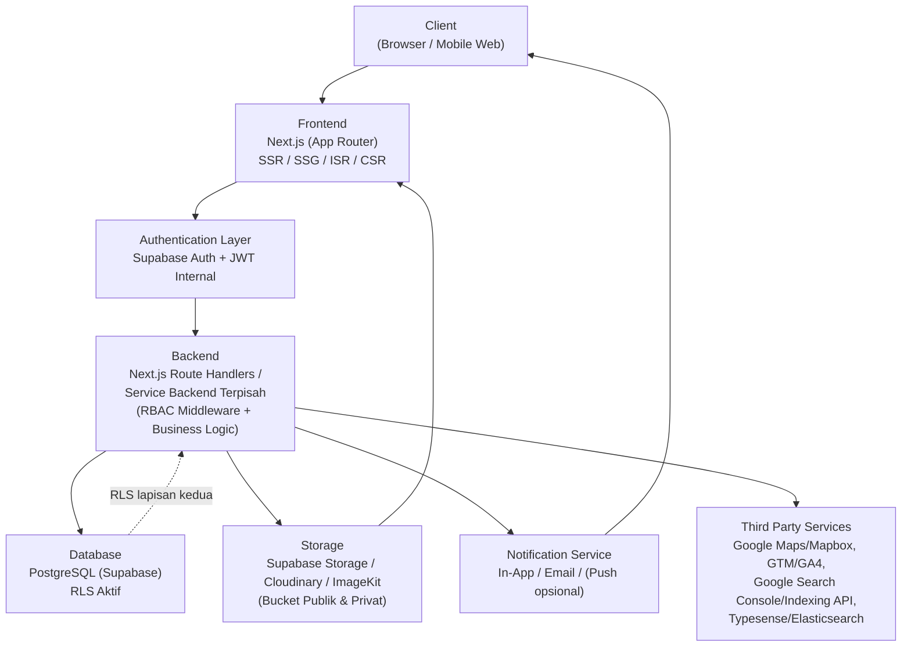
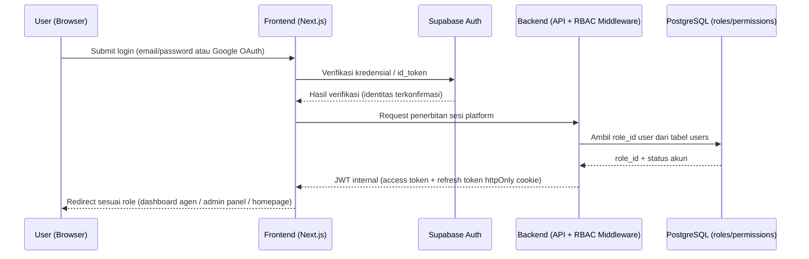
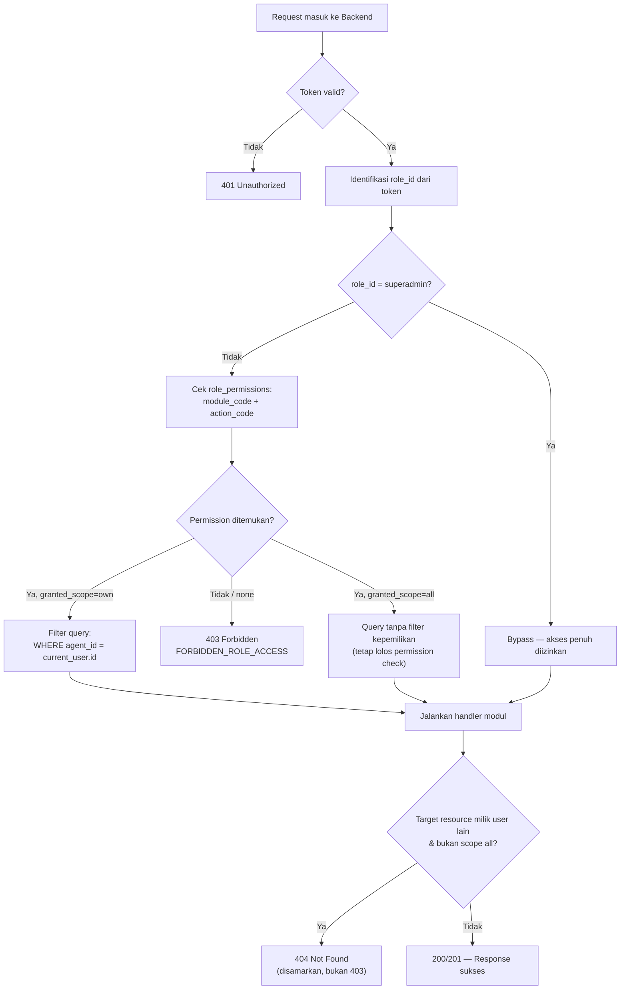
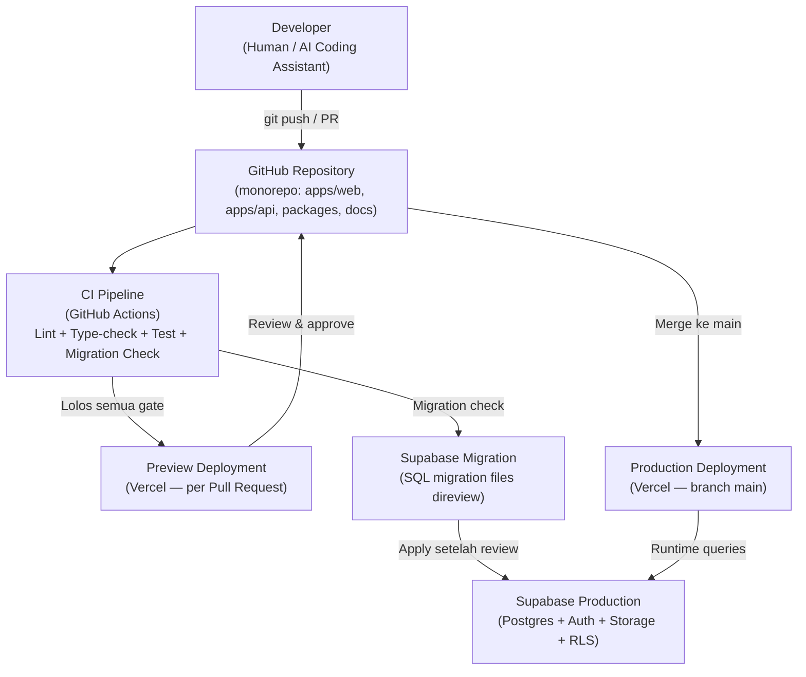

# SYSTEM ARCHITECTURE
## Platform Web Real Estate Agency

**Versi:** 1.0
**Tanggal:** 27 Juli 2026
**Disusun oleh:** Principal Software Architect / Enterprise Solution Architect / Senior Full Stack Engineer / Technical Lead / Cloud Architect (berdasarkan review menyeluruh dokumen sumber proyek)
**Status:** Referensi teknis utama — mengikat seluruh proses development, baik oleh AI Coding Assistant (Bolt.new, Claude, ChatGPT, Cursor, GitHub Copilot) maupun developer manusia.
**Dokumen sumber:** `PROJECT-CONSTITUTION.md`, `PRD-Real-Estate-Agency-Platform-v1.1.md`, `ERD-Skema-Database-Real-Estate-Agency-v1.1.md`, `ERD-Diagram-v1.1.mermaid`, `API-Specification-Real-Estate-Agency-Platform-v1.1.md`, `User-Flow-Real-Estate-Agency-Platform-v1.1.md`, `SEO-Analytics-Specification-Real-Estate-Agency-Platform-v1.1.md`, `AI-DEVELOPMENT-BLUEPRINT.md`, `AI-CONTEXT-PACK.md`.

> **Catatan hierarki dokumen:** Jika terjadi ketidaksesuaian antara dokumen ini dan `PROJECT-CONSTITUTION.md`, **Constitution yang berlaku**. Dokumen ini menerjemahkan Constitution & dokumen sumber lain menjadi pandangan arsitektur teknis yang utuh — bukan menggantikannya.

---

# TUJUAN DOKUMEN

- Menjelaskan arsitektur sistem secara lengkap, dari client hingga infrastruktur.
- Menjadi referensi teknis tunggal bagi seluruh tim (manusia maupun AI Coding Assistant).
- Mengurangi risiko perubahan arsitektur di tengah development dengan mengunci keputusan mahal sejak awal.
- Menjadi acuan implementasi seluruh modul, pola kode, dan standar teknis proyek.

---

## Daftar Isi

1. Executive Summary
2. Architecture Principles
3. High Level Architecture
4. Technology Stack
5. Module Architecture
6. Folder Structure Recommendation
7. Database Architecture
8. Authentication & Authorization Architecture
9. API Architecture
10. Frontend Architecture
11. Backend Architecture
12. File Storage Architecture
13. Notification Architecture
14. Security Architecture
15. Performance Strategy
16. Scalability Strategy
17. Error Handling Strategy
18. Deployment Architecture
19. Development Standards
20. Future Architecture
21. Risks
22. AI Development Notes
23. Open Questions & Assumptions

---

# 1. EXECUTIVE SUMMARY

### Ringkasan Sistem
Platform Web Real Estate Agency adalah sistem **PropTech SaaS bermodel B2B2C** yang mendigitalisasi operasional agensi properti Indonesia — mulai dari onboarding & administrasi agen, manajemen listing properti, edukasi agen (Learning Center), kolaborasi dengan developer properti, hingga alat bantu pre-screening kelayakan KPR (DBR Scoring). Sistem dipakai secara internal oleh tim agensi & agennya, sekaligus dikonsumsi publik oleh calon pembeli/penyewa properti.

### Tujuan Aplikasi
1. Mendigitalkan rekrutmen & administrasi agen properti secara mandiri (self-service).
2. Menyediakan sarana pengelolaan profil profesional dan listing properti per-agen.
3. Meningkatkan kapabilitas jual agen lewat Learning Center gratis.
4. Memfasilitasi kolaborasi bisnis agen–developer melalui katalog proyek.
5. Membantu agen melakukan kualifikasi awal kelayakan KPR calon pembeli.
6. Memastikan seluruh halaman publik terindeks mesin pencari secepat & seakurat mungkin sejak hari pertama rilis.

### Target Pengguna
- **Internal:** Superadmin, Manager, Admin, Instructor, Agen.
- **Eksternal:** Developer Partner (login opsional), Buyer (akun ringan opsional).
- **Publik tanpa akun:** Guest/Lead (calon pembeli/penyewa).

### Ruang Lingkup Sistem
Sistem mencakup **11 modul fungsional**: Authentication, Profil Agen, Listing, Learning Center, Kalender Event, Direktori Developer, DBR Scoring, Dashboard & Notifikasi, Admin Panel/CMS, RBAC, serta SEO & Analytics. Sistem **tidak** mencakup pemrosesan transaksi jual-beli properti (bukan payment gateway untuk closing) — nilai jual utama adalah *lead generation* (CTA WhatsApp) dan *tooling* operasional agen. Model monetisasi platform belum final (lihat Bagian 23).

Pengembangan dibagi dalam **4 fase**: Fase 1 (fondasi — Auth, Profil, Listing dasar, Admin dasar, RBAC dasar, fondasi SEO), Fase 2 (Developer, DBR), Fase 3 (Learning Center, Event), Fase 4 (dashboard analitik lanjutan, gamifikasi, integrasi SLIK/BI Checking, payment/komisi otomatis).

---

# 2. ARCHITECTURE PRINCIPLES

| Prinsip | Penerapan di Proyek Ini |
|---|---|
| **API First** | Kontrak API (`API-Specification.md`) didefinisikan lebih dulu sebagai sumber kebenaran — frontend & backend dikembangkan terhadap kontrak yang sama, tidak diasumsikan bebas dari implementasi. |
| **Modular Architecture** | 11 modul fungsional dengan batas tanggung jawab jelas dan dependency eksplisit (lihat Bagian 5), memungkinkan pengembangan bertahap per fase tanpa merombak modul lain. |
| **Separation of Concerns** | UI (komponen React) terpisah dari business logic (`/lib`, service layer) terpisah dari data access (repository layer) terpisah dari skema data (ERD). |
| **Single Source of Truth** | Satu definisi tipe data (`packages/shared-types`), satu skema validasi (Zod), satu dokumen ERD/API Spec sebagai rujukan tunggal. |
| **Ownership as Hard Boundary** | `agent_id` adalah batas kepemilikan data yang ditegakkan di kode, tidak bisa dilewati oleh konfigurasi permission apa pun. |
| **Security First** | RBAC berlapis (middleware + RLS), enkripsi data sensitif at-rest, tidak ada trust terhadap input client — diterapkan sejak desain awal, bukan ditambal belakangan. |
| **SEO First** | Strategi rendering (SSR/SSG/ISR), struktur URL/slug, dan structured data diselesaikan di Fase 1 karena mahal diubah setelah traffic organik terbentuk. |
| **Performance First** | Target Core Web Vitals (LCP < 2.5s, CLS < 0.1, INP < 200ms, TTFB < 600ms) menjadi syarat desain, bukan optimisasi pasca-rilis. |
| **Reusable Components** | Komponen UI dasar (`components/ui/`) dan pola service/repository backend dipakai ulang lintas modul. |
| **Configuration over Hard-code** | Parameter bisnis yang bisa berubah (threshold DBR, masa expired listing, passing grade) selalu configurable via Admin Panel (`system_configs`/`dbr_config`). |
| **Scalability** | Arsitektur mendukung pertumbuhan horizontal pada layer stateless (frontend, API) dan pertumbuhan data terkelola (indexing, denormalisasi terkontrol) pada database. |
| **Maintainability** | Konvensi penamaan konsisten FE↔BE↔DB, dokumentasi selalu sinkron dengan implementasi, komentar wajib pada hard rule keamanan/RBAC. |
| **Clean Code** | TypeScript `strict: true`, lint/format seragam sebagai CI gate, tidak ada duplikasi logic. |
| **Mobile First & PWA-Aware** | Agen bekerja di lapangan — form listing, kalkulator DBR, dan dashboard dirancang nyaman dipakai di layar kecil/koneksi tidak stabil. |
| **Graceful Degradation** | CTA WhatsApp adalah jalur komunikasi utama Buyer↔Agen di MVP; sistem tidak berasumsi kanal komunikasi lain (chat in-app) sudah tersedia. |

---

# 3. HIGH LEVEL ARCHITECTURE

Sistem mengikuti alur permintaan berlapis: client mengakses melalui frontend Next.js, permintaan yang memerlukan otorisasi melewati layer autentikasi, diteruskan ke backend (business logic), yang berinteraksi dengan database, storage, layanan notifikasi, dan layanan pihak ketiga.



**Penjelasan alur:**
1. **Client** mengakses via browser (desktop/mobile) — tidak ada aplikasi mobile native di scope saat ini (lihat Bagian 20).
2. **Frontend (Next.js)** merender halaman sesuai tipe: SSR/SSG/ISR untuk halaman publik (SEO-kritis), CSR untuk dashboard/admin (privat, `noindex`).
3. **Authentication Layer** memverifikasi identitas via Supabase Auth, hasil akhir berupa JWT internal platform — seluruh layer di bawahnya tidak perlu tahu metode login (password/OTP/Google).
4. **Backend** menjalankan RBAC middleware (cek `role_permissions`, resolusi `granted_scope`) sebelum menjalankan business logic modul terkait.
5. **Database (PostgreSQL via Supabase)** dengan RLS aktif sebagai lapisan pertahanan kedua.
6. **Storage** terpisah bucket publik (foto listing) vs privat (dokumen legalitas), diakses lewat CDN atau signed URL.
7. **Notification Service** mengirim notifikasi personal per user berdasarkan event bisnis (approval, expiry, sertifikat, lead baru).
8. **Third Party Services** dipanggil dari backend (server-side, menggunakan server-key rahasia) untuk Maps/Geocoding, Analytics, Search Console/Indexing API, dan search engine.

---

# 4. TECHNOLOGY STACK

> Stack berikut diambil dari `PROJECT-CONSTITUTION.md` Bagian 4 sebagai keputusan arsitektur final — **tidak ditambah teknologi di luar yang sudah disepakati** tanpa persetujuan eksplisit. Kolom "Version" hanya diisi jika versi spesifik sudah ditetapkan di dokumen sumber; jika tidak, ditulis "versi stabil terbaru saat implementasi" sesuai keputusan Constitution.

| Layer | Technology | Reason | Version |
|---|---|---|---|
| Frontend | Next.js (App Router) | Satu-satunya pilihan yang memenuhi syarat SSR/SSG/ISR wajib untuk Homepage/Search/Detail Listing/Profil Agen/Detail Proyek, sekaligus mendukung ekosistem React | Versi stabil terbaru saat implementasi |
| UI Framework / Library | React (via Next.js) | Ekosistem komponen matang, functional component + hooks | Mengikuti versi Next.js |
| CSS Framework | Tailwind CSS | Desain sistem yang dapat diaudit, mendukung Core Web Vitals rendah-JS | — |
| Component Library | shadcn/ui (atau setara headless) | Komponen headless, dapat dikustomisasi penuh dengan Tailwind | — |
| State Management | React state (useState/useReducer) + Context terbatas untuk global client state; server state via caching layer (React Query/SWR — pilih satu, konsisten project-wide) | Server state dan client state dipisah tegas untuk mengurangi kompleksitas dan bug sinkronisasi | — |
| Backend/API | Node.js (TypeScript) — Next.js Route Handlers (BFF ringan) **atau** service backend terpisah (NestJS/Express TypeScript) | REST murni dengan JWT kompatibel dengan kedua pola; tim wajib memilih satu secara eksplisit, tidak boleh dicampur untuk domain yang sama | — |
| Database | PostgreSQL (via Supabase) | Relasi ketat (FK, ENUM, UNIQUE composite) di ERD cocok RDBMS; Supabase menyediakan Auth + Storage + RLS siap pakai | — |
| ORM/Query Layer | Migration murni SQL (bukan ORM auto-sync di production) — query layer di repository pattern | Perubahan skema harus lewat migration file yang direview & reversible, bukan auto-sync yang berisiko | — |
| Authentication | Supabase Auth (email/password, OTP, Google OAuth2) dibungkus JWT internal platform | Auth + Storage + RLS terintegrasi; hasil akhir tetap JWT platform sendiri agar endpoint lain tidak perlu tahu metode login | — |
| Validation | Zod (atau setara) | Satu sumber skema validasi, dipakai baik di frontend maupun backend | — |
| Search Engine | Typesense (direkomendasikan) atau Elasticsearch | Typo-tolerance & performa filter kombinasi untuk pencarian listing | — |
| Storage/CDN | Supabase Storage / Cloudinary / ImageKit | Bucket terpisah publik (foto listing) vs privat+terenkripsi (dokumen legalitas) | — |
| Cache/Rate Limit | Redis | Rate limiting, cache halaman publik edge-level, session refresh token blocklist | — |
| Job Queue | Redis-based queue (BullMQ) atau Supabase Edge Functions + cron | Regenerasi sitemap, kalkulasi ulang counter denormalisasi, pengiriman notifikasi, panggilan Google Indexing API | — |
| Maps/Geocoding | Google Maps Platform atau Mapbox *(belum final)* | Autocomplete alamat client-side; reverse geocoding & distance matrix server-side | — |
| Analytics | GTM + GA4 | Dikonfigurasi via `system_configs`, dikelola Superadmin saja | — |
| Email | Belum ditentukan secara eksplisit di dokumen sumber — mengikuti kanal notifikasi email pada Modul 8 | Dipakai untuk OTP, status approval, reminder — provider konkret perlu ditetapkan (lihat Bagian 23) | — |
| Push Notification | Opsional, disebut sebagai kemungkinan integrasi WA Business API di dokumen sumber — belum final | Kanal tambahan di luar in-app/email | — |
| Image Processing | Transformasi otomatis via CDN (resize sesuai viewport, kompresi WebP/AVIF) di layer Storage/CDN | Tidak menyimpan file resolusi penuh mentah sebagai satu-satunya salinan | — |
| Logging | Structured logging (JSON) — bukan `console.log` bebas | Field minimal: `timestamp`, `level`, `request_id`, `user_id`, `module`, `action`, `message` | — |
| Monitoring | Belum ditentukan tool spesifik di dokumen sumber — mengacu pada kebutuhan audit trail (`audit_logs`) dan log teknis terstruktur | Perlu ditetapkan sebelum go-live (lihat Bagian 23) | — |
| Testing | Test otomatis sebagai CI gate wajib (jenis/framework spesifik belum ditetapkan di dokumen sumber) | Lint + type-check + test + migration check wajib lolos sebelum merge | — |
| CI/CD | Git-based pipeline (GitHub Actions/GitLab CI) | Lint, type-check, test, migration check wajib lolos sebelum merge ke `main` | — |
| Hosting/Deployment | Vercel (frontend Next.js) + Supabase (database/auth/storage) — *sesuai instruksi eksplisit pada permintaan dokumen ini* | Kombinasi natural untuk stack Next.js + Supabase; **belum tercantum sebagai keputusan formal di `PROJECT-CONSTITUTION.md`** — lihat Bagian 23 | — |

---

# 5. MODULE ARCHITECTURE

### 5.1 Authentication
- **Purpose:** Mengelola identitas seluruh jenis akun (agent, buyer, internal roles) dan sesi login.
- **Responsibilities:** Registrasi (email/HP + OTP), login password/Google OAuth2, refresh token, logout (single/all device), forgot/reset password, upload dokumen legalitas agen.
- **Dependencies:** RBAC (untuk penerbitan role saat registrasi), Referensi Wilayah (tidak langsung).
- **Main Features:** `POST /auth/register`, `/auth/verify-otp`, `/auth/login`, `/auth/oauth/google`, `/auth/refresh`, `/auth/logout(-all)`, `/auth/forgot-password`, `/auth/reset-password`.

### 5.2 Profil Agen
- **Purpose:** Halaman publik & privat sebagai "kartu nama digital" agen.
- **Responsibilities:** Kelola bio/spesialisasi/area, statistik listing terjual/tersewa (denormalisasi), badge sertifikasi (relasi ke Learning Center), review/rating (moderasi wajib).
- **Dependencies:** Authentication (identitas), Learning Center (badge), Listing (statistik).
- **Main Features:** `GET/PUT /users/profile`, `GET /agents/{id}`, `GET/POST /agents/{id}/reviews`, moderasi review Admin.

### 5.3 Listing
- **Purpose:** Inti transaksi platform — pengelolaan listing properti per-agen dan pencarian publik.
- **Responsibilities:** CRUD listing (kategori Primary/Secondary, tujuan Jual/Sewa), lifecycle status, upload media, CTA WhatsApp + pencatatan lead, pencarian & filter, moderasi.
- **Dependencies:** Authentication, Profil Agen (WA default), Referensi Wilayah (lokasi cascading), Direktori Developer (untuk listing Primary), RBAC (moderasi).
- **Main Features:** `POST/GET/PUT /listings`, `POST /listings/{id}/media`, `/properties/search`, `/properties/autocomplete`, pencatatan `listing_leads`.

### 5.4 Learning Center
- **Purpose:** Portal edukasi & sertifikasi gratis untuk agen.
- **Responsibilities:** Katalog kursus, self-enroll, konten video/PDF/kuis, sertifikat otomatis, progress tracking.
- **Dependencies:** Authentication (Agen/Instructor), Profil Agen (badge), Kalender Event (kelas live), RBAC.
- **Main Features:** CRUD `courses`/`course_lessons`/`quizzes`, `enrollments`, `quiz_attempts`, `certificates`.

### 5.5 Kalender Event
- **Purpose:** Manajemen event training, launching proyek, open house, gathering.
- **Responsibilities:** CRUD event, RSVP agen, pengajuan event oleh Developer Partner (butuh approval).
- **Dependencies:** Authentication, Learning Center (event = kelas live), Direktori Developer (event launching proyek), RBAC.
- **Main Features:** CRUD `events`, `event_registrations`.

### 5.6 Direktori Kerjasama Developer
- **Purpose:** Katalog proyek developer untuk dipasarkan agen.
- **Responsibilities:** CRUD proyek (data resmi harga/unit), klaim proyek oleh agen (non-eksklusif kecuali dikonfigurasi), sinkronisasi data ke listing turunan.
- **Dependencies:** Referensi Wilayah (`city_id`), Listing (listing Primary), RBAC (hanya Admin/Manager/Superadmin CRUD data resmi).
- **Main Features:** CRUD `developer_partners`/`developer_projects`/`developer_project_media`, `agent_project_claims`.

### 5.7 DBR Scoring (Kalkulator KPR)
- **Purpose:** Pre-screening kelayakan KPR calon pembeli berdasarkan standar DBR/DSR perbankan Indonesia.
- **Responsibilities:** Kalkulasi anuitas & DBR%, simulasi what-if, export PDF, riwayat simulasi per agen.
- **Dependencies:** Authentication (Agen), Listing (opsional auto-fill harga), Admin Panel (parameter `dbr_config`), RBAC (akses data sensitif terbatas).
- **Main Features:** `POST /calculator/dbr`, riwayat `dbr_simulations`, konfigurasi `dbr_config` (Superadmin only).

### 5.8 Dashboard & Notifikasi
- **Purpose:** Ringkasan lintas modul per role, dan pengiriman notifikasi personal.
- **Responsibilities:** Agregasi data dari Listing/Learning/Event/DBR (dashboard tidak menyimpan data sendiri); pengiriman notifikasi in-app/email/(push opsional).
- **Dependencies:** Listing, Learning Center, Kalender Event, DBR Scoring, RBAC (cakupan data per role).
- **Main Features:** Ringkasan dashboard per role, `notifications` (CRUD, mark-as-read).

### 5.9 Admin Panel / CMS
- **Purpose:** Pusat operasional internal — moderasi, konfigurasi, laporan.
- **Responsibilities:** Manajemen user, moderasi listing/review/event, kelola konten Learning Center & Developer, konfigurasi parameter sistem, laporan & export.
- **Dependencies:** RBAC (gating akses seluruh sub-menu), seluruh modul lain (sebagai objek moderasi/konfigurasi).
- **Main Features:** `GET/PUT /admin/agents/*`, `/admin/agent-reviews/*`, konfigurasi `system_configs`/`dbr_config`.

### 5.10 RBAC (Manajemen Role & Hak Akses)
- **Purpose:** Fondasi kontrol akses seluruh sistem.
- **Responsibilities:** Definisi role/permission, Permission Matrix Editor (Superadmin), Permission Editor terbatas (Manager, khusus Agen), Assign Role, audit trail.
- **Dependencies:** Tidak bergantung pada modul lain — **modul fondasi** yang dibutuhkan semua modul lain.
- **Main Features:** CRUD `roles`/`permissions`/`role_permissions`, resolusi `granted_scope`, middleware RBAC.

### 5.11 SEO & Analytics
- **Purpose:** Memastikan seluruh halaman publik terindeks optimal sejak awal.
- **Responsibilities:** Strategi rendering, slug & redirect, meta tag & structured data, sitemap, GTM/GA4, Search Console/Indexing API.
- **Dependencies:** Listing, Profil Agen, Direktori Developer (sebagai sumber halaman publik yang di-SEO-kan).
- **Main Features:** `url_redirects`, sitemap generator, helper `/lib/seo/`.

### Tabel Dependency Antar Modul

| Modul | Bergantung Pada | Dibutuhkan Oleh |
|---|---|---|
| RBAC | — (fondasi) | Semua modul |
| Authentication | RBAC | Profil Agen, Listing, Learning Center, Event, DBR, Dashboard, Admin Panel |
| Profil Agen | Authentication | Listing (WA default), Dashboard, SEO |
| Listing | Authentication, Profil Agen, Referensi Wilayah, Direktori Developer | Dashboard, SEO, DBR (opsional) |
| Direktori Developer | Authentication, Referensi Wilayah | Listing (Primary), Kalender Event |
| Learning Center | Authentication | Profil Agen (badge), Kalender Event (kelas live), Dashboard |
| Kalender Event | Authentication, Learning Center, Direktori Developer | Dashboard |
| DBR Scoring | Authentication, Listing (opsional), Admin Panel | Dashboard |
| Dashboard | Listing, Learning Center, Kalender Event, DBR Scoring | — (titik agregasi akhir) |
| Admin Panel | RBAC | Semua modul (sebagai objek moderasi/konfigurasi) |
| SEO & Analytics | Listing, Profil Agen, Direktori Developer | — (lintas modul publik) |

---

# 6. FOLDER STRUCTURE RECOMMENDATION

Struktur monorepo Next.js App Router (final, sinkron dengan `PROJECT-CONSTITUTION.md` Bagian 5):

```
/apps
  /web                        # Aplikasi Next.js (publik + dashboard + admin)
    /app
      /(public)/               # SSR/SSG — homepage, search, listing detail, agent profile
      /(auth)/                 # login, register, forgot-password, verify-otp
      /(dashboard)/            # CSR privat — dashboard agen, noindex
      /(admin)/                # CSR privat — admin panel, noindex, role-gated
      /api/                    # Route handlers BFF tipis (jika arsitektur ini dipilih)
    /components
      /ui/                     # komponen dasar reusable — tanpa business logic
      /features/{module}/      # komponen spesifik per modul
    /lib
      /api-client/             # wrapper fetch/axios ke backend, typed
      /supabase/                # supabase client (browser + server, terpisah)
      /seo/                     # helper meta tag, JSON-LD, sitemap
      /validation/              # skema Zod — satu sumber kebenaran form + API
    /hooks                      # custom hooks domain (useListingForm, useDbrCalculator)
    /styles
    /public

  /api                          # Backend service terpisah (jika arsitektur split dipilih)
    /src
      /modules/{nama}           # auth, agents, listings, learning-center, events,
                                 # developer-projects, dbr-calculator, notifications, rbac, seo
      /middleware/               # auth.middleware, rbac.middleware, rate-limit.middleware
      /shared/{errors,logger,validators}
      /jobs/                     # cron & queue consumers
    /migrations                  # SQL migration murni, sinkron ERD

/packages
  /shared-types/                 # TypeScript types/interfaces — single source of truth FE↔BE
  /region-data/                  # seed data wilayah Indonesia

/docs                            # seluruh dokumen sumber & turunan (Constitution, PRD, ERD, dsb.)
```

### Fungsi Masing-Masing Folder

| Folder | Fungsi |
|---|---|
| `app/(public)/` | Halaman yang wajib SSR/SSG/ISR — homepage, pencarian, detail listing, profil agen, detail proyek developer. Sumber data utama harus lewat Server Component. |
| `app/(auth)/` | Halaman otentikasi (login, register, verifikasi OTP, forgot/reset password). |
| `app/(dashboard)/` | Area privat agen — CSR, `noindex, nofollow`. |
| `app/(admin)/` | Area privat internal (Admin/Manager/Superadmin/Instructor) — CSR, `noindex, nofollow`, role-gated. |
| `app/api/` | Route handlers BFF tipis — dipakai jika arsitektur backend tidak dipisah (lihat Bagian 4). |
| `components/ui/` | Komponen dasar reusable (Button, Input, Card, Modal) — tidak tahu domain bisnis. |
| `components/features/{module}/` | Komponen spesifik domain (ListingForm, DbrCalculator, AgentReviewCard). |
| `lib/api-client/` | Wrapper terhadap API backend, typed sesuai `shared-types`. |
| `lib/supabase/` | Klien Supabase — terpisah tegas untuk browser (anon key) vs server (service role key). |
| `lib/seo/` | Helper generate meta tag, JSON-LD structured data, sitemap. |
| `lib/validation/` | Skema Zod — satu sumber kebenaran, dipakai form client & validasi server. |
| `hooks/` | Custom hooks domain — memisahkan logic dari presentasi komponen. |
| `modules/{nama}/` (backend) | Satu modul = `*.controller.ts`, `*.service.ts`, `*.repository.ts`, `*.schema.ts`, `*.types.ts`. |
| `middleware/` | Auth, RBAC, rate-limit — dijalankan sebelum handler modul. |
| `shared/` | Error class, logger, validator lintas modul. |
| `jobs/` | Consumer job queue — regenerasi sitemap, sync counter, notifikasi terjadwal. |
| `migrations/` | File migrasi SQL bernomor urut, direview, reversible. |
| `packages/shared-types/` | Definisi tipe entitas tunggal — **dilarang** didefinisikan ulang di `/apps/web` atau `/apps/api` secara terpisah. |
| `packages/region-data/` | Seed data wilayah administratif Indonesia (provinces/cities/districts/villages). |

---

# 7. DATABASE ARCHITECTURE

> ERD lengkap **tidak dibuat ulang** di sini — rujuk `ERD-Skema-Database-Real-Estate-Agency-v1.1.md` dan `ERD-Diagram-v1.1.mermaid` sebagai satu-satunya sumber kebenaran struktur data. Bagian ini menjelaskan **prinsip arsitektural** di balik skema tersebut.

### Entity Utama
Sistem terbagi ke dalam 11 kelompok entitas sesuai modul: `users`/`agent_verification_documents` (Auth), `agent_profiles`/`agent_reviews` (Profil), `listings` + tabel anak (Listing), `courses` + tabel anak (Learning Center), `events`/`event_registrations` (Kalender), `developer_partners`/`developer_projects` + tabel anak (Developer), `dbr_simulations`/`dbr_config` (DBR), `notifications` (Dashboard), `system_configs`/`audit_logs` (Admin), `roles`/`permissions`/`role_permissions` (RBAC), `ref_provinces/cities/districts/villages` (Referensi Wilayah), dan `url_redirects` (SEO).

### Relasi Antar Tabel (Ringkasan Konseptual)
- **`users`** adalah tabel induk seluruh role — dirujuk oleh hampir seluruh entitas ber-ownership (`listings.agent_id`, `agent_profiles.user_id`, `dbr_simulations.agent_id`, dsb.).
- **`roles` → `permissions` → `role_permissions`** membentuk model RBAC pivot — `role_permissions.granted_scope` menentukan apakah suatu role melihat data `own`, `all`, atau `none`.
- **Referensi wilayah** (`ref_provinces → ref_cities → ref_districts → ref_villages`) membentuk hierarki cascading yang dirujuk oleh `listings` dan `developer_projects` — **satu-satunya** pola lokasi yang diizinkan di sistem (kecuali `area_keyword` freetext terbatas).
- **`listings`** adalah entitas inti — terhubung ke `agent_id` (ownership), `developer_project_id` (nullable, untuk listing Primary), serta memiliki tabel anak 1:N (`listing_photos`, `listing_videos`, `listing_price_history`, `listing_leads`, `listing_views`) dan pivot N:N (`listing_amenities`).
- **`developer_projects`** terhubung ke `developer_partners` (N:1) dan `ref_cities` (N:1), serta menjadi sumber `agent_project_claims` (N:N dengan `users`).
- **`agent_reviews`** menghubungkan `users` (sebagai agen yang direview & buyer yang mereview) dengan alur moderasi `pending → approved/rejected`.
- **`courses`** menjadi induk `course_lessons`, `quizzes` (dan turunannya), serta terhubung ke agen lewat pivot `enrollments` dan `certificates`.
- **`dbr_simulations`** terhubung ke `agent_id` dan opsional `listing_id`, dengan parameter global terpisah di `dbr_config`.
- **`url_redirects`** bersifat generik (`entity_type` + `entity_id`) untuk menaungi redirect dari `listings` maupun `developer_projects`.

### Data Flow (Alur Data Tipikal)
```
Input form (client, validasi Zod)
   → API request (validasi ulang server, Zod sama)
   → Service layer (business rule: ownership, status lifecycle)
   → Repository layer (query terparameterisasi ke Postgres)
   → Trigger/job (jika menyentuh counter denormalisasi atau slug → url_redirects)
   → Response envelope standar ke client
```

### Normalisasi
Skema mengikuti **normalisasi standar (3NF)** untuk entitas transaksional (listings, users, courses, dsb.), dengan **denormalisasi terkontrol** hanya pada kolom counter agregat (`listings.cta_click_count`, `agent_profiles.total_listings_sold/rented`) demi performa dashboard — diperbarui via trigger/scheduled job, bukan dihitung on-the-fly. Pengecualian: `agent_reviews.rating` rata-rata dihitung on-the-fly (volume kecil di Fase 1).

### Naming Convention Database
- Tabel: `snake_case`, bentuk jamak (`listings`, `agent_verification_documents`).
- Kolom: `snake_case` (`whatsapp_number`, `created_at`).
- Enum value: `snake_case` huruf kecil (`pending_review`, `fully_furnished`).
- Primary key: `id` (UUID) di seluruh tabel — bukan auto-increment integer.
- Foreign key: `{referenced_table_singular}_id` (`agent_id`, `listing_id`, `province_id`).

### Prinsip Arsitektural Tambahan
- **Migration murni SQL**, bukan ORM auto-sync di production.
- **Soft delete** (`deleted_at`) wajib untuk `listings`, `users`, `developer_projects`.
- **Index wajib sejak migrasi awal** pada kolom filter utama (status/kategori/lokasi/harga listing, komposit lead & simulasi DBR, unique index slug).
- **Enkripsi at-rest** untuk dokumen legalitas & field finansial DBR.
- **RLS aktif** di seluruh tabel ber-scope kepemilikan sebagai lapisan kedua setelah RBAC middleware.

---

# 8. AUTHENTICATION & AUTHORIZATION ARCHITECTURE

### Login Flow



> Login via Google untuk role `agent` **tetap** melalui alur `pending_review` (wajib upload dokumen legalitas) — OAuth tidak melewati approval manual. Untuk role `buyer`, akun langsung `active` setelah verifikasi.

### Session Management
- **Access token**: umur pendek (15–60 menit), dikirim via header `Authorization: Bearer`.
- **Refresh token**: umur panjang (30 hari), disimpan sebagai **httpOnly secure cookie** (bukan localStorage) untuk mitigasi XSS.
- **Logout** (`/auth/logout`) menginvalidasi 1 device; **logout-all** (`/auth/logout-all`) menginvalidasi seluruh sesi — refresh token benar-benar dihapus dari blocklist Redis/DB, bukan sekadar dihapus dari client.

### Token Strategy
JWT internal platform diterbitkan **setelah** verifikasi identitas berhasil (baik via password/OTP maupun Google OAuth) — payload token membawa `user_id` dan `role_id`; **role/permission tidak disimpan statis di token** secara permanen — setiap request tetap dicek ulang ke `role_permissions` di backend (memungkinkan perubahan permission berlaku real-time tanpa perlu re-login).

### Role Based Access Control (RBAC)



### Permission Model
- **Struktur:** `roles` → `permissions` (`module_code + action_code`, unik) → `role_permissions` (pivot dengan `granted_scope`: `own`/`all`/`none`, dan `editable_by_role_code`).
- **Superadmin** selalu bypass (short-circuit `true`) — tidak bergantung pada data `role_permissions` yang mungkin salah konfigurasi.
- **Manager** selalu `granted_scope = 'all'` untuk modul relevan — tidak ada mode scoped tim/wilayah.
- **Manager** hanya boleh `UPDATE` baris `role_permissions` di mana `editable_by_role_code` memuat kode role-nya (hanya berlaku untuk baris `role_id = agent`).
- **Hard rule ownership Agen** diterapkan **terpisah** dari matriks permission — bahkan jika `granted_scope` salah konfigurasi menjadi `all` untuk Agen, backend tetap menolak (403) `UPDATE`/`DELETE` terhadap data bukan miliknya (aturan ini di kode, bukan konfigurasi).

### Protected Routes
- `(dashboard)` — hanya diakses user terautentikasi dengan role `agent` (atau internal roles untuk keperluan tertentu); `noindex, nofollow`.
- `(admin)` — hanya diakses `superadmin`/`manager`/`admin`/`instructor` (Instructor terbatas ke sub-menu Learning Center); role-gated per sub-menu, menu tidak relevan **disembunyikan penuh**.
- `(public)` — dapat diakses siapa pun (Guest), tanpa proteksi.

### Middleware
Urutan middleware backend untuk setiap endpoint terproteksi:
1. **auth.middleware** — validasi JWT, tolak jika invalid/expired (401).
2. **rbac.middleware** — cek permission `module_code+action_code`, resolusi `granted_scope`, terapkan filter ownership otomatis.
3. **rate-limit.middleware** — terapkan batas request sesuai kategori endpoint (publik/authenticated/sensitif).
4. **Handler modul** — dijalankan hanya setelah ketiga middleware di atas lolos.

---

# 9. API ARCHITECTURE

### API Design Standard
- **Base URL & versioning:** `https://api.<domain>.id/api/v1` — breaking change wajib naik versi (`/v2`), kontrak `/v1` yang live tidak boleh diubah.
- **Style:** REST murni dengan autentikasi JWT Bearer.

### REST Convention
- Resource dalam bentuk jamak, `kebab-case` (`/developer-projects`, `/agents/{id}/reviews`).
- Method HTTP standar: `GET` (read), `POST` (create/aksi), `PUT`/`PATCH` (update), tidak ada `DELETE` fisik untuk entitas ber-soft-delete (gunakan endpoint status/aksi, mis. `PUT /listings/{id}/archive` — bukan `DELETE`).

### Naming Convention
- Endpoint: `kebab-case`, resource jamak.
- Query param: `snake_case` (`?property_type=rumah&price_min=...`).
- JSON field request/response: `snake_case`, konsisten dengan kolom database.

### Error Response Standard
```json
{
  "success": false,
  "error": {
    "code": "LISTING_NOT_FOUND",
    "message": "Listing tidak ditemukan atau Anda tidak memiliki akses.",
    "details": null
  }
}
```
- Kode error `SCREAMING_SNAKE_CASE`, didaftarkan di `packages/shared-types/error-codes.ts`.
- HTTP status: 400 (validasi format), 401 (token invalid), 403 (RBAC ditolak, hanya untuk kasus non-ownership), 404 (data tidak ada **atau** privat milik user lain), 409 (konflik), 422 (validasi bisnis gagal), 429 (rate limit).

### Pagination
Standar di semua endpoint list: `?page=1&per_page=20&sort=created_at&order=desc`, response menyertakan `meta: { page, per_page, total }`.

### Filtering
Filter spesifik per endpoint (mis. `property_type`, `price_min`/`price_max`, `city_id`) — filter geografis **wajib** menerima ID referensi (`province_id`/`city_id`/`district_id`), bukan nama teks bebas; pemetaan slug URL human-readable ke ID adalah tanggung jawab frontend.

### Sorting
Query param `sort` + `order` (`asc`/`desc`) — default `created_at desc` kecuali endpoint pencarian listing yang mendukung sort tambahan (harga, popularitas berdasarkan `cta_click_count`).

### Versioning
Versioning di path (`/api/v1`, `/api/v2`) — perubahan yang breaking (mengubah shape response, menghapus field) wajib versi baru; penambahan field baru yang non-breaking boleh tetap di versi yang sama.

### Aturan Tambahan
- **Response envelope standar wajib** (`success`, `data`, `meta` / `error`) di seluruh endpoint.
- **Idempotency** untuk endpoint rawan double-click (`POST /listings/{id}/cta-click`, `POST /courses/{id}/enroll`) via `UNIQUE` constraint DB atau idempotency key.
- **Rate limiting**: publik 60 req/menit/IP, authenticated 300 req/menit/user, endpoint sensitif 5 req/menit/IP+identifier.

---

# 10. FRONTEND ARCHITECTURE

### Component Structure
Dua kategori komponen dipisah tegas:
- **`components/ui/`** — komponen dasar (Button, Input, Card, Modal) — reusable lintas modul, tanpa pengetahuan domain bisnis.
- **`components/features/{module}/`** — komponen spesifik domain (ListingForm, DbrCalculator, AgentReviewCard) — boleh memanggil hooks domain & memakai komponen `ui/`.

### Smart vs Presentational Components
- **Smart (container) components**: bertanggung jawab atas data-fetching, state, dan pemanggilan business logic — biasanya berada di level `page`/`feature` root.
- **Presentational components**: menerima data via props, fokus pada rendering UI — tidak memanggil API atau menyimpan state bisnis. Business logic (kalkulasi DBR, validasi ownership) **tidak boleh** berada di komponen presentasi — wajib di `/lib` atau service backend.

### State Management
- **Server state** (data dari API): dikelola caching layer (React Query/SWR — pilih satu secara konsisten).
- **Client state** (UI lokal: toggle modal, step wizard): `useState`/`useReducer`.
- **Global client state** (jika dibutuhkan): React Context terbatas — bukan Redux/Zustand kecuali dijustifikasi kompleksitas.

### Routing
Next.js App Router dengan route groups: `(public)`, `(auth)`, `(dashboard)`, `(admin)` — masing-masing punya `layout.tsx` sendiri untuk mengatur meta robots dan proteksi akses.

### Lazy Loading
Komponen berat non-kritis (peta interaktif, chart dashboard, widget kompleks) di-lazy-load (`next/dynamic`) — tidak memblokir render halaman utama; mendukung target INP < 200ms.

### Error Boundary
React Error Boundary diterapkan **per route group/segmen** — kegagalan satu widget dashboard tidak mematikan seluruh halaman.

### Form Validation
Skema Zod (satu sumber, sama dengan backend) diintegrasikan dengan library form (form state terkelola) — validasi real-time client, validasi ulang wajib di server sebelum tulis DB. Field lokasi cascading (province → city → district) divalidasi keberadaannya, bukan hanya format.

### Reusable Components
Sebelum membuat komponen baru, cek `components/ui/` — jika fungsi serupa sudah ada, pakai ulang (dengan props tambahan jika perlu) daripada duplikasi.

---

# 11. BACKEND ARCHITECTURE

### Business Logic Layer
Kalkulasi dan aturan bisnis (formula DBR, resolusi lifecycle status listing, validasi ownership) berada di **service layer** (`*.service.ts`) — dapat diuji unit tanpa bergantung pada HTTP layer atau UI.

### Service Layer
Setiap modul backend (`/modules/{nama}`) mengikuti struktur konsisten:
- `*.controller.ts` — menerima request, memanggil service, mengembalikan response envelope.
- `*.service.ts` — business logic murni.
- `*.repository.ts` — akses data (query terparameterisasi ke Postgres).
- `*.schema.ts` — skema Zod untuk validasi input.
- `*.types.ts` — tipe spesifik modul (merujuk `packages/shared-types` untuk entitas bersama).

### Repository Pattern
Digunakan untuk memisahkan akses data dari business logic — repository **satu-satunya** layer yang menyusun query SQL/Supabase client, sehingga filter `granted_scope` (ownership) diterapkan konsisten di satu tempat, bukan tersebar di banyak controller.

### Middleware
Urutan wajib: `auth.middleware` → `rbac.middleware` → `rate-limit.middleware` → handler modul (lihat Bagian 8).

### Validation
Zod schema yang sama dengan frontend dipakai untuk validasi ulang di server — **backend tidak pernah mempercayai validasi frontend**; seluruh endpoint mutating (`POST`/`PUT`/`PATCH`) wajib validasi ulang.

### Logging
Structured logging (JSON) dengan field minimal `timestamp`, `level`, `request_id`, `user_id`, `module`, `action`, `message`. Level: `error`/`warn`/`info`/`debug` (debug hanya non-production). Audit log bisnis (`audit_logs`) terpisah dari log teknis — mencatat aksi sensitif dan tidak dapat dihapus/dirotasi.

### Error Handling
Error dikembalikan lewat envelope standar; detail internal (stack trace, query SQL) **tidak pernah** bocor ke response API — hanya masuk log server dengan `request_id` yang sama dikembalikan ke client untuk tracing.

---

# 12. FILE STORAGE ARCHITECTURE

### Image Upload
- Foto listing: minimal 3 wajib sebelum submit review, format JPEG/PNG/WebP, upload via `POST /listings/{id}/media`.
- Transformasi otomatis di CDN: resize sesuai viewport, kompresi WebP/AVIF — file resolusi penuh mentah **tidak** disimpan sebagai satu-satunya salinan.

### File Upload (Dokumen)
Dokumen legalitas agen (KTP/NPWP/sertifikasi) diupload ke bucket privat terpisah, **wajib** dienkripsi at-rest, **tidak pernah** melalui CDN publik.

### Storage Structure
Bucket dipisah tegas berdasarkan sensitivitas & audiens:
| Bucket | Isi | Akses |
|---|---|---|
| `listing-photos` | Foto listing | Publik, CDN |
| `listing-videos` | Video/virtual tour listing | Publik, CDN |
| `developer-project-media` | Materi marketing proyek developer | Publik, CDN |
| `agent-verification-documents` | KTP/NPWP/sertifikasi agen | Privat, signed URL berumur pendek untuk role review |

### Naming Convention
File disimpan dengan pola `{entity_type}/{entity_id}/{uuid}-{original_filename_slug}.{ext}` agar tertelusur ke entitas induk dan tidak collision antar upload.

### Compression & Optimization
- Format modern (WebP/AVIF) otomatis via CDN.
- Lazy-loading untuk gambar di luar viewport awal.
- `alt_text` wajib terisi (auto-generate dari template jika kosong) untuk SEO gambar.
- Validasi tipe file **di server** (magic bytes/MIME type sesungguhnya) — bukan hanya ekstensi nama file client, mencegah upload file executable menyamar sebagai gambar.

---

# 13. NOTIFICATION ARCHITECTURE

### Kanal
| Kanal | Keterangan |
|---|---|
| **In-App** | Notifikasi tersimpan di tabel `notifications`, ditampilkan di dashboard user terkait. |
| **Email** | Untuk OTP, status approval, reminder — provider konkret perlu ditetapkan (lihat Bagian 23). |
| **Push Notification** | Opsional, kemungkinan integrasi WA Business API (fase lanjutan) — belum final. |

### Trigger Utama
- **Approval status** — perubahan status registrasi agen atau listing (approved/rejected/suspended).
- **Listing akan expired** — reminder sebelum masa aktif listing habis.
- **Sertifikat baru terbit** — setelah agen lulus kursus Learning Center.
- **Reminder event** — sebelum event yang di-RSVP berlangsung.
- **Lead baru** — saat ada klik CTA WhatsApp baru pada listing agen.
- **Update proyek developer** — perubahan data resmi yang relevan bagi agen yang mengklaim proyek tsb.

### Prinsip Arsitektural
- Notifikasi **selalu personal per user** — tidak ada notifikasi lintas-scope yang bocor ke role tanpa akses terkait.
- Realtime subscription (jika dipakai) wajib difilter RLS per `user_id`.
- Pengiriman notifikasi terjadwal/batch (reminder, expiry) ditangani job queue — bukan dikirim sinkron di request path utama.
- Data ke GA4/GTM dari event notifikasi **tidak boleh** menyertakan PII.

---

# 14. SECURITY ARCHITECTURE

| Aspek | Penerapan |
|---|---|
| **Authentication** | Supabase Auth + JWT internal; password hashing adaptif (bcrypt/argon2); OAuth2 Google diverifikasi server-side. |
| **Authorization** | RBAC middleware backend (lapisan pertama) + RLS Supabase (lapisan kedua); hard rule ownership `agent_id` di kode, terpisah dari matriks permission. |
| **Input Validation** | Zod di client & server; backend tidak pernah percaya validasi client; field lokasi divalidasi terhadap keberadaan baris referensi. |
| **SQL Injection Prevention** | Query terparameterisasi lewat repository layer/Supabase client — tidak ada raw string concatenation SQL. |
| **XSS Prevention** | Refresh token di httpOnly cookie (bukan localStorage); output rendering React secara default sudah escape konten — hindari `dangerouslySetInnerHTML` tanpa sanitasi. |
| **CSRF** | Mitigasi via SameSite cookie policy pada refresh token cookie + validasi origin pada request state-changing. |
| **Rate Limiting** | Redis-based; publik 60/menit/IP, authenticated 300/menit/user, endpoint sensitif (auth/OTP) 5/menit/IP+identifier. |
| **File Upload Security** | Validasi magic bytes/MIME type di server; bucket privat terpisah untuk dokumen sensitif; signed URL berumur pendek. |
| **Environment Variables** | `SCREAMING_SNAKE_CASE`, dikelompokkan per domain, `.env` tidak pernah di-commit; `.env.example` tanpa value rahasia. |
| **Secrets Management** | Key berakhiran `_SECRET`/`_SERVICE_ROLE_KEY`/`*_SERVER` dilarang di-bundle ke client-side JavaScript — audit build output berkala. |
| **Audit Log** | `audit_logs` mencatat siapa-kapan-apa untuk aksi sensitif (approval, moderasi, perubahan role/permission/config) — tidak dapat dihapus kecuali retensi resmi terjadwal. |

**Prinsip tambahan:**
- Enkripsi at-rest wajib untuk dokumen legalitas agen dan field finansial DBR.
- Data privat milik user lain disamarkan sebagai 404 (bukan 403) untuk mencegah enumerasi resource.
- Minimal 1 akun Superadmin aktif dijamin di level aplikasi (constraint non-SQL).
- PII tidak masuk ke log teknis maupun Analytics/GTM/GA4.
- Cookie consent + Google Consent Mode aktif sebelum tracking non-esensial berjalan penuh.

---

# 15. PERFORMANCE STRATEGY

| Strategi | Target/Penerapan |
|---|---|
| **Caching** | Cache halaman publik edge-level (CDN) via SSR/ISR; Redis untuk cache data yang sering diakses & session/rate-limit state. |
| **Image Optimization** | `next/image` + CDN transformasi otomatis (resize, WebP/AVIF), lazy-loading di luar viewport awal. |
| **Lazy Loading** | Komponen berat (peta interaktif, chart) di-lazy-load; skrip non-kritis dimuat setelah interaksi utama. |
| **Pagination** | Wajib di semua endpoint list — tidak ada endpoint mengembalikan seluruh baris tanpa limit. |
| **Virtualization** | Direkomendasikan untuk daftar panjang di UI (mis. tabel admin dengan ratusan baris) agar rendering tetap ringan. |
| **Database Index** | Index wajib sejak migrasi awal pada kolom filter utama (lihat Bagian 7) — bukan ditambahkan belakangan. |
| **Query Optimization** | Counter agregat dibaca dari kolom denormalisasi, bukan `COUNT()` on-the-fly; query list selalu paginated dan terindeks. |
| **Bundle Optimization** | Tree-shaking bawaan Next.js; hindari import library besar secara penuh jika hanya butuh sebagian fungsi. |
| **Code Splitting** | Otomatis per-route via App Router; komponen client berat displit lebih lanjut via `next/dynamic`. |

**Target Core Web Vitals (wajib untuk seluruh halaman publik):**
| Metrik | Target |
|---|---|
| LCP | < 2.5 detik |
| CLS | < 0.1 |
| INP | < 200ms |
| TTFB | < 600ms |
| Load katalog listing | < 2 detik |

---

# 16. SCALABILITY STRATEGY

| Dimensi | Strategi |
|---|---|
| **Horizontal Scaling** | Layer frontend (Next.js) dan backend (Route Handlers/service terpisah) bersifat stateless — dapat di-scale horizontal di belakang load balancer/edge network tanpa perubahan arsitektur. |
| **Vertical Scaling** | Database (PostgreSQL via Supabase) dapat di-scale vertikal (tier instance lebih besar) sebagai langkah awal sebelum mempertimbangkan sharding/read replica. |
| **Modular Growth** | Struktur modular (Bagian 5) memungkinkan penambahan modul baru (Fase 2/3/4) tanpa merombak modul yang sudah stabil — dependency dijaga eksplisit. |
| **Database Growth** | Index & denormalisasi terkontrol menjaga performa query seiring pertumbuhan data listing/lead; read replica dapat dipertimbangkan untuk beban baca tinggi di fase lanjutan. |
| **Storage Growth** | CDN menyerap pertumbuhan volume foto/video; bucket privat (dokumen legalitas) dipisah agar tidak membebani delivery publik. |
| **Future Services** | Search engine (Typesense/Elasticsearch) dan job queue (BullMQ/Edge Functions) dirancang sebagai layer terpisah sehingga dapat di-scale independen dari aplikasi utama saat volume pencarian/job meningkat. |

**Catatan arsitektural:** karena backend dapat berupa Route Handlers **atau** service terpisah, keputusan mana yang dipilih (lihat Bagian 4 & 23) akan memengaruhi strategi scaling secara langsung — service terpisah memberi fleksibilitas scaling independen dari frontend, sementara Route Handlers lebih sederhana dioperasikan namun scaling menyatu dengan frontend.

---

# 17. ERROR HANDLING STRATEGY

### Frontend Errors
- React Error Boundary per route group/segmen — kegagalan satu widget tidak mematikan seluruh halaman.
- State error eksplisit di setiap komponen data-fetch (loading/empty/error/success).

### Backend Errors
- Envelope error standar (`success: false`, `error.code`, `error.message`, `error.details`).
- Detail internal (stack trace, query SQL, nama tabel) **tidak pernah** bocor ke response — hanya ke log server.
- Validasi bisnis gagal → 422; validasi format gagal → 400; error tak terduga → 500 dengan `request_id` untuk tracing.

### API Errors
- Kode error `SCREAMING_SNAKE_CASE` terdaftar di file konstanta pusat.
- Data privat milik user lain → 404 (bukan 403).
- RBAC ditolak → 403 dengan `FORBIDDEN_ROLE_ACCESS`.

### Logging
Structured logging JSON dengan `request_id`/`correlation_id` yang sama dikembalikan ke client, memudahkan korelasi error client↔server↔log.

### Monitoring
Tool monitoring spesifik belum ditetapkan di dokumen sumber (lihat Bagian 23) — minimal wajib mencakup: alerting untuk error rate tinggi, tracking latency endpoint kritis (search, DBR calculation), dan uptime halaman publik (dampak langsung ke SEO).

### Retry Strategy
- Job queue (BullMQ/Edge Functions) menerapkan retry dengan backoff untuk task yang gagal sementara (panggilan Google Indexing API, pengiriman notifikasi) — idempotent agar retry aman.
- Panggilan pihak ketiga (Maps/Geocoding) di server-side menerapkan timeout & fallback (mis. degradasi ke input manual jika autocomplete gagal).

---

# 18. DEPLOYMENT ARCHITECTURE

> Alur deployment berikut memakai kombinasi **Vercel + Supabase + GitHub** sesuai instruksi pada permintaan dokumen ini. Kombinasi ini **konsisten** dengan stack Next.js + Supabase yang sudah ditetapkan di `PROJECT-CONSTITUTION.md`, namun **belum tercantum sebagai keputusan formal** di dokumen tsb — lihat Bagian 23 untuk konfirmasi yang diperlukan.



**Alur ringkas:**
1. **Developer** (manusia atau AI Coding Assistant) membuat perubahan di branch fitur (`feat/{modul}-{ringkasan}`) dan membuka Pull Request ke GitHub.
2. **CI Pipeline** (GitHub Actions) menjalankan lint, type-check, test otomatis, dan migration check — **wajib lolos** sebelum merge diizinkan.
3. **Preview Deployment** di Vercel dibuat otomatis per PR untuk review visual/fungsional sebelum merge.
4. **Migration** database (jika ada perubahan skema) melalui file SQL yang direview terpisah, diterapkan ke Supabase dengan rencana rollback — **tidak** mengedit skema langsung lewat Supabase Studio di production.
5. Setelah PR di-approve dan di-merge ke `main`, **Production Deployment** di Vercel berjalan otomatis, terhubung ke **Supabase Production** (Postgres + Auth + Storage + RLS aktif).
6. Environment variables/secrets dikelola terpisah per environment (preview vs production) di Vercel & Supabase — tidak pernah di-commit ke repo.

---

# 19. DEVELOPMENT STANDARDS

| Konteks | Konvensi | Contoh |
|---|---|---|
| File komponen React | `PascalCase.tsx`, sama dengan nama komponen | `ListingCard.tsx` |
| File backend modul | `{nama}.controller.ts` / `.service.ts` / `.repository.ts` / `.schema.ts` / `.types.ts` | `listings.service.ts` |
| Folder | `kebab-case` untuk route segment, `lowercase` untuk kategori (`components`, `lib`) | `developer-projects/` |
| Komponen React (nama) | `PascalCase` | `DbrCalculatorForm` |
| Variabel & fungsi TS | `camelCase` | `getListingBySlug()` |
| Tipe & interface TS | `PascalCase` | `ListingEntity` |
| Konstanta enum aplikasi | `SCREAMING_SNAKE_CASE` | `LISTING_STATUS.PENDING_REVIEW` |
| Endpoint REST | `kebab-case`, resource jamak | `/developer-projects` |
| Tabel & kolom database | `snake_case`, tabel jamak | `agent_verification_documents` |
| Slug URL publik | lowercase, spasi→`-`, diakhiri `{short_id}` | `rumah-minimalis-2-lantai-bsd-city-9f21a` |
| Nama branch Git | `{tipe}/{modul}-{ringkasan}` | `feat/m3-listing-crud`, `fix/m7-dbr-rounding` |
| Commit message | Conventional Commits | `feat(listing): add slug auto-generate with short id` |

**Prinsip lintas layer:** field yang sama harus memakai nama identik di DB → API JSON → hanya dikonversi ke `camelCase` **di dalam** kode TypeScript via mapper/DTO — tidak boleh "bocor" campuran di response API.

---

# 20. FUTURE ARCHITECTURE

| Arah Pengembangan | Pertimbangan Arsitektural |
|---|---|
| **Mobile App** | Backend REST API yang sudah terpisah dari frontend (jika arsitektur split dipilih) memungkinkan konsumsi oleh aplikasi mobile native/Flutter/React Native tanpa perubahan kontrak API — kontrak `/api/v1` dijaga stabil untuk tujuan ini. |
| **Multi Tenant** | Skema saat ini single-tenant (satu agensi). Jika multi-tenant dibutuhkan di masa depan, perlu penambahan `tenant_id` di tabel-tabel inti dan penyesuaian RLS — **perubahan besar**, harus direncanakan sebagai keputusan arsitektur eksplisit, bukan ditambal. |
| **Marketplace** | Struktur `developer_projects` + `agent_project_claims` sudah menyerupai pola marketplace terbatas (developer sebagai supplier, agen sebagai reseller) — dapat diperluas menjadi marketplace penuh dengan penambahan modul transaksi/komisi di Fase 4. |
| **AI Integration** | Potensi: rekomendasi listing personalisasi, auto-deskripsi listing, penilaian kualitas foto, chatbot FAQ — harus tetap menghormati prinsip "business logic terpisah dari UI" dan tidak mengorbankan SEO (konten AI-generated tetap perlu SSR). |
| **Analytics** | Fondasi GTM/GA4 sudah ada di Fase 1 — pengembangan lanjutan (dashboard analitik custom, funnel lead-to-closing) dapat dibangun di atas data `listing_leads`/`listing_views` yang sudah terstruktur. |
| **Payment Gateway** | Endpoint `POST /billing/*` sudah disiapkan sebagai placeholder non-breaking — implementasi penuh menunggu keputusan model monetisasi final (lihat Bagian 23). |
| **Third Party Integration** | Integrasi SLIK/BI Checking (validasi cicilan otomatis untuk DBR) dan WA Business API direncanakan Fase 4 — arsitektur job queue & service layer saat ini sudah mengakomodasi penambahan integrasi baru tanpa merombak modul inti. |

---

# 21. RISKS

| Kategori | Risiko | Mitigasi |
|---|---|---|
| **Technical** | Backend belum dikunci antara Route Handlers vs service terpisah — keterlambatan keputusan dapat memperlambat Fase 1. | Kunci keputusan sebelum Fase 1 selesai (Bagian 4 & 23); dokumentasikan sebagai keputusan arsitektur final begitu diputuskan. |
| **Technical** | Duplikasi definisi tipe data antara frontend & backend jika `packages/shared-types` tidak disiplin dipakai. | Enforce lewat code review & lint rule bahwa entitas domain hanya boleh didefinisikan di `shared-types`. |
| **Scalability** | Pertumbuhan volume listing/lead dapat membebani query pencarian jika index tidak dijaga sejak awal. | Index wajib sejak migrasi awal (Bagian 7), monitoring query lambat, pertimbangkan read replica di fase lanjutan. |
| **Scalability** | Ketergantungan pada satu instance Postgres tanpa strategi sharding jika platform tumbuh multi-tenant/multi-region. | Rencanakan strategi tenant/regional sebagai keputusan arsitektur terpisah sebelum benar-benar dibutuhkan (Bagian 20). |
| **Security** | Kebocoran service role key Supabase ke client jika audit build tidak rutin dilakukan. | Audit build output secara berkala; CI gate untuk mendeteksi key `_SERVICE_ROLE_KEY`/`_SECRET` di bundle client. |
| **Security** | Data finansial DBR & dokumen legalitas berisiko tinggi jika enkripsi at-rest tidak konsisten diterapkan di semua environment (termasuk staging). | Enforce enkripsi di level migration/skema, bukan opsional per environment; sertakan dalam Definition of Done. |
| **Performance** | Halaman publik gagal memenuhi Core Web Vitals jika SSR/ISR tidak konsisten diterapkan di seluruh halaman baru. | Checklist SEO/performance wajib di setiap PR yang menyentuh halaman publik (lihat `AI-DEVELOPMENT-BLUEPRINT.md` Bagian 30). |
| **Performance** | Counter agregat dihitung on-the-fly oleh developer yang tidak menyadari aturan denormalisasi. | Komentar kode eksplisit + review checklist yang menandai kolom counter sebagai "wajib trigger/job, dilarang on-the-fly". |
| **Business/Process** | Item "Hal Perlu Dikonfirmasi" (threshold DBR, monetisasi, provider Maps, dsb.) berpotensi diputuskan sepihak oleh AI Coding Assistant jika tidak diberi pengingat eksplisit. | Aturan `// TODO: menunggu keputusan bisnis` wajib di seluruh dokumen turunan (Blueprint, Context Pack, dokumen ini). |

---

# 22. AI DEVELOPMENT NOTES

Bagian khusus untuk AI Coding Assistant (Bolt.new, Claude, ChatGPT, Cursor, GitHub Copilot, dsb.) yang bekerja pada implementasi berdasarkan dokumen arsitektur ini:

1. **Jangan mengubah struktur folder tanpa alasan** — struktur di Bagian 6 adalah keputusan final; perubahan besar wajib disetujui eksplisit.
2. **Jangan membuat komponen duplikat** — periksa `components/ui/` dan `components/features/{module}/` sebelum menulis komponen baru yang fungsinya serupa.
3. **Selalu gunakan reusable component** yang sudah ada, bukan menulis ulang pola UI yang sudah tersedia.
4. **Ikuti naming convention** di Bagian 19 secara konsisten di seluruh layer (file, folder, komponen, endpoint, database, branch, commit).
5. **Jangan mengubah database tanpa memperbarui dokumentasi** — setiap perubahan skema wajib disinkronkan ke `ERD-Skema-Database.md` dan `ERD-Diagram.mermaid`.
6. **Selalu periksa Project Status** (modul mana yang sudah selesai, fase mana yang sedang berjalan) sebelum mengimplementasikan fitur baru — jangan membangun fitur fase mendatang sebelum fondasi fase saat ini solid.
7. **Selalu gunakan Development Playbook** (`AI-DEVELOPMENT-BLUEPRINT.md`) sebagai acuan pola implementasi detail (CRUD pattern, form pattern, error handling, dsb.) — dokumen ini (`SYSTEM-ARCHITECTURE.md`) menjelaskan **apa** arsitekturnya, Blueprint menjelaskan **bagaimana** menulis kode sesuai arsitektur tsb.
8. **Ownership (`agent_id`) adalah hard boundary di kode**, bukan hanya konfigurasi permission — validasi ulang di server terlepas dari hasil pengecekan RBAC.
9. **Jangan membuat keputusan arsitektur/bisnis sepihak** untuk item yang tercantum di Bagian 23 (Open Questions & Assumptions) — implementasikan sebagai placeholder configurable, tandai `// TODO: menunggu keputusan bisnis`, dan laporkan ke manusia jika keputusan tsb memblokir progres.
10. **Jangan menambahkan dependency/library baru** di luar Technology Stack (Bagian 4) tanpa justifikasi dan persetujuan eksplisit.
11. **Jika instruksi user bertentangan dengan dokumen ini atau `PROJECT-CONSTITUTION.md`** (khususnya Security/Authorization), tanyakan konfirmasi sebelum menyimpang.
12. **Setiap PR wajib lolos**: lint + type-check + test otomatis + migration check sebelum dianggap selesai (lihat Bagian 18).

---

# 23. OPEN QUESTIONS & ASSUMPTIONS

Berikut hal-hal yang **tidak diasumsikan** dan perlu dikonfirmasi tim bisnis/teknis sebelum atau selama development, sesuai dengan status "Hal Perlu Dikonfirmasi" pada dokumen sumber serta beberapa poin tambahan yang muncul khusus dari penyusunan dokumen arsitektur ini:

### Dari Dokumen Sumber (Status Terbuka, Bukan Konflik)
1. **Pilihan arsitektur Backend/API final** — Next.js Route Handlers (BFF ringan) vs service backend terpisah (NestJS/Express). Dokumen sumber mewajibkan keputusan eksplisit sebelum Fase 1 selesai; dokumen ini menampilkan keduanya sebagai opsi yang sah.
2. **Threshold DBR final** dan apakah berbeda per bank rekanan — perlu input tim bisnis/legal.
3. **Model bisnis monetisasi** — komisi transaksi, biaya keanggotaan tier, atau boost listing berbayar — belum diputuskan.
4. **Provider Maps/Geocoding final** — Google Maps Platform atau Mapbox.
5. **Kebutuhan integrasi pihak ketiga lain** — payment gateway, WA Business API, SLIK OJK — belum dikonfirmasi kebutuhan & providernya.
6. **Kebijakan eksklusivitas proyek developer** per wilayah/agen — belum diputuskan.
7. **Kebijakan promosi/demosi role** — apakah Manager dapat mempromosikan Agen langsung menjadi Manager, atau hanya Superadmin — saat ini hard rule membatasi Manager hanya pada Agen ↔ Admin.
8. **Kepemilikan akun organisasi Google Search Console/GTM/GA4** — perlu ditentukan tim operasional sebelum go-live (tidak memblokir mulainya development).
9. **Apakah agen wajib bernaung di bawah kantor/brokerage tertentu** atau bisa independen — belum dikonfirmasi.

### Muncul Khusus dari Penyusunan Dokumen Ini
10. **Provider Email transaksional** (untuk OTP, notifikasi status, reminder) — belum disebutkan secara eksplisit di dokumen sumber sebagai layanan/vendor tertentu. Diperlukan keputusan sebelum Modul Authentication & Notification dapat diimplementasikan sepenuhnya.
11. **Tooling Monitoring/Observability** (mis. Sentry, Datadog, atau setara) — belum ditetapkan di dokumen sumber. Diperlukan sebelum go-live untuk memenuhi kebutuhan alerting & tracing yang disebutkan di Bagian 17.
12. **Framework/tooling Testing** (unit test, integration test, e2e) — dokumen sumber mewajibkan "test otomatis" sebagai CI gate namun tidak menetapkan tool spesifik (mis. Jest, Vitest, Playwright).
13. **Hosting/Deployment via Vercel** — dipakai di Bagian 18 & Bagian 4 (Hosting) **sesuai instruksi eksplisit pada permintaan dokumen ini**, karena kombinasi Next.js + Supabase secara natural cocok dengan Vercel. Namun, **Vercel tidak tercantum sebagai keputusan formal** di `PROJECT-CONSTITUTION.md` — perlu dikonfirmasi dan, jika disetujui, ditambahkan sebagai keputusan arsitektur resmi di Constitution agar tidak menjadi asumsi implisit yang berbeda antar dokumen.
14. **State management library spesifik** (React Query vs SWR) — dokumen sumber tidak menyebutkan pilihan spesifik; Bagian 4 & 10 dokumen ini menyarankan memilih salah satu secara konsisten, namun keputusan final belum ada.

### Prinsip Penanganan
Untuk seluruh poin di atas: AI Coding Assistant maupun developer manusia **wajib** mengimplementasikan bagian terkait sebagai **configurable placeholder** (bukan hard-code keputusan sepihak), menandai kode dengan `// TODO: menunggu keputusan bisnis` atau `// TODO: perlu keputusan arsitektur`, dan melaporkan ke tim jika keputusan tersebut memblokir progres implementasi.

---

*Dokumen ini disusun sebagai referensi arsitektur teknis utama, turunan dari `PROJECT-CONSTITUTION.md` dan seluruh dokumen sumber v1.1 (26 Juli 2026). Mengikat seluruh proses development — AI Coding Assistant maupun developer manusia — selama lifecycle proyek berlangsung. Jika terjadi ketidaksesuaian dengan `PROJECT-CONSTITUTION.md`, Constitution yang berlaku; revisi dokumen ini wajib dilakukan bersamaan setiap kali keputusan pada Bagian 23 (Open Questions & Assumptions) diselesaikan.*
