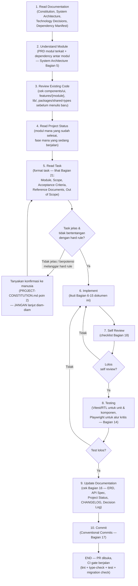
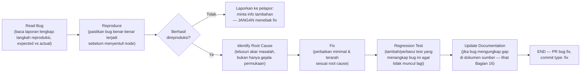

# AI DEVELOPMENT BLUEPRINT
## Platform Web Real Estate Agency

---

# 1. Document Information

| Field | Value |
|---|---|
| **Document Name** | AI Development Blueprint — Platform Web Real Estate Agency |
| **Version** | 1.0 |
| **Status** | Draft — menunggu review & pengesahan tim (mengikuti status governance yang sama dengan `technology-decisions.md`; belum berstatus "BERLAKU" seperti `PROJECT-CONSTITUTION.md`) |
| **Last Updated** | 27 Juli 2026 |
| **Owner** | Principal Software Architect / Technical Lead (nama individu penanggung jawab belum ditetapkan — konsisten dengan catatan terbuka di `technology-decisions.md` Bagian 1) |
| **Related Documents** | `PROJECT-CONSTITUTION.md`, `SYSTEM-ARCHITECTURE.md`, `technology-decisions.md`, `dependency-manifest.md`, `AI-CONTEXT-PACK.md`, `PRD-Real-Estate-Agency-Platform-v1.1.md`, `ERD-Skema-Database-Real-Estate-Agency-v1.1.md`, `ERD-Diagram-v1.1.mermaid`, `API-Specification-Real-Estate-Agency-Platform-v1.1.md`, `User-Flow-Real-Estate-Agency-Platform-v1.1.md`, `SEO-Analytics-Specification-Real-Estate-Agency-Platform-v1.1.md` |

**Kedudukan dokumen dalam hierarki governance proyek:** Dokumen ini adalah **panduan operasional level-eksekusi** (bagaimana AI Coding Assistant bekerja hari-ke-hari), turunan dari seluruh dokumen sumber di atas. Jika terjadi ketidaksesuaian antara Blueprint ini dan dokumen sumber manapun, urutan kemenangan governance adalah:

```
PROJECT-CONSTITUTION.md  >  Dokumen Sumber v1.1 (PRD/ERD/API Spec/User Flow/SEO Spec)  >  SYSTEM-ARCHITECTURE.md  >  technology-decisions.md  >  dependency-manifest.md  >  AI-DEVELOPMENT-BLUEPRINT.md (dokumen ini)
```

Blueprint ini **tidak menggantikan** dokumen manapun di atasnya — fungsinya adalah menerjemahkan seluruh keputusan yang sudah ada menjadi **prosedur kerja konkret** yang diikuti AI Coding Assistant maupun kontributor manusia setiap kali membuat, mengubah, atau mereview kode.

> **Catatan transparansi wajib:** Bagian 5 (Documentation Reading Order) dokumen ini mereferensikan beberapa jenis dokumen (mis. *Project Status*, *Engineering Guidelines*, *Development Playbook*, *Functional/UI/Technical Specification* per modul, *CHANGELOG*, *Decision Log*) yang **belum ada sebagai file terpisah** di antara 11 dokumen sumber proyek saat ini. Konsisten dengan prinsip `PROJECT-CONSTITUTION.md` Bagian 21 poin 4 ("AI Coding Assistant dilarang membuat keputusan arsitektur baru secara sepihak"), dokumen ini **tidak berasumsi isi dokumen-dokumen tersebut** — melainkan mendefinisikan *slot* yang wajib diisi begitu dokumen tsb dibuat, dan menandai statusnya sebagai **"belum ada — perlu dibuat"** di setiap kemunculannya. Ini bukan kesalahan penyusunan, melainkan keputusan sadar agar Blueprint tidak menciptakan sumber kebenaran palsu.

---

# 2. Purpose

**AI Development Blueprint** adalah dokumen operasional tunggal yang menjawab pertanyaan: *"Bagaimana seharusnya AI Coding Assistant bekerja pada proyek ini, dari task diterima sampai kode ter-merge?"*

Tujuan spesifik dokumen ini:

1. **Menjadi "operating system"** bagi seluruh AI Coding Assistant (Claude, Bolt.new, ChatGPT, Cursor, GitHub Copilot) yang bekerja pada proyek — memastikan setiap AI, terlepas dari vendor/modelnya, mengikuti prosedur kerja, prinsip kode, dan batasan yang identik.
2. **Mencegah drift arsitektur** — tanpa panduan eksekusi yang eksplisit, setiap sesi AI berisiko mengambil pendekatan berbeda-beda (struktur folder berbeda, pola state management berbeda, konvensi penamaan berbeda) meski dokumen sumber sudah final. Blueprint ini menutup celah "dokumen sumber benar tapi implementasi tetap inkonsisten."
3. **Menjadi referensi wajib dibaca sebelum implementasi** — dokumen ini, bersama urutan bacaan di Bagian 5, adalah langkah pertama yang wajib dilakukan AI Coding Assistant sebelum menyentuh kode, baik untuk fitur baru, perbaikan bug, maupun refactor.
4. **Menerjemahkan keputusan strategis menjadi checklist yang dapat diverifikasi** — setiap prinsip di dokumen sumber (mis. "Ownership sebagai Hard Boundary", "Configuration over Hard-code") diturunkan di sini menjadi langkah konkret yang dapat dicentang (lihat Bagian 18, 22, 23).
5. **Menstandardisasi cara AI menerima & melaporkan pekerjaan** — format task masuk (Bagian 21), format bug fix (Bagian 20), dan format review diri (Bagian 18) diseragamkan agar hasil kerja antar sesi/antar AI dapat dibandingkan dan diaudit.

**Prinsip dasar:** Dokumen ini **tidak berisi keputusan arsitektur baru**. Setiap aturan di sini adalah turunan langsung dari `PROJECT-CONSTITUTION.md`, `SYSTEM-ARCHITECTURE.md`, `technology-decisions.md`, atau dokumen sumber v1.1 — dirujuk secara eksplisit di setiap bagian. Jika suatu topik operasional belum tercakup oleh dokumen sumber manapun, Blueprint ini menandainya sebagai **gap terbuka**, bukan mengarang keputusan baru.

---

# 3. AI Roles

Setiap AI Coding Assistant memiliki peran utama yang disesuaikan dengan kekuatan platform-nya. Peran ini **tidak eksklusif** — AI mana pun boleh mengambil peran lain jika dibutuhkan, tapi peran utama menentukan tanggung jawab default saat task tidak menyebutkan peran secara eksplisit.

### 3.1 Claude (Claude.ai / Claude Code)
- **Product Architect** — menerjemahkan kebutuhan bisnis dari PRD ke keputusan desain teknis yang konsisten dengan Constitution & System Architecture.
- **Technical Writer** — menyusun/memperbarui dokumen turunan (Blueprint ini, ringkasan modul, catatan Decision Log) dengan presisi bahasa teknis.
- **Reviewer** — mengaudit output AI lain (Bolt.new, Cursor, Copilot) terhadap seluruh dokumen governance sebelum merge, termasuk deteksi pelanggaran Architecture Constraints (`technology-decisions.md` Bagian 6).
- **Modul kompleks lintas domain** — RBAC, DBR Scoring, SEO fondasi — yang membutuhkan penalaran lintas banyak dokumen sumber sekaligus.

### 3.2 Bolt.new
- **Full Stack Developer** — implementasi cepat modul end-to-end (UI + Route Handler + query Supabase) berdasarkan `dependency-manifest.md` sebagai katalog package yang sah.
- **Module Implementer** — mengeksekusi task modul yang scope-nya sudah jelas & sempit (lihat format task Bagian 21), bukan mengambil keputusan arsitektur baru.

### 3.3 ChatGPT
- **Architecture Reviewer** — validasi silang keputusan desain terhadap prinsip 10 poin di `technology-decisions.md` Bagian 2 sebelum implementasi dimulai.
- **QA Reviewer** — menyusun skenario uji (unit/component/E2E) berdasarkan Acceptance Criteria PRD per modul.
- **Prompt Optimizer** — menyusun/menyempurnakan task brief (Bagian 21) agar AI implementer lain menerima instruksi yang tidak ambigu.

### 3.4 Cursor / GitHub Copilot
- **Pair Programmer** — asistensi baris-per-baris di dalam IDE untuk developer manusia; mengikuti seluruh aturan Blueprint ini sebagai *ground rule* saat autocomplete/inline suggestion, bukan hanya saat diminta secara eksplisit.

### 3.5 Aturan Lintas Peran
- Peran tidak membebaskan AI mana pun dari Bagian 18 (AI Self Review Checklist) — checklist berlaku identik untuk seluruh peran.
- AI yang mengambil peran **Reviewer** tidak boleh menyetujui perubahan yang melanggar *hard rule* (`PROJECT-CONSTITUTION.md` Bagian 3.2, 11, 20) meski diminta eksplisit oleh pengguna — wajib meminta konfirmasi dulu (lihat Bagian 21 & 24).

---

# 4. AI Workflow

Alur kerja resmi yang wajib diikuti AI Coding Assistant untuk **setiap** task (fitur baru, perbaikan bug, atau refactor), tanpa pengecualian urutan.



**Catatan wajib per langkah:**
- Langkah 1–4 **tidak boleh dilewati** meski AI merasa sudah familiar dengan proyek dari sesi sebelumnya — konteks proyek dapat berubah antar sesi (modul baru selesai, keputusan bisnis baru turun).
- Langkah 5→6 memiliki **gerbang wajib**: jika instruksi task bertentangan dengan *hard rule* Security/Authorization/Ownership, AI **wajib berhenti dan bertanya**, bukan melanjutkan dengan asumsi (`PROJECT-CONSTITUTION.md` halaman pembuka, poin 2).
- Langkah 7 (Self Review) dan 8 (Testing) adalah **gate terpisah** — lolos self-review tidak berarti otomatis lolos testing, keduanya wajib dijalankan.
- Langkah 9 bukan langkah opsional "jika sempat" — ini bagian dari Definition of Done modul (lihat Bagian 22).

---

# 5. Documentation Reading Order

Setiap AI Coding Assistant **wajib** membaca dokumen berikut secara berurutan sebelum memulai implementasi apa pun. Tabel di bawah memetakan setiap nomor bacaan ke dokumen **yang benar-benar ada** di repositori proyek saat ini, dan menandai dokumen yang **belum dibuat**.

| # | Jenis Dokumen | Dokumen Aktual di Proyek | Status |
|---|---|---|---|
| 1 | Project Overview | `AI-CONTEXT-PACK.md` (Bagian 1–2) + `PRD-Real-Estate-Agency-Platform-v1.1.md` (Bagian 1) | ✅ Tersedia |
| 2 | System Architecture | `SYSTEM-ARCHITECTURE.md` | ✅ Tersedia |
| 3 | Technology Decisions | `technology-decisions.md` | ✅ Tersedia (status Draft) |
| 4 | Dependency Manifest | `dependency-manifest.md` | ✅ Tersedia |
| 5 | Engineering Guidelines | *(belum ada file terpisah)* — sebagian besar isinya saat ini tercakup oleh `PROJECT-CONSTITUTION.md` Bagian 6–7 (Coding & Naming Convention) | ⚠️ **Belum ada — direkomendasikan dibuat sebagai dokumen terpisah jika konvensi bertumbuh melebihi kapasitas Constitution** |
| 6 | Development Playbook | *(belum ada file terpisah — direferensikan berulang kali sebagai `AI-DEVELOPMENT-BLUEPRINT.md` di dokumen lain)* Dokumen **ini sendiri** berfungsi sebagai Playbook dimaksud | ✅ Terpenuhi oleh dokumen ini |
| 7 | Project Status | *(belum ada)* | ⚠️ **Belum ada — wajib dibuat sebelum Fase 1 berjalan** (lihat Bagian 16 & 24) |
| 8 | Module PRD | `PRD-Real-Estate-Agency-Platform-v1.1.md` (bagian Modul 1–11 sesuai modul yang dikerjakan) | ✅ Tersedia |
| 9 | Functional Specification | *(belum ada file terpisah)* — saat ini tercakup gabungan `PRD` + `User-Flow-Real-Estate-Agency-Platform-v1.1.md` | ⚠️ **Belum ada sebagai dokumen mandiri — PRD + User Flow dipakai sebagai pengganti sampai ada keputusan membuatnya terpisah** |
| 10 | UI Specification | *(belum ada)* — wireframe/desain visual belum tersedia di antara dokumen sumber | ⚠️ **Belum ada — AI mengikuti `AI-DEVELOPMENT-BLUEPRINT.md` Bagian 8 (Component Rules) + `SYSTEM-ARCHITECTURE.md` Bagian 10 sebagai pengganti sementara** |
| 11 | Technical Specification | `API-Specification-Real-Estate-Agency-Platform-v1.1.md` + `ERD-Skema-Database-Real-Estate-Agency-v1.1.md` + `ERD-Diagram-v1.1.mermaid` | ✅ Tersedia |
| 12 | Current Task | Diberikan oleh pengguna/manusia sesuai format Bagian 21 | Bergantung pengguna |

**Aturan tambahan bacaan lintas modul:** untuk modul apa pun, AI wajib membaca **`SEO-Analytics-Specification-Real-Estate-Agency-Platform-v1.1.md`** tambahan jika modul yang dikerjakan menghasilkan halaman publik baru (listing, profil agen, proyek developer, homepage) — checklist SEO adalah bagian dari Definition of Done, bukan tugas terpisah (`PROJECT-CONSTITUTION.md` Bagian 18 poin 1).

**Jika dokumen bertanda ⚠️ dibutuhkan tapi belum ada:** AI **tidak boleh mengarang isinya**. AI wajib: (a) menggunakan dokumen pengganti terdekat yang sudah tersedia sesuai tabel di atas, (b) menandai gap ini secara eksplisit ke manusia, dan (c) — jika diminta — membantu menyusun draft dokumen tsb sebagai task terpisah, bukan mencampurnya diam-diam ke dalam task implementasi kode.

---

# 6. Coding Principles

Prinsip berikut **wajib** dipatuhi di seluruh kode baru, selaras `PROJECT-CONSTITUTION.md` Bagian 6 dan `AI-CONTEXT-PACK.md` Bagian 9.

| Prinsip | Penerapan Konkret di Proyek Ini |
|---|---|
| **Clean Code** | Nama variabel/fungsi deskriptif (`camelCase`), fungsi pendek dengan satu tanggung jawab, tanpa nested condition berlebihan (`>3` level wajib direfactor ke fungsi terpisah/early return). |
| **SOLID** | *Single Responsibility*: satu file `*.service.ts` = satu domain bisnis (bukan mencampur logic listing & DBR di satu service). *Open/Closed*: tambah kapabilitas lewat komposisi function/hook baru, bukan mengubah signature fungsi yang sudah dipakai modul lain. *Liskov*: tidak relevan langsung (tidak ada class inheritance — lihat Composition di bawah), namun berlaku analog pada kontrak tipe TypeScript (`interface`/`type` turunan wajib tetap memenuhi kontrak induk). *Interface Segregation*: tipe request/response API dipecah per endpoint di `packages/shared-types`, tidak satu tipe raksasa untuk semua entitas. *Dependency Inversion*: service layer bergantung pada abstraksi repository, bukan langsung memanggil Supabase client di tengah business logic. |
| **DRY** | Skema Zod, tipe entitas, dan business logic (formula DBR, filter `granted_scope`) masing-masing hanya didefinisikan **satu kali** di `packages/shared-types`/`lib/` — dilarang menyalin logic yang sama ke lokasi lain (`PROJECT-CONSTITUTION.md` Bagian 6). |
| **KISS** | Pilih solusi paling sederhana yang memenuhi requirement — tidak menambah abstraksi/layer baru "untuk jaga-jaga" tanpa kebutuhan konkret saat ini (selaras prinsip Simplicity di `technology-decisions.md` Bagian 2). |
| **Separation of Concerns** | UI (komponen React) ≠ business logic (`/lib`, `*.service.ts`) ≠ data access (`*.repository.ts`) ≠ skema data (ERD). Komponen React **tidak boleh** berisi kalkulasi bisnis (formula DBR, validasi ownership) — ini *hard rule*, bukan saran gaya (`PROJECT-CONSTITUTION.md` Bagian 6). |
| **Composition over Inheritance** | React functional component + hooks **saja** — tidak ada class component baru (`AI-CONTEXT-PACK.md` Bagian 9). Reuse logic lewat custom hooks (`hooks/`) dan komposisi komponen, bukan pewarisan class. |
| **Reusability** | Cek `components/ui/` (shadcn/ui) dan `components/features/{module}/` sebelum menulis komponen baru yang fungsinya serupa — ini langkah wajib di Bagian 4 (AI Workflow) langkah 3. |
| **Scalability** | Query list selalu paginated, index database wajib sejak migrasi awal (bukan ditambahkan belakangan), counter agregat dari kolom denormalisasi bukan `COUNT()` on-the-fly (`PROJECT-CONSTITUTION.md` Bagian 19). |
| **Readability** | TypeScript `strict: true` tanpa `any` implisit; tipe eksplisit pada fungsi publik/exported; komentar wajib pada setiap implementasi *hard rule* keamanan/RBAC agar tidak terhapus tidak sengaja saat refactor. |
| **Maintainability** | Konvensi penamaan konsisten FE↔BE↔DB (Bagian 7 `PROJECT-CONSTITUTION.md`); satu tanggung jawab per file/modul backend (`*.controller.ts`/`*.service.ts`/`*.repository.ts`/`*.schema.ts`/`*.types.ts`). |

---

# 7. Folder Rules

Struktur folder berikut adalah **keputusan final** (`PROJECT-CONSTITUTION.md` Bagian 5, `SYSTEM-ARCHITECTURE.md` Bagian 6) — AI **dilarang** membuat struktur paralel atau menyimpang tanpa persetujuan eksplisit.

```
/apps
  /web
    /app
      /(public)/            # SSR/SSG/ISR wajib — homepage, search, listing detail, agent profile, developer project
        /properti/[slug]/
        /agen/[slug]/
        /developer/[slug]/
        /cari/
      /(auth)/               # login, register, forgot-password, verify-otp
      /(dashboard)/          # CSR privat — dashboard agen, noindex
        /agen/
          /listing/
          /dbr/
          /learning-center/
      /(admin)/              # CSR privat — admin panel, noindex, role-gated
        /users/
        /listings/
        /rbac/
        /system-config/
      /api/                  # Route handlers BFF tipis (Supabase + Next.js Route Handlers — lihat Bagian 12)
    /components
      /ui/                   # komponen dasar reusable (shadcn/ui) — TANPA business logic
      /features/{module}/    # komponen spesifik per modul (listing-form, dbr-calculator, dsb.)
    /lib
      /api-client/           # wrapper fetch ke backend, typed sesuai shared-types
      /supabase/             # client Supabase — browser vs server terpisah tegas
      /seo/                  # helper meta tag, JSON-LD, sitemap
      /validation/           # skema Zod — satu sumber kebenaran form + API
    /hooks                   # custom hooks domain (useListingForm, useDbrCalculator)
    /styles
    /public

  /api                       # HANYA relevan jika arsitektur backend terpisah dipilih (lihat catatan Bagian 12 — saat ini condong ke Route Handlers, bukan service terpisah)

/packages
  /shared-types/             # SATU-SATUNYA tempat definisi tipe entitas (Listing, AgentProfile, dsb.)
  /region-data/               # seed data wilayah administratif Indonesia

/docs                        # seluruh dokumen sumber & turunan (Constitution, PRD, ERD, Blueprint ini, dsb.)
```

### Aturan Penempatan
| Jenis Kode | Lokasi Wajib | Larangan |
|---|---|---|
| **Modul (Component)** | `components/features/{module}/` per domain bisnis (`listing`, `dbr`, `rbac`, dsb.) | Jangan taruh komponen fitur di `components/ui/` |
| **Components dasar** | `components/ui/` (hasil generate shadcn/ui) | Jangan modifikasi struktur dasar komponen upstream secara sembarangan (`technology-decisions.md` 4.3) |
| **Hooks** | `hooks/` untuk hook lintas fitur; hook spesifik satu fitur boleh co-located di `components/features/{module}/hooks/` | Jangan taruh business logic murni (non-hook) di folder `hooks/` |
| **Services** | `/lib/{domain}/` (frontend) atau `*.service.ts` per modul backend | Jangan panggil Supabase client langsung dari komponen React — selalu lewat service/repository layer |
| **Utils** | `/lib/utils/` untuk fungsi murni lintas domain (format, konversi tenor tahun→bulan, dsb.) | Jangan duplikasi fungsi utilitas yang fungsinya sama di lokasi berbeda |
| **Types** | `packages/shared-types/` untuk entitas domain & kontrak API; tipe lokal-komponen boleh di file komponen itu sendiri | Jangan definisikan ulang shape entitas yang sama di `/apps/web` secara terpisah |
| **Constants** | `/lib/constants/` (mis. `LISTING_STATUS`, error codes `SCREAMING_SNAKE_CASE`) | Jangan hard-code magic string/number di komponen atau service — rujuk konstanta pusat |

---

# 8. Component Rules

### 8.1 Reusable Components
- Sebelum membuat komponen baru, **wajib** cek `components/ui/` (shadcn/ui) — jika fungsi serupa sudah ada, gunakan dengan props tambahan alih-alih menulis ulang (`AI-CONTEXT-PACK.md` Bagian 11 poin 5).
- Komponen dasar (`ui/`) tidak boleh mengandung pengetahuan domain bisnis (tidak tahu apa itu "listing" atau "DBR").

### 8.2 Smart vs Presentational
| Tipe | Tanggung Jawab | Lokasi Tipikal |
|---|---|---|
| **Smart (container)** | Data-fetching (TanStack Query/Server Component), pemanggilan service/business logic, orkestrasi state | Level `page`/root fitur (`components/features/{module}/{Module}Page.tsx`) |
| **Presentational** | Menerima data via props, fokus rendering UI, tidak memanggil API atau menyimpan state bisnis | `components/ui/`, sub-komponen di `components/features/{module}/` |

> Business logic (kalkulasi DBR, validasi ownership) **tidak boleh** berada di komponen presentasi — ini *hard rule*, wajib di `/lib` atau service layer backend (`PROJECT-CONSTITUTION.md` Bagian 6).

### 8.3 Naming
- Nama file komponen: `PascalCase.tsx`, identik dengan nama komponen (`ListingCard.tsx`, `DbrCalculatorForm.tsx`).
- Komponen fitur dinamai deskriptif per domain: `{Module}{Purpose}` (`ListingForm`, `AgentReviewCard`, `DbrSimulationHistory`).

### 8.4 Props
- Props dideklarasikan sebagai `interface {ComponentName}Props` di file yang sama, atau diimpor dari `packages/shared-types` jika merepresentasikan entitas domain.
- Tidak ada `any` implisit pada props — setiap props wajib bertipe eksplisit.
- Props opsional memakai default value eksplisit (bukan bergantung pada `undefined` check tersebar di body komponen).

### 8.5 File Structure
```
components/features/listing/
  ListingForm.tsx
  ListingCard.tsx
  ListingGallery.tsx
  hooks/
    useListingForm.ts
  listing.types.ts        # jika ada tipe lokal fitur yang tidak masuk shared-types
```

### 8.6 Barrel Export
- Barrel export (`index.ts` re-export) **boleh** dipakai per folder `components/features/{module}/` untuk mempermudah import, dengan syarat: tidak menyembunyikan struktur sehingga sulit ditelusuri, dan tidak menyebabkan circular import antar modul.
- Barrel export **tidak wajib** di level `components/ui/` — import langsung per komponen (`import { Button } from "@/components/ui/button"`) tetap menjadi pola default mengikuti konvensi shadcn/ui.

---

# 9. State Management Rules

Keputusan resmi (`technology-decisions.md` Bagian 4.16–4.17, Bagian 6 poin 1 & 5):

| State Category | Library Resmi | Kapan Digunakan |
|---|---|---|
| **UI State** | **Zustand** | State lokal/lintas komponen yang **bukan** data dari server — wizard form multi-step, filter UI sementara sebelum submit, modal/dialog global, toggle sidebar. Satu store per domain UI, bukan satu store raksasa global. |
| **Server State** | **TanStack Query** | Seluruh data yang berasal dari API/Supabase — daftar listing, profil agen, notifikasi, riwayat simulasi DBR. Dipakai khusus di route group `(dashboard)`/`(admin)` (CSR). |
| **Halaman Publik `(public)`** | **Server Component fetch** (bukan TanStack Query) | Menjaga SSR untuk kebutuhan SEO — halaman publik **tidak** memakai TanStack Query sebagai sumber data utama (`technology-decisions.md` 4.16 Integration Notes). |

### Aturan Wajib
1. **Tidak boleh mencampur** pola fetch manual (`useEffect` + `fetch`) dengan TanStack Query dalam komponen yang sama — pilih satu pola secara konsisten per halaman (`technology-decisions.md` 4.16 AI Development Notes).
2. **Tidak boleh mencampur Server Component fetch dan TanStack Query** dalam satu halaman sebagai dua sumber kebenaran data yang berbeda untuk data yang sama (`technology-decisions.md` Bagian 6 poin 15).
3. **Server state tidak pernah disimpan di Zustand** — itu domain TanStack Query; Zustand murni untuk UI state (`technology-decisions.md` 4.17 Integration Notes).
4. Sebelum membuat store Zustand baru, pastikan state yang dimaksud benar-benar UI state, bukan server state yang seharusnya lewat TanStack Query.
5. **Dilarang** menggunakan Redux/Redux Toolkit dalam bentuk apa pun (`technology-decisions.md` Bagian 6 poin 1) — juga dilarang menambah SWR sebagai library server-state kedua (poin 5).

---

# 10. Form Rules

Keputusan resmi: **React Hook Form + Zod** (`technology-decisions.md` Bagian 4.18–4.19).

### Standar Validasi
1. **Satu skema Zod, dua tempat pakai** — skema yang sama dipakai sebagai `resolver` React Hook Form di client (via `@hookform/resolvers/zod`) **dan** untuk validasi ulang di server sebelum tulis DB (`PROJECT-CONSTITUTION.md` Bagian 14). Backend **tidak pernah** mempercayai validasi frontend.
2. **Lokasi skema**: didefinisikan sekali di `lib/validation/` atau `packages/shared-types` — dilarang menduplikasi aturan validasi manual di dalam komponen form.
3. **Field wajib per PRD Modul 3.2** (judul, lokasi cascading province/city/district, harga, minimal 3 foto, status legalitas, nomor WA) **wajib** divalidasi Zod sebelum status listing dapat berubah ke `pending_review`.
4. **Field lokasi administratif** (`province_id`/`city_id`/`district_id`) divalidasi terhadap keberadaan baris di tabel referensi (bukan hanya format UUID) — cascading (city harus benar-benar berada di province terpilih, dst).
5. **`area_keyword`**: divalidasi panjang maksimal 20 karakter, freetext, tidak divalidasi terhadap data wilayah.
6. **Konversi tenor tahun→bulan** (`tenor_months`) **wajib** dilakukan di layer validasi/transform Zod di sisi client sebelum payload dikirim ke API — API tidak pernah menerima satuan tahun dalam bentuk apa pun (`PROJECT-CONSTITUTION.md` Riwayat Keputusan Arsitektur poin 4; `API-Specification` Bagian 6).
7. **Data finansial DBR** (`net_income`, `existing_installments`): validasi tipe numerik positif, batas wajar (tidak boleh negatif/nol untuk `net_income`).
8. **Pesan error validasi** wajib dalam Bahasa Indonesia yang jelas bagi pengguna akhir (agen), terpisah dari `error.code` teknis (`SCREAMING_SNAKE_CASE`) yang dipakai di layer API (Bagian 12).
9. **Form kompleks** (listing multi-field, kalkulator DBR) memakai field array/nested field React Hook Form untuk kebutuhan seperti multi-upload foto dan field lokasi cascading — bukan state manual terpisah di luar RHF.
10. **Formik dilarang** digunakan sebagai library form kedua (`technology-decisions.md` Bagian 6 poin 4).

---

# 11. Database Rules

1. **Jangan mengubah schema tanpa Decision Log.** Setiap perubahan skema (tabel baru, kolom baru, perubahan tipe/constraint) wajib melalui migration file yang direview **dan** dicatat sebagai entri Decision Log (lihat Bagian 16 — dokumen Decision Log saat ini belum ada sebagai file terpisah; sampai dibuat, catatan perubahan wajib minimal ditulis di deskripsi PR migration dan disinkronkan ke ERD, lihat poin 3).
2. **Jangan membuat tabel baru tanpa justifikasi tertulis.** Cek `ERD-Skema-Database-Real-Estate-Agency-v1.1.md` dan `ERD-Diagram-v1.1.mermaid` dulu — kebutuhan baru kemungkinan besar sudah tertampung di 37+ entitas yang ada (`AI-CONTEXT-PACK.md` Bagian 11 poin 4).
3. **Selalu mengikuti Database Dictionary** (`ERD-Skema-Database-Real-Estate-Agency-v1.1.md`) sebagai satu-satunya sumber kebenaran struktur data — setiap penambahan/perubahan tabel/field **wajib** disinkronkan balik ke dokumen ERD **dan** `ERD-Diagram-v1.1.mermaid` di `/docs` sebelum PR dianggap selesai (`PROJECT-CONSTITUTION.md` Bagian 21 poin 5).
4. **Migration murni SQL**, dikelola via Supabase CLI, disimpan di repo — bukan ORM auto-sync di production; setiap perubahan lewat file migrasi bernomor urut, dapat direview, reversible.
5. **Tidak boleh mengedit skema langsung** lewat Supabase Studio di environment production (`technology-decisions.md` Bagian 6 poin 14).
6. **Konvensi wajib**: PK selalu UUID; nama tabel `snake_case` jamak; FK `{referenced_table_singular}_id`; soft delete (`deleted_at`) wajib untuk `listings`, `users`, `developer_projects` — dilarang `DELETE` fisik pada tabel ini.
7. **Index wajib sejak migrasi awal** — bukan ditambahkan belakangan — mengikuti daftar prioritas di `PROJECT-CONSTITUTION.md` Bagian 9 (`listings(status, category, transaction_type, city_id, price)`, `listing_leads(listing_id, created_at)`, `dbr_simulations(agent_id, created_at)`, dsb.).
8. **Enkripsi at-rest wajib** untuk `agent_verification_documents.file_url` dan field finansial `dbr_simulations` (`net_income`, `existing_installments`) — tidak ada pengecualian environment (termasuk staging).
9. **Data lokasi selalu cascading** (`province_id → city_id → district_id`) merujuk `ref_provinces/cities/districts` — dilarang menambah kolom lokasi freetext baru tanpa alasan kuat (kecuali `area_keyword`, maks. 20 karakter, sudah menjadi pengecualian resmi).
10. **Counter agregat** (`listings.cta_click_count`, `agent_profiles.total_listings_sold/rented`) wajib via trigger/scheduled job, bukan `COUNT()` on-the-fly — pengecualian: `agent_reviews.rating` rata-rata dihitung on-the-fly (volume kecil di Fase 1).
11. **Trigger `url_redirects` wajib**, bukan opsional, setiap kali `slug` listing/proyek developer berubah atau entitas berhalaman publik dihapus permanen.

---

# 12. API Rules

Mengikuti `API-Specification-Real-Estate-Agency-Platform-v1.1.md` dan `PROJECT-CONSTITUTION.md` Bagian 8 secara ketat.

### API Convention
- **Base URL & versioning**: `https://api.<domain>.id/api/v1` — breaking change wajib naik versi (`/v2`); kontrak `/v1` yang live **tidak boleh** diubah.
- **Arsitektur backend saat ini**: Supabase + Next.js Route Handlers (BFF tipis) — **tanpa** service Node.js terpisah (NestJS/Express), mengikuti arah `technology-decisions.md` Bagian 3. Catatan governance: keputusan ini **belum secara resmi disinkronkan** ke `PROJECT-CONSTITUTION.md` Bagian 4/23 yang masih mencatatnya sebagai opsi terbuka — AI **wajib** mengikuti arah `technology-decisions.md` untuk implementasi, namun **melaporkan** ketidaksesuaian status ini ke manusia bila mengubah keputusan arsitektur backend secara signifikan.

### Naming
- Endpoint: `kebab-case`, resource jamak (`/developer-projects`, `/agents/{id}/reviews`).
- Query param: `snake_case` (`?property_type=rumah&price_min=...`).
- JSON field request/response: `snake_case`, identik dengan nama kolom database — konversi ke `camelCase` hanya terjadi **di dalam** kode TypeScript via mapper/DTO, tidak "bocor" ke response API.

### Error Response
```json
{
  "success": false,
  "error": {
    "code": "LISTING_NOT_FOUND",
    "message": "Listing tidak ditemukan atau Anda tidak memiliki akses.",
    "details": null
  }
}
```
- Kode error `SCREAMING_SNAKE_CASE`, didaftarkan di satu file pusat `packages/shared-types/error-codes.ts`.
- Data privat milik user lain → **404**, bukan 403 (mencegah enumerasi resource).
- RBAC ditolak → **403** dengan `error.code = "FORBIDDEN_ROLE_ACCESS"`.
- Validasi bisnis gagal (bukan format) → **422**.
- Detail internal (stack trace, query SQL, nama tabel) **tidak pernah** bocor ke response — hanya ke log server dengan `request_id` yang sama dikembalikan ke client.

### Pagination
- Standar di semua endpoint list: `?page=1&per_page=20&sort=created_at&order=desc`, response menyertakan `meta: { page, per_page, total }`.
- **Tidak ada** endpoint yang mengembalikan seluruh baris tanpa limit.

### Filtering
- Filter geografis **wajib** menerima ID referensi (`province_id`/`city_id`/`district_id`), bukan nama teks bebas — termasuk `developer_projects` (sudah migrasi dari `city` freetext ke `city_id`).
- Pemetaan slug URL human-readable (`?kota=tangerang-selatan`) ke ID adalah tanggung jawab **frontend**, bukan mengubah kontrak API.

### Validation
- Zod schema yang sama dengan frontend dipakai untuk validasi ulang di server — backend **tidak pernah** mempercayai validasi frontend; seluruh endpoint mutating (`POST`/`PUT`/`PATCH`) wajib validasi ulang.

### Aturan Tambahan
- **RBAC middleware wajib** urutan baku: `auth.middleware` → `rbac.middleware` (cek permission + resolusi `granted_scope`) → `rate-limit.middleware` → handler modul.
- **Idempotency** untuk endpoint rawan double-click (`POST /listings/{id}/cta-click`, `POST /courses/{id}/enroll`) via `UNIQUE` constraint DB atau idempotency key.
- **Rate limiting**: publik 60/menit/IP; authenticated 300/menit/user; endpoint sensitif (auth/OTP) 5/menit/IP+identifier.
- **Satuan tenor DBR** (`tenor_months`) selalu bulan — tidak ada varian endpoint yang menerima tahun.

---

# 13. Security Rules

### Authentication
- JWT Bearer Token: access token umur pendek (15–60 menit); refresh token umur panjang (30 hari) sebagai **httpOnly secure cookie** (bukan localStorage).
- Login didukung: email/password (dengan OTP), Google OAuth2 — verifikasi `id_token` **wajib server-side** via Google Auth Library resmi, tidak pernah trust token client mentah.
- Login Google untuk role `agent` **tetap** melalui alur `pending_review` (wajib upload dokumen legalitas) — OAuth tidak melewati approval manual.
- Password hashing wajib adaptif (bcrypt/argon2) — tidak boleh SHA/MD5 telanjang.

### Authorization
- **RBAC middleware (lapisan 1) + RLS Supabase (lapisan 2)** — tidak pernah hanya mengandalkan satu lapisan.
- **Ownership (`agent_id`) sebagai hard boundary di kode**, terpisah dari matriks permission — bahkan jika `granted_scope` salah konfigurasi menjadi `all` untuk Agen, backend tetap menolak (403) `UPDATE`/`DELETE` terhadap data bukan miliknya.
- **Superadmin selalu bypass** (short-circuit `true`), tidak bergantung data `role_permissions`.
- **Manager selalu `granted_scope = 'all'`** — tidak ada mode scoped tim/wilayah, tidak boleh diimplementasikan tanpa perubahan skema eksplisit yang disetujui ulang.
- **Manager hanya boleh mengubah** baris `role_permissions` dengan `role_id = agent` (divalidasi via `editable_by_role_code`, bukan hanya di UI).

### Input Validation
- Zod di client & server; **backend tidak pernah percaya validasi client**.
- Field lokasi divalidasi terhadap keberadaan baris referensi (bukan hanya format UUID).
- Validasi tipe file **di server** (magic bytes/MIME type sesungguhnya, bukan hanya ekstensi nama file client).

### Secrets
- Key berakhiran `_SECRET`, `_SERVICE_ROLE_KEY`, `*_SERVER` **dilarang** di-bundle ke JavaScript client-side — audit build output secara berkala.
- `SUPABASE_SERVICE_ROLE_KEY` **hanya** di server-side untuk operasi admin/job terjadwal.
- API key pihak ketiga dipisah tegas: client-key (dibatasi domain/referrer, kuota rendah) vs server-key (rahasia, kuota penuh) — khususnya Google Maps & Google Indexing API.

### Rate Limiting
- Wajib khususnya endpoint auth & OTP untuk mencegah brute-force: 5 req/menit/IP+identifier.
- Publik 60 req/menit/IP; authenticated 300 req/menit/user.

### Environment Variables
- Konvensi `SCREAMING_SNAKE_CASE`, dikelompokkan per domain, **tidak pernah** di-commit (`.env` masuk `.gitignore`; `.env.example` tanpa value rahasia).
- Konfigurasi bisnis yang bisa berubah tanpa deploy ulang (threshold DBR, masa expired listing, GTM Container ID) wajib di `system_configs`/`dbr_config` — **bukan** environment variable.

### Aturan Umum Tambahan
- Enkripsi at-rest wajib untuk dokumen legalitas agen & field finansial DBR — non-negotiable.
- Signed URL berumur pendek untuk dokumen privat — tidak ada URL publik permanen untuk KTP/NPWP.
- Audit trail (`audit_logs`) tidak dapat dihapus oleh siapa pun kecuali proses retensi resmi terjadwal.
- Minimal 1 akun Superadmin aktif dijamin di level aplikasi (constraint non-SQL), bukan hanya kebijakan dokumentasi.
- PII tidak masuk ke Analytics/log teknis — hanya event & parameter agregat ke GA4/GTM.
- Cookie consent + Google Consent Mode wajib aktif sebelum tracking non-esensial berjalan penuh.

---

# 14. Testing Rules

Keputusan resmi: **Vitest** (unit), **React Testing Library** (component), **Playwright** (E2E) — `technology-decisions.md` Bagian 4.20–4.22.

| Jenis Test | Tool | Kapan Digunakan |
|---|---|---|
| **Unit Testing** | **Vitest** | Business logic murni yang dapat diuji tanpa render UI — formula kalkulasi DBR, filter `granted_scope`, validasi ownership, fungsi utilitas (`lib/`, `*.service.ts`, skema Zod). **Wajib** ada unit test eksplisit untuk business logic sensitif — bukan hanya diuji manual (`technology-decisions.md` 4.20 AI Development Notes). |
| **Component Testing** | **React Testing Library** (+ Vitest sebagai runner) | Pengujian komponen React dari perspektif interaksi pengguna — query berdasarkan `getByRole`/label (bukan `data-testid` sebagai default pertama), memverifikasi form/dashboard kompleks berfungsi sesuai interaksi nyata. |
| **E2E Testing** | **Playwright** | Alur kritis lintas halaman: registrasi agen, publish listing, submit simulasi DBR, moderasi admin, login (termasuk redirect OAuth Google lintas origin). Dijalankan terhadap `next build && next start` (bukan `next dev`) di CI agar representatif kondisi production. Prioritaskan cakupan Acceptance Criteria PRD — bukan menduplikasi seluruh unit test di level E2E. |

### Aturan Tambahan
- Test otomatis (lint + type-check + test + migration check) adalah **CI gate wajib** sebelum merge — tidak ada bypass, termasuk oleh AI Coding Assistant (`PROJECT-CONSTITUTION.md` Bagian 21 poin 2).
- Cypress, Enzyme, dan Jest **tidak dipakai** sebagai alternatif kedua — menghindari dua tool berfungsi sama tanpa Architecture Decision (`technology-decisions.md` Bagian 4.20–4.22).
- Data sensitif (`net_income`, dokumen legalitas) **tidak pernah** dipakai sebagai data test nyata — gunakan data dummy/mock yang jelas fiktif.

---

# 15. Performance Rules

Target Core Web Vitals (`PROJECT-CONSTITUTION.md` Bagian 19, `SYSTEM-ARCHITECTURE.md` Bagian 15): LCP < 2.5s, CLS < 0.1, INP < 200ms, TTFB < 600ms, load katalog listing < 2 detik.

| Strategi | Aturan Implementasi |
|---|---|
| **Lazy Loading** | Komponen berat non-kritis (peta interaktif, chart dashboard, widget kompleks) di-lazy-load via `next/dynamic` — tidak memblokir render halaman utama. Gambar di luar viewport awal lazy-load. |
| **Caching** | Cache halaman publik edge-level (CDN) via SSR/ISR; Redis (bila diadopsi — lihat status *Open Question* di `technology-decisions.md` Bagian 9 poin 3) untuk cache data sering diakses & session/rate-limit state. |
| **Image Optimization** | Wajib lewat komponen `next/image` dengan `width`/`height`/`aspect-ratio` reserved (mencegah CLS); transformasi otomatis resize sesuai viewport + kompresi WebP/AVIF via CDN; kompresi client-side (`browser-image-compression`) sebelum upload sebagai lapisan tambahan, bukan pengganti validasi server. |
| **Bundle Optimization** | Tree-shaking bawaan Next.js; impor per-fungsi (`import { format } from "date-fns"`), bukan seluruh objek library; impor per-ikon (`lucide-react`); audit rutin agar tidak ada dependency besar diimpor penuh untuk kebutuhan kecil. |
| **Memoization** | Gunakan `useMemo`/`useCallback`/`React.memo` untuk komputasi berat atau komponen yang sering re-render tanpa perubahan props relevan — terutama di dashboard dengan chart/tabel besar; hindari memoization prematur pada komponen sederhana yang tidak menunjukkan masalah performa nyata. |
| **Pagination** | Wajib di semua endpoint list dan komponen tabel (`TanStack Table` mode `manualPagination`) — dilarang mengambil seluruh baris tanpa limit lalu memfilter di frontend. |
| **Query Optimization** | Counter agregat dibaca dari kolom denormalisasi, bukan `COUNT()` on-the-fly; index database wajib sejak migrasi awal pada kolom filter utama. |
| **Code Splitting** | Otomatis per-route via App Router; komponen client berat displit lebih lanjut via `next/dynamic`. |

---

# 16. Documentation Rules

Setiap perubahan kode **wajib** melalui pengecekan eksplisit — bukan asumsi "tidak perlu update dokumen" — terhadap daftar berikut:

| Dokumen | Kapan Wajib Diperbarui | Status Dokumen Saat Ini |
|---|---|---|
| **Project Status** | Setiap kali status modul berubah (mis. mulai dikerjakan, selesai, lolos acceptance criteria) | ⚠️ **Belum ada sebagai file** — direkomendasikan dibuat sesegera mungkin (lihat Bagian 24 Golden Rules poin terkait); sampai dibuat, status modul minimal dilacak di deskripsi PR & tool project management yang dipakai tim. |
| **CHANGELOG** | Setiap kali ada perubahan yang terlihat pengguna/developer lain (fitur baru, breaking change, bug fix signifikan) | ⚠️ **Belum ada sebagai file** — direkomendasikan format Keep a Changelog begitu proyek mulai rilis versi. |
| **Decision Log** | Setiap kali ada keputusan arsitektur/bisnis baru yang menyelesaikan salah satu item "Hal Perlu Dikonfirmasi"/Open Question di dokumen sumber manapun | ⚠️ **Belum ada sebagai file** — sampai dibuat, keputusan wajib dicatat di `audit_logs` (untuk keputusan yang tersimpan sebagai data) dan disinkronkan balik ke dokumen sumber terkait (Constitution/System Architecture/technology-decisions) sesuai aturan masing-masing dokumen. |
| **Technical Specification** (`ERD-Skema-Database`, `ERD-Diagram.mermaid`, `API-Specification`) | Setiap penambahan/perubahan tabel, field, atau endpoint | ✅ Sudah ada — wajib disinkronkan (`PROJECT-CONSTITUTION.md` Bagian 21 poin 5–6) |
| **Functional Specification** (saat ini: `PRD` + `User-Flow`) | Jika implementasi menemukan perbedaan alur bisnis dari yang tertulis di PRD/User Flow, atau ada keputusan bisnis baru yang mengubah alur | ✅ Sudah ada — perubahan pada dokumen ini **memerlukan persetujuan manusia**, bukan diedit sepihak oleh AI |
| **API Specification** | Setiap penambahan/perubahan endpoint — termasuk label Auth-nya | ✅ Sudah ada |

### Prosedur Wajib per PR
1. Sebelum membuka PR, AI **wajib** menjawab eksplisit (di deskripsi PR atau laporan ke manusia): *"Dokumen mana dari tabel di atas yang terdampak oleh perubahan ini?"*
2. Jika ada dokumen yang terdampak namun belum tersedia sebagai file (ditandai ⚠️ di atas), AI **melaporkan gap ini**, bukan mengabaikannya atau membuat dokumen baru secara sepihak tanpa arahan.
3. Perubahan pada dokumen sumber "BERLAKU"/final (`PROJECT-CONSTITUTION.md`, PRD/ERD/API Spec v1.1) **tidak boleh** dilakukan AI tanpa instruksi eksplisit manusia — dokumen tersebut hanya boleh disinkronkan (ditambahkan detail baru yang konsisten), bukan diubah keputusannya.

---

# 17. Git Workflow

### Branch Strategy
- Pola: `{tipe}/{modul}-{ringkasan}` (`PROJECT-CONSTITUTION.md` Bagian 7).
- Contoh: `feat/m3-listing-crud`, `fix/m7-dbr-rounding`, `refactor/m10-rbac-middleware`.
- Tipe yang dipakai: `feat`, `fix`, `refactor`, `chore`, `docs`, `test` — konsisten dengan prefix Conventional Commits di bawah.
- Branch dibuka dari `main` (atau branch integrasi resmi tim, bila ada — belum didefinisikan eksplisit di dokumen sumber; sampai ada keputusan lain, `main` adalah default).

### Commit Convention
- **Conventional Commits** wajib (`PROJECT-CONSTITUTION.md` Bagian 7): `feat(listing): add slug auto-generate with short id`.
- Format: `{type}({scope}): {deskripsi singkat, present tense}`.
- `type` yang dipakai: `feat`, `fix`, `refactor`, `docs`, `test`, `chore`, `perf`.
- `scope` merujuk nama modul (`listing`, `dbr`, `rbac`, `seo`, dsb.).

### Merge Strategy
- **Setiap PR wajib lolos**: lint + type-check + test otomatis + migration check (jika menyentuh skema DB) sebelum merge — ini gate CI, bukan opsional (`PROJECT-CONSTITUTION.md` Bagian 21 poin 2).
- Preview Deployment (Vercel) dibuat otomatis per PR untuk review visual/fungsional sebelum merge.
- AI **dilarang** bypass CI check untuk "mempercepat" merge, dalam kondisi apa pun (`technology-decisions.md` 4.13 AI Development Notes).
- Strategi merge spesifik (squash vs merge commit vs rebase) **belum ditetapkan** di dokumen sumber manapun — ⚠️ **gap terbuka**, direkomendasikan tim menetapkan satu strategi konsisten sebelum Fase 1 selesai; sampai diputuskan, AI mengikuti default platform Git yang dipakai tim tanpa memaksakan satu gaya tertentu.

### Versioning
- API mengikuti versioning di path (`/api/v1`, `/api/v2`) — breaking change wajib naik versi, kontrak versi live tidak boleh diubah.
- Versioning untuk release aplikasi secara keseluruhan (semantic versioning `MAJOR.MINOR.PATCH` untuk package.json/tag rilis) **belum ditetapkan secara eksplisit** di dokumen sumber — ⚠️ **gap terbuka**, direkomendasikan mengikuti SemVer standar begitu proyek mulai rilis versi bernomor, dikonfirmasi sebagai keputusan tim sebelum go-live.

---

# 18. AI Self Review Checklist

Sebelum AI Coding Assistant menyatakan sebuah task **selesai**, checklist berikut wajib diperiksa satu per satu:

- [ ] Tidak ada duplicate component — sudah dicek `components/ui/` dan `components/features/{module}/` sebelum membuat komponen baru.
- [ ] Tidak ada duplicate function/business logic — logic yang sama tidak disalin ke lokasi lain di luar satu sumber kebenaran (`lib/`, `packages/shared-types`).
- [ ] Menggunakan library resmi proyek — dicek terhadap `dependency-manifest.md` Bagian 2 & 3, tidak ada package baru yang tidak terdaftar tanpa justifikasi tertulis.
- [ ] Tidak ada unused dependency — package yang diimpor benar-benar dipakai; tidak ada import yang ditinggalkan dari eksperimen sebelumnya.
- [ ] Mengikuti folder structure resmi (Bagian 7) — tidak ada file diletakkan di luar struktur yang ditetapkan.
- [ ] Mengikuti naming convention (Bagian 7, `PROJECT-CONSTITUTION.md` Bagian 7) — konsisten `snake_case` (DB/API JSON), `camelCase` (variabel/fungsi TS), `PascalCase` (tipe/komponen), `kebab-case` (endpoint/folder route).
- [ ] Mengikuti Technology Decisions — tidak menambah library di luar `technology-decisions.md` Bagian 3 tanpa alasan tertulis berbasis 10 prinsip Bagian 2.
- [ ] Tidak melanggar Architecture Constraints (`technology-decisions.md` Bagian 6) — tidak ada Redux, MUI, Ant Design, Formik, SWR, Moment.js, react-beautiful-dnd, CSS-in-JS runtime, Axios, atau backend Node.js terpisah tanpa Architecture Decision eksplisit.
- [ ] TypeScript `strict: true` terpenuhi — tanpa `any` implisit, tanpa `// @ts-ignore` untuk menutupi masalah tipe yang belum selesai.
- [ ] Ownership (`agent_id`) sebagai hard boundary diterapkan di kode — bukan hanya bergantung pada konfigurasi permission.
- [ ] Validasi ulang di server ada untuk seluruh endpoint mutating (`POST`/`PUT`/`PATCH`) — tidak mempercayai validasi client saja.
- [ ] Tidak ada secret/service role key ter-expose ke bundle client-side.
- [ ] Query list dipastikan paginated — tidak ada endpoint yang mengembalikan seluruh baris tanpa limit.
- [ ] Parameter bisnis baru (threshold, expiry, passing grade) bersifat configurable via `system_configs`/`dbr_config` — bukan hard-code.
- [ ] Halaman publik baru (jika ada) sudah dicek terhadap checklist SEO (SSR, slug, meta tag, structured data) — lihat Bagian 5 catatan tambahan.
- [ ] Dokumentasi terkait sudah diperbarui atau gap-nya dilaporkan (lihat Bagian 16).
- [ ] Item "Hal Perlu Dikonfirmasi"/Open Question apa pun yang tersentuh sudah diimplementasikan sebagai *configurable placeholder* dengan komentar `// TODO: menunggu keputusan bisnis/arsitektur` — bukan diputuskan sepihak.

---

# 19. AI Refactoring Rules

### Kapan AI **Boleh** Melakukan Refactor
- Refactor **eksplisit diminta** sebagai task (mis. "refactor `ListingForm` agar validasi lokasi reusable").
- Refactor **berskala kecil dan lokal** yang muncul sebagai efek samping wajar dari task yang sedang dikerjakan (mis. mengekstrak fungsi duplikat yang baru disadari saat menambah fitur di file yang sama) — dengan syarat tidak mengubah behavior publik/kontrak API/skema data.
- Refactor untuk **menghilangkan pelanggaran Architecture Constraints** yang ditemukan saat code review (mis. mengganti pemakaian `useEffect` + `fetch` manual dengan TanStack Query sesuai Bagian 9), dengan tetap melaporkan perubahan ini secara eksplisit.
- Refactor untuk **menyelaraskan kode lama dengan konvensi Blueprint ini** setelah Blueprint disahkan, jika secara eksplisit ditugaskan sebagai *cleanup task*.

### Kapan AI **Tidak Boleh** Melakukan Refactor
- **Tidak boleh** refactor yang mengubah skema database, kontrak API (`/v1`) yang sudah live, atau nama tabel/field yang sudah dipakai FE/BE/DB — ini memerlukan Decision Log/Architecture Decision eksplisit, bukan inisiatif refactor.
- **Tidak boleh** refactor besar (restrukturisasi folder, penggantian library inti, perubahan pola state management project-wide) tanpa task eksplisit dan persetujuan manusia — meski AI meyakini itu "praktik lebih baik".
- **Tidak boleh** refactor yang bercampur dengan fitur baru dalam satu PR/commit yang sama tanpa pemisahan jelas — refactor dan fitur baru sebaiknya dipisah agar review lebih mudah diaudit (kecuali refactor kecil lokal seperti disebut di atas).
- **Tidak boleh** menghapus komentar wajib pada implementasi *hard rule* keamanan/RBAC saat refactor (`PROJECT-CONSTITUTION.md` Bagian 6) — komentar ini harus tetap ada atau dipindahkan mengikuti kode yang direfactor.
- **Tidak boleh** melakukan refactor "diam-diam" di luar scope task yang diberikan (lihat Bagian 21 — *Out of Scope*) — jika AI menemukan kode bermasalah di luar scope task, laporkan sebagai temuan terpisah, jangan langsung diubah.

---

# 20. AI Bug Fix Rules

Proses wajib untuk setiap laporan bug:



### Catatan Wajib per Langkah
- **Reproduce**: jika bug tidak dapat direproduksi dengan informasi yang ada, AI **tidak boleh** menebak-nebak perbaikan berdasarkan asumsi — wajib meminta klarifikasi (langkah, environment, data yang dipakai).
- **Identify Root Cause**: khusus untuk bug yang menyentuh area *hard rule* (ownership, RBAC, data sensitif), root cause **wajib** ditelusuri sampai ke lapisan yang benar (aplikasi vs RLS vs middleware) — bukan ditambal di lapisan yang salah (mis. menyembunyikan gejala di UI padahal celahnya ada di backend).
- **Fix**: perbaikan **sesempit mungkin** menutup root cause — bukan kesempatan untuk refactor luas tanpa izin (lihat Bagian 19).
- **Regression Test**: bug terkait business logic sensitif (DBR, ownership, RBAC) **wajib** mendapat unit test baru yang secara spesifik mereproduksi kondisi bug sebelumnya.
- **Update Documentation**: jika bug ternyata disebabkan oleh ambiguitas/gap di dokumen sumber (bukan murni kesalahan implementasi), ini **wajib dilaporkan** sebagai temuan terpisah ke manusia — bukan diam-diam "diperbaiki" dengan menyimpang dari dokumen.
- Bug yang berpotensi merupakan **celah keamanan** (kebocoran data lintas agen, bypass RBAC) wajib dilaporkan sebagai prioritas tinggi dan mengikuti `PROJECT-CONSTITUTION.md` Bagian 20 poin 11 (review keamanan eksplisit), bukan diperlakukan sebagai bug biasa.

---

# 21. AI Prompting Rules

Setiap task yang diterima AI Coding Assistant — baik dari manusia maupun dari AI lain dalam peran *Prompt Optimizer* (Bagian 3.3) — **wajib** menyertakan lima elemen berikut sebelum implementasi dimulai:

| Elemen | Deskripsi | Contoh |
|---|---|---|
| **Module** | Modul mana (dari 11 modul PRD) yang menjadi objek task | `Modul 3 — Manajemen Listing Properti` |
| **Scope** | Batasan konkret pekerjaan — file/fitur spesifik apa yang disentuh | `Implementasi endpoint POST /listings & validasi Zod form listing (field wajib PRD 3.2)` |
| **Acceptance Criteria** | Kriteria lolos, diambil langsung dari PRD/User Flow modul terkait | `Agen dapat CRUD listing miliknya sendiri; form memvalidasi seluruh field wajib sebelum submit untuk review` (PRD Modul 3) |
| **Reference Documents** | Dokumen sumber spesifik yang wajib dirujuk untuk task ini | `PRD Modul 3.2, ERD listings & listing_photos, API Spec Bagian 2` |
| **Out of Scope** | Apa yang **secara eksplisit tidak** boleh disentuh dalam task ini | `Tidak menyentuh modul DBR/Learning Center; tidak mengubah skema tabel listings selain yang sudah didefinisikan ERD` |

### Aturan Tambahan
1. Jika task yang diterima **tidak** menyertakan salah satu dari lima elemen di atas, AI (dalam peran manapun) **wajib** meminta elemen yang hilang sebelum mulai implementasi — bukan berasumsi bebas mengisi kekosongan tsb.
2. Jika instruksi task **bertentangan** dengan *hard rule* di `PROJECT-CONSTITUTION.md` (khususnya Bagian 3.2, 11, 20), AI **wajib menanyakan konfirmasi eksplisit** sebelum menyimpang — sesuai aturan utama di halaman pembuka Constitution.
3. Task yang menyentuh item berstatus "Hal Perlu Dikonfirmasi"/Open Question (threshold DBR, model monetisasi, provider Maps final, dsb.) **wajib** diimplementasikan sebagai *configurable placeholder*, ditandai `// TODO: menunggu keputusan bisnis/arsitektur` — AI tidak mengambil keputusan bisnis tsb sendiri meski task memungkinkan.
4. AI dalam peran **Prompt Optimizer** (ChatGPT) bertanggung jawab menyusun ulang task brief yang ambigu menjadi format lima-elemen di atas sebelum diteruskan ke AI implementer (Bolt.new/Cursor/Copilot).

---

# 22. Module Completion Checklist

Checklist resmi sebelum sebuah modul dinyatakan **selesai** (Definition of Done):

- [ ] Seluruh **Acceptance Criteria** modul di PRD terpenuhi dan dapat diverifikasi (bukan hanya "kelihatannya jalan").
- [ ] Seluruh endpoint modul terdaftar & sesuai label Auth di `API-Specification-Real-Estate-Agency-Platform-v1.1.md` — tidak ada endpoint yang diimplementasikan tapi tidak terdokumentasi, atau sebaliknya.
- [ ] Skema database yang disentuh modul ini sudah sinkron dengan `ERD-Skema-Database-Real-Estate-Agency-v1.1.md` dan `ERD-Diagram-v1.1.mermaid`.
- [ ] RBAC middleware diterapkan di setiap endpoint ber-scope (own/all/none), termasuk hard rule ownership (`agent_id`) sebagai lapisan terpisah dari permission.
- [ ] RLS aktif di seluruh tabel ber-scope kepemilikan yang disentuh modul (jika Supabase dipakai sebagai backend).
- [ ] Unit test (Vitest) untuk business logic sensitif modul ini sudah ada dan lolos.
- [ ] Component test (React Testing Library) untuk komponen form/interaktif kompleks modul ini sudah ada dan lolos.
- [ ] E2E test (Playwright) untuk minimal satu alur kritis modul ini (sesuai Acceptance Criteria utama) sudah ada dan lolos.
- [ ] Lint + type-check lolos tanpa `any` implisit dan tanpa `// @ts-ignore` yang menutupi masalah tipe.
- [ ] Jika modul menghasilkan halaman publik baru: checklist SEO (SSR/SSG, slug unik, meta tag, structured data JSON-LD, entri sitemap) terpenuhi — lihat `SEO-Analytics-Specification-Real-Estate-Agency-Platform-v1.1.md`.
- [ ] Data sensitif yang disentuh modul (jika ada) sudah dienkripsi at-rest dan tidak masuk log/Analytics sebagai plain text/PII.
- [ ] Parameter bisnis baru yang diperkenalkan modul ini bersifat configurable (`system_configs`/`dbr_config`), bukan hard-code.
- [ ] Dokumentasi terkait diperbarui sesuai Bagian 16 (atau gap dilaporkan bila dokumen terkait belum ada).
- [ ] Tidak ada pelanggaran Architecture Constraints (`technology-decisions.md` Bagian 6) di seluruh kode modul.
- [ ] AI Self Review Checklist (Bagian 18) sudah dijalankan penuh untuk seluruh perubahan modul ini.
- [ ] PR terkait sudah lolos CI gate penuh (lint + type-check + test + migration check) dan mendapat review manusia sebelum merge ke `main`.

---

# 23. Production Readiness Checklist

Checklist sebelum **deployment ke production**, mencakup seluruh sistem (bukan per-modul):

### Keamanan
- [ ] Audit build output memastikan tidak ada `*_SECRET`/`*_SERVICE_ROLE_KEY`/`*_SERVER` ter-bundle ke client-side JavaScript.
- [ ] RLS aktif di seluruh tabel ber-scope kepemilikan di environment production (bukan hanya staging).
- [ ] Enkripsi at-rest terverifikasi aktif untuk dokumen legalitas agen & field finansial DBR di production.
- [ ] Rate limiting aktif dan teruji untuk endpoint auth/OTP/sensitif.
- [ ] Minimal 1 akun Superadmin aktif terverifikasi ada di database production.
- [ ] Cookie consent banner + Google Consent Mode aktif sebelum tracking non-esensial berjalan.
- [ ] Signed URL berumur pendek terverifikasi untuk seluruh akses dokumen privat.

### Data & Migrasi
- [ ] Seluruh migration sudah direview dan diterapkan lewat pipeline resmi (bukan edit langsung Supabase Studio production).
- [ ] Data referensi wilayah Indonesia (`ref_provinces/cities/districts/villages`) sudah di-seed lengkap dari sumber resmi.
- [ ] Rencana rollback migration terdokumentasi untuk perubahan skema signifikan.

### SEO & Performa (untuk halaman publik)
- [ ] Homepage, Search, Detail Listing, Profil Agen, Detail Proyek Developer menghasilkan HTML lengkap tanpa JavaScript aktif (indikator SSR berhasil).
- [ ] `robots.txt` dan meta robots sudah membedakan halaman publik (indexable) vs privat (`noindex, nofollow`).
- [ ] Sitemap XML dapat diakses publik dan ter-update otomatis; sudah disubmit ke Google Search Console.
- [ ] Structured data (JSON-LD) tervalidasi lewat Google Rich Results Test untuk listing, profil agen, dan breadcrumb.
- [ ] Target Core Web Vitals (LCP < 2.5s, CLS < 0.1, INP < 200ms, TTFB < 600ms) terverifikasi di lingkungan production-like.
- [ ] Event `generate_lead` (GA4) terverifikasi tercatat saat CTA WhatsApp diklik.

### Operasional
- [ ] CI/CD pipeline (lint + type-check + test + migration check) berjalan konsisten di branch `main`.
- [ ] Environment variables production dikelola terpisah dari staging/preview, tidak pernah di-commit ke repo.
- [ ] Monitoring/error tracking aktif dan terverifikasi menangkap error dari environment production (tanpa mengirim data sensitif ke tool eksternal).
- [ ] Audit log (`audit_logs`) terverifikasi mencatat aksi sensitif (approval, moderasi, perubahan role/permission/config) di production.
- [ ] Item "Hal Perlu Dikonfirmasi"/Open Question yang **memblokir go-live** (kepemilikan akun GSC/GTM/GA4, provider Maps final, dsb. — lihat dokumen sumber masing-masing) sudah diselesaikan tim operasional/bisnis, atau secara eksplisit disepakati dapat diselesaikan pasca-go-live tanpa risiko.

### Roadmap & Scope
- [ ] Hanya fitur Fase 1 (Auth, Profil Agen, Listing dasar, Admin dasar, RBAC dasar, fondasi SEO) yang di-deploy — fitur Fase 2/3/4 tidak dibangun mendahului fondasi Fase 1 yang solid.
- [ ] Modul Fase 1 yang di-deploy sudah lolos Module Completion Checklist (Bagian 22) masing-masing.

---

# 24. AI Golden Rules

Aturan emas berikut wajib dipatuhi seluruh AI Coding Assistant (Claude, Bolt.new, ChatGPT, Cursor, GitHub Copilot) tanpa pengecualian, sepanjang lifecycle proyek:

1. Jangan mengubah arsitektur tanpa Architecture Decision eksplisit yang disetujui manusia.
2. Jangan menginstal dependency baru di luar `dependency-manifest.md` tanpa analisis tertulis berbasis 10 prinsip `technology-decisions.md` Bagian 2.
3. Selalu membaca dokumentasi sesuai urutan Bagian 5 sebelum menyentuh kode — tanpa pengecualian "sudah familiar dari sesi lalu".
4. Selalu memperbarui dokumentasi terkait (Bagian 16) jika perubahan kode berdampak padanya — atau melaporkan gap bila dokumen tsb belum ada.
5. Hindari duplikasi kode — satu logic bisnis, satu skema validasi, satu definisi tipe hanya di satu lokasi sumber kebenaran.
6. Gunakan reusable component (`components/ui/`, `components/features/{module}/`) sebelum membuat komponen baru yang fungsinya serupa.
7. Jangan membuat asumsi bisnis tanpa referensi PRD/ERD/API Spec — jika belum tercakup, tandai `// TODO: perlu keputusan arsitektur/bisnis`.
8. Selalu patuhi Technology Decisions (`technology-decisions.md` Bagian 3) sebagai satu-satunya stack yang boleh dipakai.
9. Jangan pernah mengekspos secret/service role key (`*_SECRET`, `*_SERVICE_ROLE_KEY`, `*_SERVER`) ke bundle client-side.
10. Ownership (`agent_id`) adalah hard boundary di kode, bukan hanya konfigurasi permission — validasi ulang di server terlepas dari hasil RBAC.
11. Superadmin selalu bypass pengecekan permission; Manager selalu berskala global (`all`) — tidak ada mode scoped tim/wilayah, ini keputusan final yang tidak boleh ditanyakan ulang.
12. Jangan membangun fitur fase mendatang (Fase 2/3/4) sebelum fondasi fase saat ini solid dan lolos Module Completion Checklist.
13. Jangan mengambil keputusan sepihak untuk item berstatus "Hal Perlu Dikonfirmasi"/Open Question — implementasikan sebagai configurable placeholder dengan `// TODO`, laporkan ke manusia jika memblokir progres.
14. Data sensitif (KTP/NPWP, `net_income`, `existing_installments`, token JWT penuh) tidak pernah masuk log/Analytics dalam bentuk plain text.
15. Backend tidak pernah mempercayai validasi frontend — validasi ulang wajib untuk seluruh endpoint mutating.
16. Data privat milik user lain selalu direspons sebagai 404, bukan 403, untuk mencegah enumerasi resource.
17. Query list selalu paginated — tidak ada endpoint yang mengembalikan seluruh baris tanpa limit.
18. Counter agregat selalu dari kolom denormalisasi via trigger/job — tidak pernah `COUNT()` on-the-fly di request path utama.
19. Setiap perubahan skema database wajib migration file yang direview dan disinkronkan ke ERD & ERD Diagram.
20. Setiap penambahan/perubahan endpoint wajib disinkronkan ke API Specification, termasuk label Auth-nya.
21. Field lokasi baru selalu mengikuti pola cascading `province_id → city_id → district_id` — jangan menambah freetext lokasi baru tanpa alasan kuat (kecuali `area_keyword`, maks. 20 karakter).
22. Halaman publik baru wajib dicek terhadap checklist SEO (SSR, slug, meta tag, structured data) sebelum dianggap selesai — bukan tugas terpisah yang ditambal belakangan.
23. Jangan mencampur dua pendekatan untuk kapabilitas yang sama dalam codebase yang sama (mis. sebagian TanStack Query, sebagian `useEffect` manual untuk data server setara).
24. TypeScript `strict: true` wajib di seluruh kode baru — tanpa `any` implisit, tanpa `// @ts-ignore` untuk menutupi masalah tipe yang belum selesai.
25. Functional component + hooks saja — tidak ada class component React baru.
26. Business logic (kalkulasi DBR, validasi ownership) tidak pernah berada di komponen UI — selalu di `/lib` atau service layer.
27. Jangan bypass CI gate (lint + type-check + test + migration check) untuk "mempercepat" merge, dalam kondisi apa pun.
28. Jika instruksi user bertentangan dengan hard rule Security/Authorization (`PROJECT-CONSTITUTION.md` Bagian 3.2, 11, 20), tanyakan konfirmasi eksplisit sebelum menyimpang — jangan diam-diam mengikuti instruksi yang melanggar.
29. Refactor besar (struktur folder, penggantian library inti, pola state management project-wide) tidak dilakukan tanpa task eksplisit dan persetujuan manusia.
30. Satuan tenor DBR (`tenor_months`) selalu dalam bulan di seluruh kontrak data/API — konversi tahun→bulan hanya terjadi di layer validasi client.
31. Ketika keraguan muncul dan tidak tercakup pola manapun di dokumen sumber, ikuti pola paling dekat yang sudah ada atau tandai `// TODO: perlu keputusan arsitektur` — jangan berasumsi bebas.

---

*Dokumen ini adalah turunan operasional dari `PROJECT-CONSTITUTION.md` dan seluruh dokumen sumber proyek v1.1 (26–27 Juli 2026), berpasangan erat dengan `technology-decisions.md` dan `dependency-manifest.md`. Wajib direview ulang setiap kali ada perubahan signifikan pada dokumen governance di atasnya (lihat Bagian 1 — hierarki dokumen), dan menjadi acuan tetap bagi seluruh AI Coding Assistant serta kontributor manusia selama lifecycle proyek berlangsung.*
