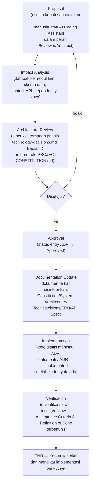

# DECISION LOG
## Platform Web Real Estate Agency

> Dokumen ini adalah catatan resmi seluruh keputusan penting proyek — teknis maupun non-teknis — beserta alasan di baliknya. Menjadi referensi wajib bagi seluruh AI Coding Assistant (Claude, Bolt.new, ChatGPT, Cursor) dan developer manusia sebelum melakukan implementasi, maintenance, atau refactor.

---

# 1. Document Information

| Field | Value |
|---|---|
| **Document Name** | Decision Log — Platform Web Real Estate Agency |
| **Version** | 1.0 |
| **Status** | Living Document — BERLAKU sejak dibuat, diperbarui berkelanjutan sepanjang lifecycle proyek |
| **Last Updated** | 27 Juli 2026 (penambahan ADR-038 — sinkronisasi keputusan Backend Architecture dari `architecture-decision-records.md` ADR-001) |
| **Owner** | Principal Software Architect / Technical Lead (nama individu penanggung jawab belum ditetapkan — konsisten dengan catatan terbuka di `technology-decisions.md` Bagian 1) |
| **Related Documents** | `PROJECT-CONSTITUTION.md`, `SYSTEM-ARCHITECTURE.md`, `technology-decisions.md`, `dependency-manifest.md`, `AI-DEVELOPMENT-BLUEPRINT.md` (versi aktif), `AI-CONTEXT-PACK.md`, `DEVELOPMENT-ROADMAP.md`, `TASK-TEMPLATE.md`, `CURRENT-PROJECT-STATE.md`, `CHANGELOG.md`, dan dokumen sumber v1.1 (PRD/ERD/ERD Diagram/API Specification/User Flow/SEO Analytics Specification) |

**Kedudukan dokumen dalam hierarki governance:** Decision Log **tidak menggantikan** dokumen manapun di atas — fungsinya adalah menjelaskan **mengapa** sebuah keputusan yang tercatat di dokumen-dokumen tersebut diambil, kapan, dan apa alternatif yang dipertimbangkan. Jika `PROJECT-CONSTITUTION.md` menyatakan sesuatu "final" tanpa penjelasan alasan, Decision Log inilah tempat alasan tsb dicatat lengkap.

> **Catatan status keputusan vs status dokumen sumber:** Sebagian keputusan di Bagian 5 diambil dari `technology-decisions.md`, yang statusnya sendiri masih **"Draft — menunggu review & pengesahan tim"**. Decision Log ini tetap mencatatnya dengan status **Approved** (bukan Proposed) karena dokumen sumber tsb secara eksplisit menyebut stack-nya sebagai *"keputusan resmi dan final"* yang mengikat implementasi — namun pengesahan organisasi formal (nama individu/komite yang menandatangani) belum terjadi. Ini dicatat sebagai item tersendiri di **Open Decisions** (Bagian 11).

---

# 2. Cara Menggunakan Decision Log

1. **Setiap keputusan baru wajib ditambahkan sebagai entry baru** (`ADR-XXX` berikutnya secara berurutan) — tidak pernah disisipkan ke nomor yang sudah dipakai.
2. **Entry lama tidak boleh dihapus atau ditulis ulang isinya**, apa pun yang terjadi kemudian. Sejarah keputusan (termasuk yang sudah usang) adalah bagian dari nilai dokumen ini.
3. **Jika sebuah keputusan berubah**, buat **entry ADR baru** yang secara eksplisit menyebutkan `ADR` mana yang digantikannya di field *Related Documents*/*Future Review* — lalu ubah status entry lama menjadi `Replaced` (lihat Bagian 3). Jangan pernah mengedit isi keputusan lama seolah-olah itu keputusan awal.
4. **Selalu referensikan dokumen yang berkaitan** — setiap entry wajib menyebut dokumen sumber mana yang mencatat/menerapkan keputusan tsb (`PROJECT-CONSTITUTION.md`, `SYSTEM-ARCHITECTURE.md`, `technology-decisions.md`, ERD, API Specification, dll.) sehingga pembaca dapat menelusuri implementasi nyatanya.
5. **AI Coding Assistant wajib membaca Decision Log ini sebelum mengambil pendekatan teknis apa pun** yang berpotensi tumpang tindih dengan keputusan yang sudah tercatat (lihat Bagian 9).
6. Dokumen ini **tidak memutuskan sendiri** pertentangan yang ditemukan antar dokumen sumber — pertentangan semacam itu dicatat di **Open Decisions** (Bagian 11), menunggu keputusan eksplisit manusia.

---

# 3. Decision Status

| Status | Arti |
|---|---|
| **Proposed** | Keputusan diusulkan/dipertimbangkan, namun belum direview secara arsitektural dan belum mengikat implementasi. AI/developer **tidak boleh** mengimplementasikan sesuatu hanya berdasarkan entry berstatus ini tanpa konfirmasi lebih lanjut. |
| **Approved** | Keputusan sudah disetujui secara arsitektural dan **mengikat** untuk implementasi berikutnya, tetapi **belum tentu sudah ada di kode** (proyek saat ini masih Pra-Development — lihat `CURRENT-PROJECT-STATE.md`). Ini adalah status "siap dieksekusi". |
| **Implemented** | Keputusan sudah disetujui **dan** sudah benar-benar ada di kode/skema/infrastruktur nyata, dapat diverifikasi di repository/lingkungan yang berjalan. |
| **Deprecated** | Keputusan pernah berlaku dan mungkin masih ada sisa implementasinya di kode, namun **tidak lagi direkomendasikan** untuk dipakai pada kode baru — belum tentu sudah sepenuhnya digantikan. |
| **Replaced** | Keputusan telah **sepenuhnya digantikan** oleh keputusan lain yang tercatat sebagai entry ADR baru — entry ini dipertahankan sebagai sejarah, bukan dihapus. |

---

# 4. Decision Entry Template

Template baku untuk setiap entry baru di Decision Log:

```markdown
## ADR-XXX — <Decision Title>

**Date:** <YYYY-MM-DD>
**Status:** Proposed | Approved | Implemented | Deprecated | Replaced
**Category:** <lihat Bagian 6 — satu atau lebih kategori>
**Related Documents:** <dokumen sumber yang mencatat/menerapkan keputusan ini>

### Problem
<Masalah/kebutuhan apa yang mendorong perlunya keputusan ini>

### Decision
<Keputusan yang diambil, dinyatakan tegas dan tidak ambigu>

### Reason
<Alasan keputusan ini diambil, dikaitkan ke prinsip/kriteria yang relevan>

### Alternatives Considered
<Opsi lain yang dipertimbangkan dan mengapa tidak dipilih>

### Consequences
<Dampak positif maupun trade-off yang harus diterima akibat keputusan ini>

### Implementation Notes
<Catatan teknis praktis untuk implementasi — pola integrasi, batasan, hal yang perlu diperhatikan AI/developer>

### Future Review
<Kondisi yang dapat memicu keputusan ini ditinjau ulang di masa depan>
```

---

# 5. Initial Decisions

> Seluruh entry di bagian ini mencatat keputusan yang **sudah diambil** berdasarkan dokumen yang telah diupload (`PROJECT-CONSTITUTION.md`, `SYSTEM-ARCHITECTURE.md`, `technology-decisions.md`, `dependency-manifest.md`, dan dokumen sumber v1.1). Status **Approved** berarti mengikat untuk implementasi berikutnya — lihat catatan status di Bagian 1.

## ADR-001 — Next.js (App Router) sebagai Frontend Framework

**Date:** 2026-07-26
**Status:** Approved
**Category:** Architecture, Frontend
**Related Documents:** `PROJECT-CONSTITUTION.md` Bagian 4 & Riwayat Keputusan Arsitektur #6, `SYSTEM-ARCHITECTURE.md` Bagian 4, `technology-decisions.md` 4.1, `SEO-Analytics-Specification-v1.1.md` §1.1

### Problem
Seluruh halaman publik (homepage, search, detail listing, profil agen, detail proyek developer) **wajib** SSR/SSG/ISR agar terindeks mesin pencari secepat dan seakurat mungkin sejak hari pertama rilis — keputusan rendering ini mahal diubah setelah traffic organik terbentuk.

### Decision
Menggunakan **Next.js dengan App Router** sebagai satu-satunya framework frontend, dengan Server Components untuk halaman publik dan Route Handlers sebagai kandidat BFF.

### Reason
Satu-satunya pilihan arus utama yang memenuhi seluruh syarat SSR/SSG/ISR wajib sekaligus mendukung ekosistem React penuh dan integrasi native dengan Vercel.

### Alternatives Considered
- **Remix** — ekosistem lebih kecil, dukungan Vercel-native lebih lemah.
- **Astro** — kurang cocok untuk aplikasi interaktif kompleks (dashboard/admin CSR).
- **SPA React murni (Vite) + backend terpisah** — gagal memenuhi syarat SSR wajib tanpa menambah kompleksitas prerendering terpisah.

### Consequences
- Kurva belajar App Router (Server Components, model caching) perlu dipahami tim.
- Strategi caching (`fetch` cache directives) butuh kedisiplinan agar tidak salah men-cache data privat.
- Membuka jalan integrasi native dengan Vercel (lihat ADR-008).

### Implementation Notes
Route group `(public)` wajib Server Component untuk data-fetching utama; `(dashboard)`/`(admin)` CSR dengan `noindex, nofollow`. Jangan membuat halaman publik baru sebagai client component murni dengan `useEffect`+`fetch` sebagai sumber data utama.

### Future Review
Jika Next.js mengubah model rendering/caching secara fundamental di versi mayor mendatang, atau jika kebutuhan mobile-native (lihat Bagian 10) mendorong pemisahan backend penuh.

---

## ADR-002 — TypeScript sebagai Bahasa Utama

**Date:** 2026-07-26
**Status:** Approved
**Category:** Architecture
**Related Documents:** `PROJECT-CONSTITUTION.md` Bagian 6, `technology-decisions.md` 4.2

### Problem
Proyek membutuhkan satu sumber kebenaran tipe data (`packages/shared-types`) yang konsisten di frontend & backend sekaligus, untuk skema RBAC/ownership yang kompleks dan rawan bug jika tidak bertipe statis.

### Decision
Seluruh codebase (frontend, Route Handlers, skema validasi, shared types) ditulis dalam **TypeScript** dengan `strict: true`, tanpa `any` implisit.

### Reason
Deteksi error saat compile-time, autocomplete AI/IDE jauh lebih akurat, refactor besar lebih aman — prasyarat mutlak untuk prinsip *Single Source of Truth*.

### Alternatives Considered
- **JavaScript murni** — ditolak karena tidak mendukung Single Source of Truth tipe data lintas layer dan risiko bug runtime jauh lebih tinggi.

### Consequences
Build time lebih lambat dibanding JS murni; butuh disiplin tim agar tidak memakai `any`/`// @ts-ignore` untuk menutupi masalah tipe.

### Implementation Notes
`strict: true` wajib di seluruh `tsconfig.json`. AI dilarang menonaktifkan strict mode demi "membuat kode jalan".

### Future Review
Tidak ada pemicu peninjauan ulang yang diantisipasi — ini keputusan fondasi jangka panjang.

---

## ADR-003 — Supabase sebagai Backend-as-a-Service

**Date:** 2026-07-26
**Status:** Approved
**Category:** Infrastructure, Backend
**Related Documents:** `PROJECT-CONSTITUTION.md` Bagian 4 & 12, `technology-decisions.md` 4.6

### Problem
Proyek membutuhkan Auth + Storage + database relasional + Row Level Security tanpa membangun ulang seluruhnya dari nol, dengan tim kecil dan target MVP cepat.

### Decision
Menggunakan **Supabase** sebagai platform backend-as-a-service (Postgres, Auth, Storage, RLS, Edge Functions).

### Reason
Memberi Auth+Storage+RLS siap pakai sekaligus database relasional penuh yang dibutuhkan skema ERD kaya relasi (37+ entitas, FK/ENUM/UNIQUE composite) — mengurangi jumlah vendor yang perlu dikelola tim kecil.

### Alternatives Considered
- **Firebase (Firestore/NoSQL)** — tidak cocok skema relasional ketat proyek.
- **Backend custom (NestJS/Express + Postgres terkelola sendiri)** — menambah beban operasional yang bertentangan dengan prinsip Simplicity & Cost Efficiency di tahap MVP.

### Consequences
Vendor lock-in relatif terhadap konvensi Supabase; skala sangat besar mungkin perlu strategi tambahan (read replica/sharding) di fase lanjutan; RLS policy kompleks butuh kedisiplinan penulisan agar tidak membocorkan data.

### Implementation Notes
Wajib dua lapis pertahanan: RBAC middleware aplikasi **dan** RLS (lihat ADR-011). Service role key hanya server-side.

### Future Review
Jika volume data/traffic melampaui kapasitas single-instance Postgres Supabase secara signifikan — evaluasi read replica/sharding sebagai keputusan arsitektur terpisah.

---

## ADR-004 — PostgreSQL sebagai Database

**Date:** 2026-07-26
**Status:** Approved
**Category:** Database
**Related Documents:** `PROJECT-CONSTITUTION.md` Bagian 4, `technology-decisions.md` 4.7, `ERD-Skema-Database-Real-Estate-Agency-v1.1.md`

### Problem
Skema ERD proyek memakai relasi ketat (FK, ENUM, UNIQUE composite, cascading wilayah) yang menjadi tulang punggung RBAC dan ownership hard rule.

### Decision
Menggunakan **PostgreSQL** (di-host via Supabase) sebagai database relasional utama.

### Reason
ACID compliance, indexing kaya (composite, trigram/full-text), ekosistem migration/backup matang — cocok untuk relasi ketat yang dibutuhkan skema.

### Alternatives Considered
- **MongoDB/NoSQL document store** — tidak cocok kebutuhan relasi ketat & constraint yang menjadi tulang punggung RBAC/ownership.

### Consequences
Scaling horizontal butuh strategi eksplisit (partitioning/sharding) jika volume tumbuh sangat besar — dicatat sebagai keputusan arsitektur terpisah di masa depan.

### Implementation Notes
Migration murni SQL via Supabase CLI, disimpan di repo, tidak diedit langsung lewat Supabase Studio di production (lihat ADR-014).

### Future Review
Jika kebutuhan multi-tenant/multi-region (lihat Bagian 10) memerlukan penyesuaian skema besar.

---

## ADR-005 — Supabase Auth untuk Authentication

**Date:** 2026-07-26
**Status:** Approved
**Category:** Authentication
**Related Documents:** `PROJECT-CONSTITUTION.md` Bagian 10, `technology-decisions.md` 4.8, `API-Specification-v1.1.md` §0.1 & §1.1

### Problem
Dibutuhkan mekanisme login (email/password, OTP, Google OAuth2) tanpa membangun ulang dari nol, namun endpoint lain tidak boleh terikat pada metode login spesifik.

### Decision
Menggunakan **Supabase Auth**, dibungkus **JWT internal platform** — seluruh layer di luar Auth hanya mengenal JWT ini, bukan metode login aslinya.

### Reason
OTP & OAuth2 siap pakai, terintegrasi rapat dengan RLS Supabase (`auth.uid()`), tanpa menambah vendor Auth terpisah.

### Alternatives Considered
- **Auth0, Clerk** — menambah vendor terpisah dari database, biaya & kompleksitas tambahan.
- **NextAuth.js/Auth.js custom** — tidak seintegrasi Supabase Auth dengan RLS Postgres yang sudah dipilih.

### Consequences
Role/permission aplikasi (RBAC kustom 8 role) tidak sepenuhnya native di Supabase Auth — wajib tetap dikelola di tabel `roles`/`role_permissions` aplikasi sendiri (lihat ADR-011).

### Implementation Notes
Verifikasi `id_token` Google OAuth wajib server-side dengan Google Auth Library resmi. Role tidak boleh disimpan sebagai satu-satunya sumber kebenaran di token/metadata Supabase.

### Future Review
Tidak ada pemicu spesifik diantisipasi kecuali kebutuhan SSO enterprise di masa depan.

---

## ADR-006 — RLS + RBAC Kustom Aplikasi untuk Authorization

**Date:** 2026-07-26
**Status:** Approved
**Category:** Authorization, Security
**Related Documents:** `PROJECT-CONSTITUTION.md` Bagian 11 & 20 poin 2, `technology-decisions.md` 4.9, `ERD-Skema-Database-Real-Estate-Agency-v1.1.md` §2.28–2.30

### Problem
Sistem membutuhkan kontrol akses granular untuk 8 role dengan hard rule ownership (`agent_id`) yang tidak boleh bocor lintas agen, bahkan jika satu lapisan pertahanan gagal.

### Decision
Menerapkan **dua lapis pertahanan**: RBAC kustom aplikasi (`roles`/`permissions`/`role_permissions`, model `granted_scope`: `own`/`all`/`none`) sebagai lapisan pertama, dan **Row Level Security (RLS)** Supabase sebagai lapisan kedua.

### Reason
Satu lapisan gagal (mis. bug middleware) tidak langsung membocorkan seluruh data karena RLS tetap menjaring di level database.

### Alternatives Considered
- **RBAC aplikasi saja tanpa RLS** — ditolak karena bertentangan langsung dengan hard rule keamanan proyek (dua lapisan wajib).

### Consequences
Kompleksitas ganda — setiap perubahan skema permission harus disinkronkan hati-hati di kedua lapisan.

### Implementation Notes
Superadmin selalu bypass (short-circuit); Manager selalu `granted_scope = 'all'` (global, tanpa mode scoped tim/wilayah — keputusan final, lihat ADR-024). `granted_scope` diterapkan di layer service/repository, bukan controller.

### Future Review
Jika kebutuhan bisnis "Manager per wilayah" benar-benar muncul di masa depan — akan menjadi ADR baru yang mengganti sebagian ADR-024, bukan menambal diam-diam.

---

## ADR-007 — Supabase Storage untuk File Storage

**Date:** 2026-07-26
**Status:** Approved
**Category:** Infrastructure, Security
**Related Documents:** `PROJECT-CONSTITUTION.md` Bagian 12 & 16, `technology-decisions.md` 4.10

### Problem
Dibutuhkan penyimpanan foto/video listing (publik) dan dokumen legalitas agen (privat, sensitif) dengan kontrol akses yang terintegrasi dengan Auth/RLS.

### Decision
Menggunakan **Supabase Storage** dengan bucket terpisah tegas: publik (`listing-photos`, `listing-videos`, `developer-project-media`) vs privat (`agent-verification-documents`).

### Reason
Terintegrasi langsung dengan Supabase Auth/RLS untuk kontrol akses signed URL, mengurangi vendor tambahan di tahap MVP.

### Alternatives Considered
- **Cloudinary, ImageKit, AWS S3+CloudFront** — dicatat sebagai evaluasi fase lanjutan (Bagian 10) jika kebutuhan transformasi gambar (resize dinamis multi-varian, video streaming) melampaui kapasitas Supabase Storage.

### Consequences
Transformasi gambar (resize/WebP/AVIF) tidak sekaya CDN gambar khusus — dikompensasi dengan kompresi client-side (`browser-image-compression`, lihat ADR-027).

### Implementation Notes
Dokumen legalitas tidak pernah lewat CDN publik; akses hanya via signed URL berumur pendek untuk role `superadmin`/`manager`/`admin`.

### Future Review
Jika kebutuhan transformasi gambar/video bertumbuh kompleks — evaluasi Cloudinary/ImageKit sebagai lapisan tambahan (bukan pengganti).

---

## ADR-008 — Vercel sebagai Hosting/Deployment

**Date:** 2026-07-27
**Status:** Approved
**Category:** Deployment, Infrastructure
**Related Documents:** `SYSTEM-ARCHITECTURE.md` Bagian 4 & 18, `technology-decisions.md` 4.11

### Problem
Dibutuhkan platform hosting yang mendukung penuh fitur Next.js App Router (ISR, Edge Middleware, Image Optimization) tanpa konfigurasi tambahan, dengan alur deploy yang cepat untuk tim kecil.

### Decision
Menggunakan **Vercel** sebagai platform hosting & deployment aplikasi Next.js.

### Reason
Kombinasi Next.js + Vercel adalah pasangan native (pembuat framework yang sama) — zero-config deploy, preview deployment per PR, edge caching bawaan mendukung target TTFB < 600ms.

### Alternatives Considered
- **Self-hosted (Docker+VPS/Kubernetes)** — beban operasional DevOps tidak sepadan untuk tim kecil di tahap MVP.
- **Netlify, AWS Amplify** — dukungan fitur App Router terbaru kurang seketat Vercel sebagai pembuat framework.

### Consequences
Model harga berbasis fungsi serverless/edge dapat signifikan pada traffic sangat tinggi — perlu dipantau seiring pertumbuhan.

### Implementation Notes
Deployment pipeline: GitHub → Vercel. Environment variables dikelola terpisah per environment (preview vs production) di dashboard Vercel, tidak pernah di-commit ke repo.

> **Catatan governance:** keputusan ini **belum tercatat formal** di `PROJECT-CONSTITUTION.md` (baru ada di `SYSTEM-ARCHITECTURE.md`/`technology-decisions.md`) — lihat Open Decisions Bagian 11 poin 3.

### Future Review
Jika biaya serverless/edge Vercel menjadi tidak proporsional terhadap traffic aktual di fase lanjutan.

---

## ADR-009 — GitHub sebagai Repository & CI/CD

**Date:** 2026-07-27
**Status:** Approved
**Category:** Deployment, Infrastructure
**Related Documents:** `technology-decisions.md` 4.12–4.13, `PROJECT-CONSTITUTION.md` Bagian 21

### Problem
Dibutuhkan version control dengan integrasi native ke hosting (Vercel) dan CI/CD yang matang.

### Decision
Menggunakan **GitHub** sebagai repository, dengan **GitHub Actions** untuk CI (lint, type-check, test, migration check) dan integrasi otomatis ke Vercel untuk deployment.

### Reason
Integrasi native dengan Vercel (auto-deploy per push/PR) dan ekosistem terbesar untuk code review/Actions/integrasi pihak ketiga (Sentry, dll).

### Alternatives Considered
- **GitLab, Bitbucket** — tidak memberi keuntungan tambahan dibanding GitHub untuk kombinasi stack ini, sementara integrasi Vercel paling matang lewat GitHub.

### Consequences
Tidak relevan untuk tim yang sudah terkunci di platform Git lain — tidak berlaku di proyek ini.

### Implementation Notes
Branch protection + status check (lint/type-check/test/migration) wajib lolos sebelum merge ke `main`. Commit message mengikuti Conventional Commits.

### Future Review
Tidak ada pemicu spesifik diantisipasi.

---

## ADR-010 — Resend untuk Transactional Email

**Date:** 2026-07-27
**Status:** Approved
**Category:** Backend
**Related Documents:** `technology-decisions.md` 4.14, `SYSTEM-ARCHITECTURE.md` Bagian 23 poin 10

### Problem
Dibutuhkan pengiriman email transaksional (OTP registrasi, notifikasi status approval, reminder) — provider belum ditetapkan eksplisit di dokumen sumber v1.1.

### Decision
Menggunakan **Resend** sebagai provider transactional email, dipasangkan dengan **React Email** untuk template berbasis komponen React.

### Reason
Developer experience TypeScript/React paling selaras dengan stack Next.js yang sudah dipilih; deliverability baik; dashboard log pengiriman untuk debugging.

### Alternatives Considered
- **SendGrid, Postmark** — valid tapi DX TypeScript-nya dinilai kurang seselaras Resend.
- **Amazon SES** — butuh konfigurasi infrastruktur tambahan (domain warm-up, DKIM manual) yang lebih berat untuk tim kecil.

### Consequences
Harga per volume email perlu dipantau seiring pertumbuhan basis pengguna (agen + buyer).

### Implementation Notes
Dipakai untuk OTP (Modul 1) & notifikasi status (Modul 8) — bukan untuk marketing/bulk email. Jangan mengirim data sensitif (`net_income`, dokumen legalitas) sebagai lampiran/isi email.

### Future Review
Jika kebutuhan volume email melonjak signifikan (mis. campaign marketing skala besar) — evaluasi ulang model harga.

---

## ADR-011 — Sentry untuk Monitoring & Error Tracking

**Date:** 2026-07-27
**Status:** Approved
**Category:** Monitoring
**Related Documents:** `technology-decisions.md` 4.15, `SYSTEM-ARCHITECTURE.md` Bagian 23 poin 11

### Problem
Dibutuhkan error tracking & performance monitoring untuk frontend (Next.js) dan Route Handlers — tool belum ditetapkan di dokumen sumber v1.1.

### Decision
Menggunakan **Sentry** (`@sentry/nextjs`) sebagai tool monitoring resmi.

### Reason
SDK resmi terintegrasi rapat dengan App Router (server & client components, edge runtime); source map otomatis untuk stack trace production yang terbaca; performance tracing untuk mendeteksi regresi Core Web Vitals/TTFB.

### Alternatives Considered
- **Datadog, self-hosted (Grafana+Loki)** — jauh lebih kompleks & mahal untuk kebutuhan MVP.
- **LogRocket** — lebih fokus session replay dibanding error/performance tracing.

### Consequences
Volume error/tracing tinggi dapat memakan kuota paket berbayar — perlu sampling rate dikonfigurasi wajar.

### Implementation Notes
`request_id`/`correlation_id` error backend wajib konsisten dengan yang dikembalikan ke client. Jangan pernah mengirim data sensitif (`net_income`, KTP/NPWP, token JWT penuh) ke Sentry breadcrumb/context.

### Future Review
Tidak ada pemicu spesifik diantisipasi.

---

## ADR-012 — Tailwind CSS sebagai CSS Framework

**Date:** 2026-07-26
**Status:** Approved
**Category:** UI/UX
**Related Documents:** `PROJECT-CONSTITUTION.md` Bagian 4, `technology-decisions.md` 4.4

### Problem
Dibutuhkan pendekatan styling yang mendukung Core Web Vitals rendah-JS (tanpa CSS-in-JS runtime) dan desain sistem yang konsisten & dapat diaudit.

### Decision
Menggunakan **Tailwind CSS v4** (CSS-first configuration) sebagai satu-satunya pendekatan styling.

### Reason
Tidak ada beban JS runtime tambahan (bertentangan dengan CSS-in-JS); build sangat cepat; ukuran CSS akhir kecil karena purging otomatis.

### Alternatives Considered
- **CSS Modules murni** — tidak menyediakan sistem desain token yang konsisten out-of-the-box seperti Tailwind+shadcn/ui.
- **styled-components/Emotion (CSS-in-JS)** — menambah beban JS di client, bertentangan prinsip performance.

### Consequences
Markup dapat terlihat padat kelas utilitas; migrasi v3→v4 (jika terjadi) memerlukan penyesuaian variabel warna (HSL→OKLCH) — tidak relevan karena proyek diinisialisasi langsung di v4.

### Implementation Notes
Jangan menambahkan library CSS-in-JS sebagai "pelengkap" — seluruh styling baru wajib memakai kelas Tailwind/komponen shadcn/ui yang sudah ada.

### Future Review
Tidak ada pemicu spesifik diantisipasi.

---

## ADR-013 — shadcn/ui sebagai UI Component Library

**Date:** 2026-07-26
**Status:** Approved
**Category:** UI/UX
**Related Documents:** `PROJECT-CONSTITUTION.md` Bagian 4, `technology-decisions.md` 4.3

### Problem
Dibutuhkan komponen UI headless yang dapat diaudit dan dikustomisasi penuh tanpa "fighting the library" bergaya desain vendor.

### Decision
Menggunakan **shadcn/ui** (berbasis Radix UI primitives, digenerate langsung ke repo) sebagai component library.

### Reason
Kode komponen sepenuhnya berada di repo (`components/ui/`) sehingga dapat dikustomisasi bebas; aksesibilitas bawaan dari Radix UI; kompatibel penuh Tailwind v4 & React 19.

### Alternatives Considered
- **Material UI (MUI), Ant Design** — membawa opini desain visual kuat (sulit dikustomisasi total), bundel lebih berat — **eksplisit dilarang** (lihat Architecture Constraints).
- **Chakra UI** — valid tapi tidak dipilih untuk menghindari dua sistem desain berbeda filosofi tanpa kebutuhan jelas.

### Consequences
Bukan package versi tunggal yang di-`npm update` — update komponen upstream ditarik manual via CLI; tim wajib disiplin tidak memodifikasi struktur dasar komponen secara sembarangan.

### Implementation Notes
Selalu cek `components/ui/` sebelum membuat komponen custom baru yang fungsinya serupa. Bergantung pada `@radix-ui/*` per komponen, `class-variance-authority`, `clsx`, `tailwind-merge`.

### Future Review
Jika shadcn/ui menghentikan dukungan versi Tailwind/React yang dipakai proyek.

---

## ADR-014 — Lucide React sebagai Icon Set

**Date:** 2026-07-26
**Status:** Approved
**Category:** UI/UX
**Related Documents:** `technology-decisions.md` 4.5

### Problem
Dibutuhkan set ikon SVG yang ringan dan konsisten secara visual di seluruh UI.

### Decision
Menggunakan **Lucide React**, diimpor per-ikon.

### Reason
Ikon default resmi ekosistem shadcn/ui, tree-shakeable per-ikon, aktif dipelihara, kompatibel React Server/Client Components.

### Alternatives Considered
- **React Icons** — menggabungkan banyak set berbeda gaya dalam satu dependency besar (risiko inkonsistensi visual & bundle lebih besar).
- **Heroicons** — kurang terintegrasi rapat dengan shadcn/ui dibanding Lucide.

### Consequences
Gaya ikon tunggal (line icons) — jika kebutuhan desain memerlukan gaya lain, perlu keputusan tambahan.

### Implementation Notes
Import per-ikon (`import { Home } from "lucide-react"`). Jangan mencampur set ikon lain dalam satu halaman/komponen.

### Future Review
Jika kebutuhan desain memerlukan gaya ikon berbeda (filled/duotone) secara signifikan.

---

## ADR-015 — TanStack Query untuk Server State Management

**Date:** 2026-07-27
**Status:** Approved
**Category:** State Management
**Related Documents:** `technology-decisions.md` 4.16, `dependency-manifest.md`

### Problem
Dashboard/admin panel (CSR) membutuhkan pengelolaan cache server-state (loading/error/stale) tanpa reinventing logic tsb secara manual.

### Decision
Menggunakan **TanStack Query** sebagai satu-satunya library server-state, khusus di route group `(dashboard)`/`(admin)`.

### Reason
Automatic refetching, cache invalidation granular, devtools bawaan; mengurangi boilerplate `useEffect`+`useState` manual.

### Alternatives Considered
- **SWR** — **eksplisit dilarang** (Architecture Constraints) untuk menghindari dua library server-state berfungsi sama berjalan berdampingan; TanStack Query dipilih karena fitur mutation & devtools lebih lengkap untuk CRUD dashboard kompleks.

### Consequences
Konsep cache key & invalidation butuh pemahaman tim agar tidak terjadi stale data yang tidak disadari.

### Implementation Notes
Halaman publik `(public)` tetap mengandalkan Server Component fetch, **bukan** TanStack Query, untuk menjaga SSR. Jangan mencampur pola fetch manual dengan TanStack Query dalam komponen yang sama.

> **Catatan governance:** `SYSTEM-ARCHITECTURE.md` Bagian 10 masih memakai frasa lama "React Query/SWR — pilih satu" — lihat Open Decisions Bagian 11 poin 2 untuk sinkronisasi.

### Future Review
Tidak ada pemicu spesifik diantisipasi.

---

## ADR-016 — Zustand untuk UI State Management

**Date:** 2026-07-27
**Status:** Approved
**Category:** State Management
**Related Documents:** `technology-decisions.md` 4.17

### Problem
Dibutuhkan state management untuk state UI lokal/lintas komponen yang bukan server-state (wizard form multi-step, filter UI sementara, modal global).

### Decision
Menggunakan **Zustand**, satu store per domain UI (bukan satu store raksasa global).

### Reason
API minimal tanpa boilerplate reducer/action/dispatch, ukuran bundle sangat kecil, hanya me-render ulang komponen yang subscribe ke slice terkait.

### Alternatives Considered
- **Redux (Toolkit)** — **eksplisit dilarang** (Architecture Constraints), boilerplate berlebihan untuk kebutuhan UI state proyek ini.
- **Context API murni** — tidak dioptimasi untuk update frekuensi tinggi.
- **Jotai/Recoil** — valid tapi tidak dipilih agar tidak menambah library state tanpa kebutuhan jelas di luar yang sudah dipilih.

### Consequences
Tanpa disiplin tim, store bisa jadi "keranjang sampah" state acak.

### Implementation Notes
Server state **tidak pernah** disimpan di Zustand — itu domain TanStack Query. Sebelum membuat store baru, pastikan itu benar-benar UI state.

### Future Review
Tidak ada pemicu spesifik diantisipasi.

---

## ADR-017 — React Hook Form untuk Form Management

**Date:** 2026-07-27
**Status:** Approved
**Category:** Frontend, Validation
**Related Documents:** `technology-decisions.md` 4.18

### Problem
Dibutuhkan manajemen state form performa tinggi untuk form kompleks (listing multi-step, upload multi-foto, field lokasi cascading, kalkulator DBR).

### Decision
Menggunakan **React Hook Form**, dipasangkan dengan `@hookform/resolvers` + Zod (lihat ADR-018).

### Reason
Performa tinggi (uncontrolled inputs, minim re-render), mendukung nested fields/field array yang dibutuhkan form listing.

### Alternatives Considered
- **Formik** — **eksplisit dilarang** (Architecture Constraints), performa re-render lebih rendah pada form besar/kompleks.

### Consequences
Pola uncontrolled berbeda dari form berbasis state React biasa — perlu penyesuaian pola pikir tim.

### Implementation Notes
Skema validasi Zod ditulis sekali di `lib/validation`/`shared-types`, dipakai sebagai resolver — jangan duplikasi aturan validasi manual di komponen form.

### Future Review
Tidak ada pemicu spesifik diantisipasi.

---

## ADR-018 — Zod untuk Validation

**Date:** 2026-07-27
**Status:** Approved
**Category:** Validation
**Related Documents:** `PROJECT-CONSTITUTION.md` Bagian 14, `technology-decisions.md` 4.19

### Problem
Dibutuhkan satu skema validasi tunggal yang dipakai baik di client (real-time form) maupun server (validasi ulang sebelum tulis DB), untuk mencegah drift antara tipe TypeScript manual dan aturan validasi runtime.

### Decision
Menggunakan **Zod** sebagai satu-satunya skema validasi, dengan `z.infer` untuk menghasilkan tipe statis otomatis.

### Reason
TypeScript-first, memenuhi prinsip Single Source of Truth validasi.

### Alternatives Considered
- **Yup, Joi** — tidak memiliki inferensi tipe TypeScript native sekuat Zod, tetap butuh definisi tipe terpisah yang berisiko drift.

### Consequences
Skema kompleks (validasi kondisional lintas field, mis. konversi tenor tahun→bulan) butuh `.refine()`/`.transform()` yang perlu didokumentasikan.

### Implementation Notes
Backend tidak pernah mempercayai validasi frontend — validasi ulang wajib untuk semua endpoint mutating. Field wajib PRD Modul 3.2 divalidasi sebelum status listing berubah ke `pending_review`.

### Future Review
Tidak ada pemicu spesifik diantisipasi.

---

## ADR-019 — Vitest untuk Unit Testing

**Date:** 2026-07-27
**Status:** Approved
**Category:** Testing
**Related Documents:** `technology-decisions.md` 4.20

### Problem
Dibutuhkan unit test untuk business logic (service layer, utility function, skema Zod) dengan kecepatan eksekusi tinggi pada stack Next.js/TypeScript modern.

### Decision
Menggunakan **Vitest** sebagai test runner unit testing.

### Reason
Kompatibel native dengan tooling Vite/Next.js modern, konfigurasi minimal, kecepatan eksekusi tinggi, dukungan native TypeScript/ESM.

### Alternatives Considered
- **Jest** — tetap valid secara fungsional, namun Vitest dipilih untuk performa & kompatibilitas ESM/TypeScript yang lebih mulus — menghindari dua test runner berjalan berdampingan tanpa alasan kuat.

### Consequences
Ekosistem plugin sedikit lebih muda dibanding Jest.

### Implementation Notes
Business logic sensitif (kalkulasi DBR, filter `granted_scope`, ownership check) wajib memiliki unit test eksplisit, dijalankan sebagai CI gate wajib.

### Future Review
Tidak ada pemicu spesifik diantisipasi.

---

## ADR-020 — React Testing Library untuk Component Testing

**Date:** 2026-07-27
**Status:** Approved
**Category:** Testing
**Related Documents:** `technology-decisions.md` 4.21

### Problem
Dibutuhkan pengujian komponen React dari perspektif interaksi pengguna, bukan detail implementasi internal.

### Decision
Menggunakan **React Testing Library**, dipasangkan dengan `@testing-library/jest-dom`.

### Reason
Standar industri, filosofi "test seperti pengguna memakai aplikasi" cocok memverifikasi form/dashboard kompleks; terintegrasi mulus dengan Vitest.

### Alternatives Considered
- **Enzyme** — tidak lagi dipelihara aktif untuk versi React modern (Server Components) — tidak kompatibel App Router.

### Consequences
Tidak menguji end-to-end lintas halaman/navigasi nyata (itu domain Playwright).

### Implementation Notes
Query elemen berdasarkan role/label (`getByRole`), bukan `data-testid` sebagai default pertama, agar turut memverifikasi aksesibilitas.

### Future Review
Tidak ada pemicu spesifik diantisipasi.

---

## ADR-021 — Playwright untuk E2E Testing

**Date:** 2026-07-27
**Status:** Approved
**Category:** Testing
**Related Documents:** `technology-decisions.md` 4.22

### Problem
Dibutuhkan pengujian end-to-end lintas browser untuk alur kritis (registrasi agen, publish listing, submit DBR, moderasi admin), termasuk alur OAuth Google yang lintas origin.

### Decision
Menggunakan **Playwright** sebagai tool E2E testing.

### Reason
Dukungan multi-browser (Chromium, Firefox, WebKit) dalam satu API, auto-wait bawaan mengurangi flaky test, dukungan resmi Next.js/Vercel yang matang, dan performa lebih baik untuk pengujian multi-tab/multi-origin (relevan untuk redirect OAuth Google) dibanding alternatif.

### Alternatives Considered
- **Cypress** — secara historis lebih terbatas pada multi-tab/multi-origin testing dan dukungan WebKit.

### Consequences
Waktu eksekusi E2E lebih lambat dibanding unit test — perlu strategi seleksi alur kritis saja.

### Implementation Notes
Dijalankan terhadap `next build && next start` (bukan `next dev`) di CI agar representatif kondisi production. Prioritaskan cakupan Acceptance Criteria PRD, bukan menduplikasi seluruh unit test di level E2E.

### Future Review
Tidak ada pemicu spesifik diantisipasi.

---

## ADR-022 — Recharts untuk Data Visualization

**Date:** 2026-07-27
**Status:** Approved
**Category:** UI/UX
**Related Documents:** `technology-decisions.md` 4.23

### Problem
Dashboard agen (jumlah lead 7/30 hari) dan dashboard admin (statistik agen/listing/proyek) membutuhkan visualisasi data standar (bar, line, pie).

### Decision
Menggunakan **Recharts** sebagai library chart.

### Reason
Berbasis React/SVG deklaratif (komponen React biasa), dokumentasi baik, cukup untuk kebutuhan chart standar proyek; responsif bawaan (`ResponsiveContainer`).

### Alternatives Considered
- **Chart.js, Victory** — valid namun tidak dipilih untuk menghindari dua library chart tanpa kebutuhan jelas.
- **D3 murni** — lebih fleksibel untuk visualisasi sangat kompleks, namun belum menjadi kebutuhan di scope Fase 1–2.

### Consequences
Untuk visualisasi geospasial lanjutan di masa depan mungkin kurang fleksibel dibanding D3 murni.

### Implementation Notes
Dipakai di Modul 8 (Dashboard) & Modul 9 (Admin Laporan).

### Future Review
Jika kebutuhan visualisasi sangat kompleks/custom muncul di fase lanjutan (mis. peta panas geospasial).

---

## ADR-023 — TanStack Table untuk Data Table

**Date:** 2026-07-27
**Status:** Approved
**Category:** UI/UX
**Related Documents:** `technology-decisions.md` Bagian 3, `dependency-manifest.md`

### Problem
Admin Panel membutuhkan tabel data headless untuk daftar user, listing, dan laporan dengan sorting/filtering/pagination manual (server-side).

### Decision
Menggunakan **TanStack Table** sebagai library tabel.

### Reason
Headless (tidak membawa styling sendiri, cocok dipadukan Tailwind/shadcn/ui), mendukung `manualPagination` untuk query list yang selalu paginated di server.

### Alternatives Considered
Tidak ada alternatif lain yang dicatat eksplisit di dokumen sumber — dipilih sebagai satu-satunya solusi tabel resmi untuk menghindari duplikasi fungsi (Architecture Constraints poin 11).

### Consequences
Butuh effort integrasi manual untuk styling (karena headless) — dikompensasi oleh fleksibilitas penuh dengan Tailwind.

### Implementation Notes
Dipakai di Modul 9 Admin Panel (daftar user, listing, laporan). Jangan menambah library table kedua.

### Future Review
Tidak ada pemicu spesifik diantisipasi.

---

## ADR-024 — dnd-kit untuk Drag & Drop

**Date:** 2026-07-27
**Status:** Approved
**Category:** UI/UX
**Related Documents:** `technology-decisions.md` 4.25, `dependency-manifest.md`

### Problem
Dibutuhkan drag-and-drop untuk reorder foto listing (Modul 3) dan reorder lesson/soal kuis (Modul 4).

### Decision
Menggunakan **dnd-kit** (`@dnd-kit/core` + `@dnd-kit/sortable`).

### Reason
Pengganti resmi `react-beautiful-dnd` yang sudah deprecated; aktif dipelihara, mendukung React modern.

### Alternatives Considered
- **react-beautiful-dnd** — **eksplisit dilarang** (deprecated oleh tim intinya).

### Consequences
Tidak ada trade-off signifikan dicatat di dokumen sumber.

### Implementation Notes
`@dnd-kit/sortable` adalah preset di atas `@dnd-kit/core` — keduanya wajib versi yang saling kompatibel.

### Future Review
Tidak ada pemicu spesifik diantisipasi.

---

## ADR-025 — date-fns untuk Date Utility

**Date:** 2026-07-27
**Status:** Approved
**Category:** Backend, Frontend
**Related Documents:** `technology-decisions.md` 4.26

### Problem
Dibutuhkan manipulasi & formatting tanggal (masa berlaku listing, expiry, jadwal event, tenor DBR) dengan dukungan locale Indonesia.

### Decision
Menggunakan **date-fns** sebagai satu-satunya library utilitas tanggal.

### Reason
Modular (tree-shakeable per fungsi), immutable by design, ukuran bundle jauh lebih kecil dibanding alternatif monolitik, dukungan locale `id`.

### Alternatives Considered
- **Moment.js** — **eksplisit dilarang** (mode maintenance, mutable API rawan bug, ukuran besar).
- **Day.js, Luxon** — valid secara teknis, tidak dipilih agar tidak ada dua library date-utility tumpang tindih.

### Consequences
Penanganan timezone kompleks lintas zona waktu membutuhkan paket pendamping (`date-fns-tz`) jika suatu saat dibutuhkan — belum jadi kebutuhan eksplisit (aplikasi berbasis WIB/lokal Indonesia).

### Implementation Notes
Konversi tenor tahun→bulan (lihat ADR-034) sebaiknya memakai utility murni, bukan objek Date. Impor fungsi spesifik, jangan impor seluruh objek.

### Future Review
Jika kebutuhan multi-timezone muncul (mis. ekspansi platform ke luar WIB).

---

## ADR-026 — pdf-lib untuk PDF Generation

**Date:** 2026-07-27
**Status:** Approved
**Category:** Backend
**Related Documents:** `technology-decisions.md` 4.27

### Problem
Modul 7 (DBR) membutuhkan export hasil simulasi ke PDF sebagai lampiran pengajuan KPR ke bank.

### Decision
Menggunakan **pdf-lib** untuk generate PDF terprogram di server (Route Handler).

### Reason
Library PDF murni JS/TS yang berjalan baik di Node.js tanpa dependency native/binary eksternal — ringan untuk lingkungan serverless (Vercel Functions).

### Alternatives Considered
- **Puppeteer/Playwright (render HTML→PDF)** — jauh lebih berat untuk lingkungan serverless (ukuran binary besar, cold start lambat).
- **jsPDF** — tumpang tindih penuh dengan pdf-lib, ditolak untuk menghindari duplikasi fungsi.

### Consequences
Tidak dirancang untuk "convert HTML ke PDF" — layout kompleks harus disusun manual lewat koordinat teks/gambar.

### Implementation Notes
Data finansial (`net_income`, `existing_installments`) yang masuk PDF tetap tunduk aturan data sensitif — PDF hasil generate tidak boleh disimpan di bucket publik.

### Future Review
Tidak ada pemicu spesifik diantisipasi.

---

## ADR-027 — browser-image-compression untuk Image Compression

**Date:** 2026-07-27
**Status:** Approved
**Category:** Frontend
**Related Documents:** `technology-decisions.md` 4.28

### Problem
Foto listing perlu dikompresi sebelum upload agar tidak membebani bandwidth dan mendukung target LCP.

### Decision
Menggunakan **browser-image-compression** untuk kompresi gambar sisi client sebelum upload ke Supabase Storage.

### Reason
Berjalan di Web Worker (tidak memblokir main thread), mengurangi kebutuhan CDN transformasi pihak ketiga yang berat di server.

### Alternatives Considered
- **Kompresi server-side penuh (Sharp) / CDN transformation sebagai satu-satunya lapisan** — menambah beban proses di serverless function; pendekatan hybrid dipilih agar selaras keputusan tidak menambah vendor CDN gambar terpisah (lihat ADR-007).

### Consequences
Kompresi client bergantung kemampuan device pengguna di lapangan — tetap perlu validasi ulang di server.

### Implementation Notes
Validasi tipe file **wajib** tetap dilakukan di server (magic bytes) — kompresi client bukan pengganti validasi keamanan upload.

### Future Review
Tidak ada pemicu spesifik diantisipasi.

---

## ADR-028 — Google Maps Platform untuk Maps/Geocoding

**Date:** 2026-07-27
**Status:** Approved
**Category:** Backend, Frontend
**Related Documents:** `technology-decisions.md` 4.29, `API-Specification-v1.1.md` §13/§9.1

### Problem
Fitur lokasi listing membutuhkan autocomplete alamat (client-side) serta reverse geocoding & distance matrix (server-side), dengan akurasi data alamat Indonesia yang matang.

### Decision
Menggunakan **Google Maps Platform** sebagai provider Maps/Geocoding.

### Reason
Akurasi data alamat/POI Indonesia yang matang, dokumentasi lengkap, satu vendor untuk seluruh kebutuhan (Autocomplete, Geocoding, Distance Matrix, Places Nearby).

### Alternatives Considered
- **Mapbox** — tetap alternatif valid secara teknis dan sebelumnya dicatat sebagai opsi terbuka di dokumen sumber; tidak dipilih pada iterasi keputusan ini.

### Consequences
Model harga per-request setelah kuota gratis terlampaui — perlu pemisahan tegas client-key (dibatasi domain/referrer, kuota rendah) vs server-key (rahasia, kuota penuh).

### Implementation Notes
Reverse geocoding & Distance Matrix server-side (API key rahasia); Autocomplete client-side (API key dibatasi domain/referrer). Jangan pernah mengekspos `GOOGLE_MAPS_API_KEY_SERVER` ke client. Package wrapper React spesifik (`@vis.gl/react-google-maps` vs `@react-google-maps/api`) belum ditentukan (lihat `dependency-manifest.md` Bagian 9).

> **Catatan governance:** keputusan ini diambil di `technology-decisions.md`, namun dokumen tsb sendiri mencatat perlunya **konfirmasi eksplisit tim bisnis** (implikasi biaya per-request) sebelum disinkronkan sebagai final ke `PROJECT-CONSTITUTION.md`/`API-Specification-v1.1.md`, yang saat ini masih mencatat provider Maps sebagai belum final. Lihat Open Decisions Bagian 11 poin 4.

### Future Review
Menunggu konfirmasi tim bisnis atas implikasi biaya; jika ditolak, ADR ini akan diberi status `Replaced` oleh ADR baru yang menetapkan Mapbox.

---

## ADR-029 — Migration Murni SQL (Tanpa ORM Auto-Sync)

**Date:** 2026-07-26
**Status:** Approved
**Category:** Database, Architecture
**Related Documents:** `PROJECT-CONSTITUTION.md` Bagian 9 & 12, `technology-decisions.md` Bagian 6 poin 14

### Problem
Perubahan skema database yang tidak terkontrol (auto-sync ORM langsung ke production) berisiko tinggi terhadap data production dan sulit di-review/rollback.

### Decision
Seluruh perubahan skema database dikelola lewat **migration file SQL murni bernomor urut** (via Supabase CLI), direview sebelum diterapkan, dan reversible.

### Reason
Perubahan skema harus dapat direview manusia dan memiliki rencana rollback eksplisit — auto-sync ORM menyembunyikan risiko ini.

### Alternatives Considered
- **ORM auto-sync (mis. Prisma `db push` langsung ke production)** — ditolak karena berisiko schema drift tak terkontrol tanpa jejak review.

### Consequences
Setiap perubahan skema butuh langkah eksplisit (menulis migration) — sedikit lebih lambat dibanding auto-sync, namun jauh lebih aman.

### Implementation Notes
Migration disimpan di repo (`/apps/api/migrations` atau folder migration Supabase CLI). Tidak boleh diedit langsung lewat Supabase Studio di environment production.

### Future Review
Tidak ada pemicu spesifik diantisipasi.

---

## ADR-030 — UUID sebagai Primary Key & Soft Delete Wajib

**Date:** 2026-07-25
**Status:** Approved
**Category:** Database
**Related Documents:** `PROJECT-CONSTITUTION.md` Bagian 9, `ERD-Skema-Database-Real-Estate-Agency-v1.1.md`

### Problem
ID auto-increment integer dapat dienumerasi (mis. menebak jumlah listing/agen kompetitor dengan menaikkan angka ID); penghapusan fisik data transaksional berisiko kehilangan jejak audit & nilai SEO.

### Decision
Seluruh tabel memakai **UUID sebagai primary key** (bukan auto-increment), dan **soft delete** (`deleted_at`) wajib untuk `listings`, `users`, `developer_projects` — dilarang `DELETE` fisik dari aplikasi untuk tabel ini.

### Reason
UUID mencegah enumerasi resource kompetitor; soft delete menjaga jejak audit dan memungkinkan pemulihan/redirect SEO (`url_redirects`) untuk listing yang dihapus.

### Alternatives Considered
- **Auto-increment integer + hard delete** — ditolak karena risiko enumerasi & kehilangan data permanen tanpa jejak.

### Consequences
Index UUID sedikit lebih besar dibanding integer; query harus selalu menyertakan filter `deleted_at IS NULL` secara konsisten.

### Implementation Notes
Listing yang dihapus permanen oleh agen/admin tetap wajib menulis `url_redirects` (301) sebelum status akhir diterapkan.

### Future Review
Tidak ada pemicu spesifik diantisipasi.

---

## ADR-031 — Strategi Rendering per Tipe Halaman (SSR/SSG untuk Publik, CSR untuk Privat)

**Date:** 2026-07-25
**Status:** Approved
**Category:** Architecture, Frontend
**Related Documents:** `SEO-Analytics-Specification-v1.1.md` §1.1, `PROJECT-CONSTITUTION.md` Riwayat Keputusan Arsitektur #6

### Problem
Halaman publik harus terindeks Google secepat & seakurat mungkin sejak hari pertama; halaman privat (dashboard, admin, hasil DBR personal) sebaliknya harus **dicegah** dari indeks demi privasi data.

### Decision
- Homepage, Search & Filter, Detail Listing, Profil Publik Agen, Detail Proyek Developer → **SSR atau SSG/ISR**.
- Dashboard Agen, Admin Panel, Kalkulator DBR (hasil personal), Chat → **CSR**, dengan `noindex, nofollow`.
- Halaman statis (Tentang, Privasi, FAQ) → **SSG**.

### Reason
Googlebot harus menerima HTML berisi konten penuh saat request pertama; CSR murni terbukti lambat/tidak konsisten diindeks. Halaman privat sebaliknya wajib dikeluarkan dari indeks.

### Alternatives Considered
Tidak ada alternatif teknis lain yang dipertimbangkan — ini derivatif langsung dari keputusan Next.js App Router (ADR-001) yang memang dipilih untuk memenuhi kebutuhan ini.

### Consequences
Route group harus disiplin dipisah (`(public)` vs `(dashboard)`/`(admin)`) agar aturan ini tidak tercampur.

### Implementation Notes
`(dashboard)` dan `(admin)` layout wajib set meta `robots: { index: false, follow: false }` di level layout, bukan per halaman.

### Future Review
Tidak ada pemicu spesifik diantisipasi — keputusan arsitektur fondasi jangka panjang.

---

## ADR-032 — Model Role: Formalisasi Buyer & Instructor sebagai Role Resmi

**Date:** 2026-07-26
**Status:** Approved
**Category:** Authorization
**Related Documents:** `PROJECT-CONSTITUTION.md` Riwayat Keputusan Arsitektur #1 & #3, `ERD-Skema-Database-Real-Estate-Agency-v1.1.md` §2.28

### Problem
Dokumen v1.0 tidak konsisten: API Specification menyebut role `buyer` sebagai akun terdaftar, namun PRD hanya mengenal "Calon Pembeli" sebagai Guest tanpa akun; `instructor` disebut di PRD Modul 4 namun tidak masuk tabel role formal.

### Decision
Menambahkan **`buyer`** (akun ringan opsional untuk simpan listing/lead & submit review) dan **`instructor`** (role internal terbatas ke Modul 4) sebagai baris resmi di tabel `roles`, sehingga total **8 role**: Superadmin, Manager, Admin, Instructor, Agen, Developer Partner, Buyer, Guest.

### Reason
Menghilangkan ambiguitas lintas dokumen dan memastikan kedua role punya baris `role_permissions` eksplisit, bukan diasumsikan sebagai alias role lain.

### Alternatives Considered
- **Buyer = Agent dengan flag tambahan** — ditolak karena mencampur domain kepemilikan listing dengan domain pencarian, berisiko bug ownership.
- **Instructor = alias Admin** — ditolak karena Instructor tidak boleh punya akses moderasi listing/RBAC.

### Consequences
Migrasi skema `roles` bertambah 2 baris seed; permission matrix perlu didefinisikan eksplisit untuk keduanya sebelum fitur terkait aktif.

### Implementation Notes
`buyer` tidak pernah otomatis mendapat akses ke data Agen/Admin. `instructor` hanya berwenang di Modul 4.

### Future Review
Tidak ada pemicu spesifik diantisipasi.

---

## ADR-033 — Cakupan Akses Manager Selalu Global (Tanpa Mode Scoped Tim/Wilayah)

**Date:** 2026-07-26
**Status:** Approved
**Category:** Authorization
**Related Documents:** `PROJECT-CONSTITUTION.md` Riwayat Keputusan Arsitektur #2, `User-Flow-Real-Estate-Agency-Platform-v1.1.md` Modul 9 & 10.3

### Problem
User Flow v1.0 menyebut Manager "terbatas ke tim/wilayahnya" dengan level izin "Scoped (tim/wilayah)" — level ini tidak pernah ada di skema `granted_scope` (`own`/`all`/`none`), sehingga bertentangan dengan PRD & ERD yang menyatakan Manager selalu global.

### Decision
Manager **selalu** memiliki `granted_scope = 'all'` (global, seluruh agen/listing/wilayah) untuk seluruh modul relevan — **tidak ada** dan tidak akan ada mode "scoped tim/wilayah" pada rilis ini.

### Reason
Mengikuti PRD & ERD sebagai dokumen paling detail dan konsisten dengan skema DB nyata; User Flow yang menyebut pembatasan tim/wilayah dianggap keliru dan telah dikoreksi ke v1.1.

### Alternatives Considered
- **Menambahkan level `scoped` ke `granted_scope`** — ditolak untuk rilis ini karena memerlukan perubahan skema baru (`region_scope` di `role_permissions`) yang belum diminta kebutuhan bisnis konkret.

### Consequences
Jika kebutuhan "Manager per wilayah" muncul di masa depan, ini akan menjadi ADR baru yang secara eksplisit mengganti (Replaced) ADR ini — bukan ditambal diam-diam.

### Implementation Notes
AI Coding Assistant dilarang mengimplementasikan pembatasan tim/wilayah untuk Manager dalam bentuk apa pun tanpa ADR baru yang eksplisit menggantikan ini.

### Future Review
Jika tim bisnis secara eksplisit meminta model "Manager regional" — evaluasi sebagai perubahan skema baru.

---

## ADR-034 — Satuan Tenor DBR Selalu dalam Bulan

**Date:** 2026-07-26
**Status:** Approved
**Category:** Validation, Backend
**Related Documents:** `PROJECT-CONSTITUTION.md` Riwayat Keputusan Arsitektur #4, `ERD-Skema-Database-Real-Estate-Agency-v1.1.md` (`dbr_simulations.tenor_months`), `API-Specification-v1.1.md` Bagian 6

### Problem
PRD/User Flow v1.0 menyebut input "Tenor (tahun)" di beberapa tempat, sementara ERD dan contoh payload API eksplisit memakai satuan bulan (`tenor_months`) — berisiko salah konversi jika tidak ditegaskan satu sumber kebenaran.

### Decision
Kontrak data/API untuk tenor KPR **selalu dalam satuan bulan** (`tenor_months`). UI boleh menampilkan input dalam tahun untuk kenyamanan pengguna, namun **wajib dikonversi ke bulan (tahun × 12) di sisi client** sebelum dikirim ke API.

### Reason
Menghindari ambiguitas satuan yang dapat menyebabkan kesalahan kalkulasi finansial (DBR/anuitas) yang berdampak langsung ke keputusan bisnis pengguna (kelayakan KPR).

### Alternatives Considered
- **API menerima kedua satuan (tahun & bulan)** — ditolak karena menambah kompleksitas validasi dan potensi ambiguitas di sisi konsumen API lain di masa depan.

### Consequences
Titik konversi harus konsisten hanya di satu layer (validasi/transform client) — tidak boleh diduplikasi di tempat lain.

### Implementation Notes
Gunakan utility murni (bukan objek Date) untuk konversi tahun→bulan (lihat ADR-025).

### Future Review
Tidak ada pemicu spesifik diantisipasi.

---

## ADR-035 — Migrasi `developer_projects.city` (Freetext) ke `city_id` (FK)

**Date:** 2026-07-26
**Status:** Approved
**Category:** Database
**Related Documents:** `PROJECT-CONSTITUTION.md` Riwayat Keputusan Arsitektur #5, `ERD-Skema-Database-Real-Estate-Agency-v1.1.md`

### Problem
`developer_projects.city` semula bertipe `VARCHAR` bebas, tidak konsisten dengan `listings.city_id` yang sudah memakai FK ke `ref_cities` — mencegah filter lokasi lintas listing & proyek developer digabung secara konsisten.

### Decision
Migrasi `developer_projects.city` (freetext) menjadi **`developer_projects.city_id`** (FK → `ref_cities`), konsisten dengan pola `listings`.

### Reason
Data lokasi proyek developer dan listing biasa kini dapat difilter/diagregasi bersama di pencarian tanpa mapping string manual di aplikasi.

### Alternatives Considered
- **Mapping string manual di layer aplikasi** — ditolak karena rapuh (typo, variasi penulisan nama kota) dan menambah beban maintenance jangka panjang.

### Consequences
Index tambahan `developer_projects(city_id, status, property_type)` direkomendasikan; endpoint `GET /developer-projects` berubah menerima `city_id`, bukan `city` freetext.

### Implementation Notes
Field lokasi baru di modul manapun wajib mengikuti pola cascading region yang sama — dilarang menambah kolom lokasi freetext baru (kecuali `area_keyword`, maks 20 karakter, pengecualian resmi).

### Future Review
Tidak ada pemicu spesifik diantisipasi.

---

## ADR-036 — Fitur Review/Rating Agen Diaktifkan di Fase 1

**Date:** 2026-07-26
**Status:** Approved
**Category:** Architecture, Database
**Related Documents:** `PROJECT-CONSTITUTION.md` Riwayat Keputusan Arsitektur #7, `ERD-Skema-Database-Real-Estate-Agency-v1.1.md` §2.3b (`agent_reviews`)

### Problem
API Specification v1.0 sudah mendefinisikan endpoint `GET /agents/{id}/reviews` sebagai endpoint hidup, namun status aktivasi fitur ini belum diputuskan di PRD/SEO Spec, dan tidak ada tabel `reviews` di ERD.

### Decision
Fitur review/rating agen **diaktifkan di Fase 1**, dengan tabel baru `agent_reviews` (status `pending`→`approved`/`rejected`, submit oleh Buyer, moderasi oleh Admin/Manager/Superadmin). `aggregateRating` di structured data SEO dihitung on-the-fly, hanya tampil jika ≥1 review `approved`.

### Reason
Menutup kesenjangan antara endpoint yang sudah didefinisikan API Spec dengan ketiadaan skema pendukungnya — mengaktifkan sejak awal juga selaras kebutuhan SEO (`aggregateRating` relevan sejak awal, bukan menyusul).

### Alternatives Considered
- **Endpoint sebagai stub kosong hingga fase lanjutan** — dipertimbangkan namun ditolak karena PRD Modul 2 sudah eksplisit ingin menampilkan reputasi agen sejak awal sebagai nilai jual (transparansi reputasi agen).

### Consequences
Menambah tabel baru (`agent_reviews`) dan alur moderasi baru yang harus diaudit keamanannya (mencegah review palsu/spam) sebelum aktif.

### Implementation Notes
Setiap penambahan fitur user-generated content baru mengikuti pola moderasi `agent_reviews` ini sebagai referensi baku.

### Future Review
Jika penyalahgunaan (fake review/spam) terbukti signifikan pasca-rilis — evaluasi rate-limit submission per Buyer atau verifikasi tambahan.

---

## ADR-037 — Hierarki Dokumen Governance & Blueprint Aktif

**Date:** 2026-07-27
**Status:** Approved
**Category:** Documentation, AI Development
**Related Documents:** `AI-DEVELOPMENT-BLUEPRINT.md` (versi aktif) Bagian 1, seluruh dokumen governance

### Problem
Setelah beberapa dokumen governance tambahan diupload (`SYSTEM-ARCHITECTURE.md`, `technology-decisions.md`, `dependency-manifest.md`, dan versi Blueprint baru), dibutuhkan urutan kemenangan yang jelas saat dokumen-dokumen ini tidak sinkron satu sama lain, serta kejelasan versi Blueprint mana yang berlaku.

### Decision
Hierarki governance resmi: `PROJECT-CONSTITUTION.md` > Dokumen Sumber v1.1 (PRD/ERD/API Spec/User Flow/SEO Spec) > `SYSTEM-ARCHITECTURE.md` > `technology-decisions.md` > `dependency-manifest.md` > `AI-DEVELOPMENT-BLUEPRINT.md`. Versi **Blueprint yang diupload** (24 bagian, dengan AI Roles/AI Workflow/Golden Rules) ditetapkan sebagai **versi aktif**, menggantikan versi 32-bagian yang dibuat pada sesi sebelumnya.

### Reason
Tanpa hierarki eksplisit, AI Coding Assistant berisiko mengikuti dokumen yang salah saat menemukan pertentangan; user secara eksplisit memilih versi Blueprint yang lebih lengkap (AI Roles per platform, workflow diagram, Golden Rules 31 poin) sebagai acuan ke depan.

### Alternatives Considered
- **Mempertahankan kedua versi Blueprint berdampingan** — ditolak karena berpotensi membingungkan AI Coding Assistant tentang mana yang mengikat.

### Consequences
Blueprint versi lama (32 bagian) menjadi `Replaced` — dipertahankan sebagai sejarah percakapan namun tidak lagi menjadi acuan aktif.

### Implementation Notes
AI Coding Assistant yang membuka sesi baru wajib mengonfirmasi sedang merujuk versi Blueprint yang benar sebelum memulai kerja.

### Future Review
Setiap kali dokumen governance lain (Constitution, System Architecture) diperbarui dan berdampak ke Blueprint.

---

## ADR-038 — Backend Architecture: Next.js Route Handlers sebagai BFF Tipis (Tanpa Service Node Terpisah)

**Date:** 2026-07-27
**Status:** Approved
**Category:** Architecture, Backend, Infrastructure
**Related Documents:** `PROJECT-CONSTITUTION.md` §4, `SYSTEM-ARCHITECTURE.md` §4/§9/§11/§23, `technology-decisions.md` §9.1, `AI-DEVELOPMENT-BLUEPRINT.md`, `dependency-manifest.md`, `CHANGELOG.md`, `CURRENT-PROJECT-STATE.md`, `architecture-decision-records.md` ADR-001

### Problem
Proyek membutuhkan lapisan backend/API untuk 11 modul PRD dengan RBAC granular 2-lapis, kalkulasi finansial (DBR), dan integrasi pihak ketiga (Maps, Search, Email). Dua pola arsitektur dipertimbangkan: BFF tipis lewat Next.js Route Handlers (menyatu dengan Supabase), atau service backend terpisah (mis. NestJS/Express). Keputusan ini sebelumnya tercatat sebagai pertentangan terbuka antar dokumen governance — lihat **Open Decisions Bagian 11, poin 1**.

### Decision
**Next.js Route Handlers sebagai BFF tipis, terintegrasi langsung dengan Supabase.** Seluruh endpoint API (`API-Specification-v1.1.md`) diimplementasikan sebagai Route Handlers (`app/api/v1/**/route.ts`) dalam satu aplikasi (`apps/web`), berkomunikasi langsung ke Supabase (Auth, Postgres, Storage) via service role key server-side. **Tidak ada** service backend Node terpisah (NestJS/Express) yang diadakan untuk cakupan proyek saat ini.

### Reason
(1) Selaras penuh dengan ADR lain yang sudah mengasumsikan integrasi rapat Supabase+Vercel (ADR-002 Vercel Hosting, ADR-010 Resend, dst.) — memilih service terpisah akan menciptakan inkonsistensi arsitektural terhadap keputusan yang sudah final; (2) kompatibilitas struktural dengan **Bolt.new**, yang dirancang untuk satu aplikasi full-stack Node/Next.js dalam WebContainer, bukan untuk mengorkestrasi dua service terpisah dengan siklus hidup independen; (3) tidak ada bukti kebutuhan bisnis di PRD yang mensyaratkan proses long-running/heavy-compute — modul paling "berat" (DBR, RBAC) adalah operasi CPU ringan berbasis query dan formula; (4) meminimalkan risiko drift asumsi arsitektur antar sesi AI Coding Assistant dengan satu mental model tunggal; (5) kompleksitas operasional & biaya paling rendah untuk tim kecil di tahap MVP — satu deployment unit, tanpa kebutuhan auth-bridging antar sistem.

### Alternatives Considered
- **Next.js Route Handlers sebagai BFF tipis** *(dipilih)*: kompleksitas operasional rendah, satu deployment unit, cocok tim kecil, native terhadap Bolt.new.
- **Service backend terpisah (NestJS/Express)** *(ditolak)*: pemisahan concern lebih jelas untuk logic kompleks (RBAC, DBR) dan skalabilitas independen, namun menimbulkan friksi tinggi dengan Bolt.new (dua proses, dua port, konfigurasi CORS, dua alur build), menambah kompleksitas auth-bridging JWT Supabase ke service terpisah, serta operational overhead yang tidak sepadan dengan kebutuhan skala yang terbukti saat ini.
- **Hybrid: Route Handlers + Supabase Edge Functions untuk logic berat/sensitif** *(tidak ditolak, dipisah ke ADR-006 di `architecture-decision-records.md`, masih OPEN)*: skor tertinggi pada kesesuaian PRD/ERD, namun sengaja tidak dijadikan bagian keputusan ini agar tidak mencampur dua keputusan independen. Keputusan ini tetap kompatibel penuh dengan pendekatan ini di masa depan tanpa perlu direvisi.

### Consequences
**Dampak (Impact):** Menentukan struktur folder — **tidak ada** `apps/api` terpisah, seluruh implementasi berada di `apps/web`; pola implementasi seluruh endpoint `API-Specification-v1.1.md` terkunci sebagai Route Handlers; tidak dibutuhkan repository/deployment terpisah. Berdampak lintas seluruh 11 modul PRD (setiap modul memiliki lapisan API). Proyek terikat pada batas eksekusi fungsi serverless Vercel (~10–60 detik tergantung paket) — proses berat di masa depan (bulk processing, batch job) wajib diarahkan ke Edge Function/Job Queue (ADR-006, masih OPEN), bukan dipaksakan ke Route Handler. Migrasi ke service terpisah di masa depan (bila kebutuhan skalabilitas berubah signifikan, dikonfirmasi data produksi) memerlukan ekstraksi logic dari Route Handlers — dapat dilakukan bertahap karena logic tetap TypeScript murni (ADR-025), namun tetap merupakan pekerjaan migrasi non-trivial. Konvensi API (bentuk kontrak) tidak berubah — hanya lokasi eksekusinya yang kini terkunci.

### Dokumen Terdampak (Affected Documents)
`PROJECT-CONSTITUTION.md` §4, `SYSTEM-ARCHITECTURE.md` §4/§9/§11/§23, `technology-decisions.md` §9.1, `AI-DEVELOPMENT-BLUEPRINT.md`, `dependency-manifest.md`, `decision-log.md` (entry ini), `CHANGELOG.md`, `CURRENT-PROJECT-STATE.md`, Technical Specification (belum ada).

### Implementation Notes
Diselesaikan melalui sesi Architecture Review Board (27 Juli 2026) mengikuti proses 10-tahap governance. Status akhir sesi tersebut **APPROVED WITH NOTES** — dua catatan kondisional dari Board: (1) batas eksekusi serverless Vercel wajib didokumentasikan eksplisit di `SYSTEM-ARCHITECTURE.md` saat sinkronisasi; (2) **Bolt.new** sebagai bagian toolchain resmi proyek belum tercatat di `technology-decisions.md`/`dependency-manifest.md` dan direkomendasikan ditambahkan secara eksplisit, bukan hanya menjadi konteks satu sesi percakapan. Keputusan ini **menyelesaikan Open Decisions Bagian 11, poin 1** — item tersebut agar ditandai *Resolved* dan dipindahkan/direferensikan ke entry ini pada pembaruan Bagian 11 berikutnya.

> **Catatan sinkronisasi:** Sumber utama keputusan ini adalah `architecture-decision-records.md` ADR-001 (Backend Architecture), yang menggunakan skema penomoran ADR independen dari `decision-log.md`. Entry ini adalah pencatatan/sinkronisasi keputusan tsb ke dalam Decision Log dengan Decision ID lanjutan (`ADR-038`) sesuai aturan penomoran Bagian 2.

### Future Review
Ditinjau ulang jika kebutuhan proses long-running/heavy-compute atau skala traffic yang terbukti melampaui batas fungsi serverless Vercel dikonfirmasi eksplisit oleh data produksi pasca-rilis.

---

# 6. Decision Categories

Setiap entry ADR di atas diklasifikasikan ke satu atau lebih kategori berikut, untuk memudahkan pencarian keputusan berdasarkan domain:

| Kategori | Cakupan | Contoh ADR |
|---|---|---|
| **Architecture** | Keputusan struktural lintas sistem | ADR-001, 002, 029, 031, 036 |
| **Infrastructure** | Hosting, storage, platform pendukung | ADR-003, 007, 008, 009 |
| **Frontend** | Framework, rendering, form, library UI teknis | ADR-001, 017, 025, 027 |
| **Backend** | Service layer, integrasi pihak ketiga, PDF/email | ADR-003, 010, 025, 026, 028 |
| **Database** | Skema, migration, tipe data, indexing | ADR-004, 029, 030, 035, 036 |
| **Authentication** | Login, sesi, token | ADR-005 |
| **Authorization** | RBAC, RLS, ownership, role model | ADR-006, 032, 033 |
| **UI/UX** | Styling, komponen visual, ikon, chart, tabel | ADR-012, 013, 014, 022, 023, 024 |
| **State Management** | Server state & UI state | ADR-015, 016 |
| **Validation** | Skema validasi, aturan bisnis input | ADR-018, 034 |
| **Testing** | Unit/component/E2E testing | ADR-019, 020, 021 |
| **Monitoring** | Error tracking, observability | ADR-011 |
| **Deployment** | CI/CD, hosting, repository | ADR-008, 009 |
| **Security** | Enkripsi, storage sensitif, RLS | ADR-006, 007 |
| **AI Development** | Aturan/hierarki khusus AI Coding Assistant | ADR-037 |
| **Documentation** | Governance dokumen itu sendiri | ADR-037 |

---

# 7. Change Rules

1. **Keputusan yang sudah `Approved` tidak boleh diubah tanpa analisis** — perubahan wajib melalui alur Decision Review Process (Bagian 8), bukan diedit langsung.
2. **Semua perubahan harus dibuat sebagai entry baru** (`ADR-XXX` nomor berikutnya) — tidak ada pengecualian, termasuk untuk perubahan kecil.
3. **Jangan mengedit histori keputusan lama** — jika sebuah ADR ternyata salah/usang, buat ADR baru yang menggantikannya, lalu ubah status ADR lama menjadi `Replaced` dengan rujukan ke ADR baru.
4. **Selalu jelaskan alasan perubahan** — ADR baru yang menggantikan ADR lama wajib mengisi field *Problem* dengan alasan mengapa keputusan lama tidak lagi memadai, bukan hanya menyatakan keputusan baru.
5. **Perbarui dokumen terkait jika keputusan berubah** — `PROJECT-CONSTITUTION.md`, `SYSTEM-ARCHITECTURE.md`, `technology-decisions.md`, `dependency-manifest.md`, ERD, atau API Specification wajib disinkronkan mengikuti ADR baru, dicatat di field *Implementation Notes* ADR tsb.

---

# 8. Decision Review Process

Alur wajib untuk **setiap** keputusan baru atau perubahan atas keputusan yang sudah `Approved`:



**Catatan alur:**
- Jika sebuah keputusan yang sudah `Approved`/`Implemented` perlu diubah, alur ini diulang dari **Proposal**, dengan ADR baru yang secara eksplisit merujuk ADR yang akan digantikannya.
- **Impact Analysis** wajib menyertakan pengecekan terhadap Module Dependency & Feature Dependency (`AI-DEVELOPMENT-BLUEPRINT.md`) agar perubahan tidak merusak modul yang sudah bergantung pada keputusan lama.
- AI Coding Assistant **tidak berwenang** melompati tahap **Architecture Review**/**Approval** — AI dapat mengusulkan (Proposal) dan membantu Impact Analysis, namun keputusan akhir (Approval) tetap memerlukan konfirmasi manusia untuk keputusan berskala arsitektur/bisnis.

---

# 9. AI Guidelines

1. **Selalu baca Decision Log ini sebelum implementasi** — khususnya sebelum memilih library, pola arsitektur, atau pendekatan teknis apa pun yang berpotensi sudah pernah diputuskan di sini.
2. **Jangan melanggar keputusan yang berstatus `Approved` atau `Implemented`** — termasuk larangan eksplisit yang tercatat di *Alternatives Considered* (mis. Redux, SWR, Formik, Moment.js, MUI, Ant Design, react-beautiful-dnd, CSS-in-JS runtime, Axios, backend Node terpisah tanpa ADR baru).
3. **Jika memerlukan teknologi/pendekatan baru yang belum tercatat di sini**, buat **proposal** terlebih dahulu (draft entry ADR berstatus `Proposed`, mengikuti Decision Review Process Bagian 8) — jangan langsung menginstal/menerapkannya.
4. **Jangan mengubah keputusan tanpa memperbarui Decision Log** — perubahan kode yang menyimpang dari ADR yang berlaku, tanpa ADR baru yang menggantikannya, dianggap pelanggaran governance, bukan sekadar preferensi implementasi.
5. **Untuk keputusan yang masih berstatus `Proposed`**, AI tidak boleh mengimplementasikannya sebagai final — implementasikan sebagai *configurable placeholder* dengan `// TODO: menunggu Approval Decision Log`, konsisten dengan aturan "Hal Perlu Dikonfirmasi" di dokumen governance lain.
6. **Jika ditemukan pertentangan baru antar dokumen governance** yang belum tercatat sebagai Open Decision (Bagian 11) — laporkan sebagai temuan, jangan memilih sendiri salah satu opsi secara diam-diam.
7. **Setiap ADR yang statusnya berubah menjadi `Implemented`** (kode nyata sudah ada) wajib dikonfirmasi silang dengan `CURRENT-PROJECT-STATE.md` agar kedua dokumen tetap sinkron.

---

# 10. Future Decisions

Keputusan berikut **belum diambil** dan diperkirakan akan muncul pada fase pengembangan mendatang. Seluruhnya ditandai `Proposed` — bukan keputusan aktif, tidak mengikat implementasi apa pun saat ini.

| Topik | Status | Konteks Singkat |
|---|---|---|
| **Payment Gateway** (mis. Midtrans/Xendit) | Proposed | Menunggu keputusan model monetisasi final (komisi/tier/boost listing); endpoint `POST /billing/*` sudah disiapkan sebagai placeholder non-breaking. |
| **Multi Tenant** | Proposed | Skema saat ini single-tenant; jika dibutuhkan, perlu penambahan `tenant_id` + penyesuaian RLS besar-besaran — perubahan arsitektur signifikan. |
| **Queue System** (mis. BullMQ) | Proposed | Untuk regenerasi sitemap event-driven, sinkronisasi counter, panggilan Google Indexing API — alternatif: Supabase Edge Functions + cron. |
| **Redis** | Proposed | Untuk cache & rate limiting endpoint sensitif jika fitur bawaan Vercel/Supabase edge dinilai belum cukup saat traffic bertumbuh. |
| **AI Integration** | Proposed | Rekomendasi listing personalisasi, auto-deskripsi listing, penilaian kualitas foto, chatbot FAQ — wajib tetap SSR-compatible agar tidak mengorbankan SEO. |
| **Search Engine** (Typesense/Elasticsearch) | Proposed | Untuk `/properties/search`/`/properties/autocomplete` dengan typo-tolerance pada volume listing besar — belum masuk Official Technology Stack. |
| **Mobile App** (Flutter/React Native) | Proposed | Kontrak `/api/v1` dijaga stabil sejak awal justru agar opsi ini terbuka tanpa perubahan backend. |
| **CDN (gambar khusus)** | Proposed | Cloudinary/ImageKit sebagai lapisan transformasi tambahan di atas Supabase Storage, jika kebutuhan resize dinamis/video streaming bertumbuh. |
| **Background Jobs** (integrasi lanjutan) | Proposed | Integrasi SLIK/BI Checking (validasi cicilan otomatis DBR), WA Business API — Fase 4. |
| **Analytics** (dashboard lanjutan) | Proposed | Funnel lead-to-closing, dashboard analitik custom — dibangun di atas `listing_leads`/`listing_views` yang sudah terstruktur sejak Fase 1. |
| **Konten Blog/Artikel SEO** | Proposed | Materi informasional (mis. "Cara menghitung DBR") — dapat memakai ulang materi Learning Center yang disederhanakan. |
| **Role Kustom di Luar 8 Role Bawaan** | Proposed | Hanya Superadmin yang berwenang membuatnya di masa depan — belum dibutuhkan untuk MVP. |
| **Strategi Versioning Rilis Aplikasi (SemVer untuk tag/package.json)** | Proposed | Belum ditetapkan formal sebagai keputusan tim — direkomendasikan mengikuti SemVer standar begitu proyek mulai rilis versi bernomor. |
| **Strategi Merge Git** (squash vs merge commit vs rebase) | Proposed | Belum ditetapkan — AI mengikuti default platform Git tim untuk saat ini. |

---

# 11. Open Decisions

> Bagian ini mencatat **pertentangan yang ditemukan antar dokumen governance**, yang **tidak diputuskan sepihak** oleh dokumen ini — menunggu keputusan eksplisit manusia sebelum diimplementasikan atau disinkronkan sebagai ADR `Approved` baru.

| # | Pertentangan | Dokumen yang Bertentangan | Dampak Jika Tidak Diselesaikan |
|---|---|---|---|
| 1 | **Arsitektur backend/API**: `technology-decisions.md` condong tegas ke "Supabase + Next.js Route Handlers" (tanpa service Node terpisah), namun `PROJECT-CONSTITUTION.md` Bagian 4 & `SYSTEM-ARCHITECTURE.md` Bagian 4/23 masih mencatatnya sebagai **dua opsi terbuka** yang harus dikunci eksplisit sebelum Fase 1 selesai. | `PROJECT-CONSTITUTION.md`, `SYSTEM-ARCHITECTURE.md` vs `technology-decisions.md` | Risiko Sprint S0/S1 dimulai dengan asumsi arsitektur backend yang berbeda-beda antar sesi AI. |
| 2 | **Terminologi state management server-state**: `technology-decisions.md` & `dependency-manifest.md` sudah final ke TanStack Query (SWR eksplisit dilarang), namun `SYSTEM-ARCHITECTURE.md` Bagian 10 masih memakai frasa lama "React Query/SWR — pilih satu, konsisten". | `SYSTEM-ARCHITECTURE.md` | Rendah — hanya risiko kebingungan bahasa dokumen, bukan konflik keputusan nyata; perlu sinkronisasi redaksional. |
| 3 | **Vercel sebagai hosting resmi** dipakai sebagai keputusan aktif di `SYSTEM-ARCHITECTURE.md` & `technology-decisions.md`, namun **belum tercatat formal** sebagai keputusan arsitektur di `PROJECT-CONSTITUTION.md` Bagian 4. | `PROJECT-CONSTITUTION.md` | Dokumen tertinggi governance belum mencerminkan keputusan hosting yang sudah dipakai — potensi kebingungan urutan kemenangan dokumen. |
| 4 | **Provider Maps final**: `technology-decisions.md` menetapkan Google Maps Platform (ADR-028), namun dokumen itu sendiri mencatat perlunya **konfirmasi bisnis atas implikasi biaya** sebelum disinkronkan sebagai final ke `PROJECT-CONSTITUTION.md`/`API-Specification-v1.1.md`, yang masih mencatat "belum final" (vs Mapbox). | `technology-decisions.md` (dengan caveat internal) vs `PROJECT-CONSTITUTION.md`, `API-Specification-v1.1.md` | Memblokir implementasi penuh Modul 3 (form lokasi listing) & Modul 6 (peta proyek developer) jika konfirmasi biaya belum turun sebelum Sprint S4/S9. |
| 5 | **Search Engine** (Typesense/Elasticsearch) dan **Job Queue** (BullMQ vs Supabase Edge Functions+cron) belum masuk *Official Technology Stack* (`technology-decisions.md` Bagian 3), padahal `API-Specification-v1.1.md` mensyaratkan pencarian kombinasi filter & proses asinkron (regenerasi sitemap, sync counter) yang secara teknis membutuhkan salah satunya. | `technology-decisions.md` vs `API-Specification-v1.1.md`, `SEO-Analytics-Specification-v1.1.md` | Risiko performa pencarian (Sprint S5) & keterlambatan indexing SEO (Sprint S6) jika keputusan tertunda hingga volume data bertumbuh. |
| 6 | **Provider Email (Resend) & Monitoring (Sentry)** sudah diputuskan eksplisit di `technology-decisions.md` (ADR-010, ADR-011), namun belum disinkronkan balik ke `SYSTEM-ARCHITECTURE.md` Bagian 23 poin 10–11 yang masih mencatatnya sebagai kekosongan/open question. | `SYSTEM-ARCHITECTURE.md` | Rendah — risiko redaksional, bukan konflik keputusan nyata. |
| 7 | **Kepemilikan akun organisasi** (Google Search Console, GTM, GA4) belum ditentukan tim operasional — dicatat konsisten di seluruh dokumen sumber sebagai item terbuka, bukan konflik antar dokumen, namun berdampak langsung ke Sprint S6 & S14. | `PROJECT-CONSTITUTION.md`, `SEO-Analytics-Specification-v1.1.md`, `DEVELOPMENT-ROADMAP.md` | Memblokir verifikasi Search Console/Indexing API di Sprint S6 dan item Go-Live Checklist di Sprint S14 jika belum diselesaikan tim operasional. |
| 8 | **Threshold DBR final & model monetisasi** — keduanya tetap terbuka di seluruh dokumen sumber (bukan konflik antar dokumen, melainkan keputusan bisnis yang memang belum diambil) — wajib tetap *configurable* (`dbr_config`/`system_configs`) sampai keputusan turun. | `PROJECT-CONSTITUTION.md`, `PRD-v1.1.md` | Tidak memblokir development jika tetap configurable; memblokir go-live penuh jika belum diputuskan saat Sprint S14. |

> **Aturan penanganan:** AI Coding Assistant maupun developer manusia **tidak berwenang** memilih salah satu sisi pertentangan di atas secara sepihak. Setiap item di tabel ini hanya dapat dipindahkan ke Bagian 5 (Initial Decisions) sebagai ADR baru berstatus `Approved` setelah melalui Decision Review Process (Bagian 8) dengan keterlibatan manusia yang berwenang.

---

*Dokumen ini adalah Decision Log resmi proyek — living document yang wajib diperbarui setiap kali keputusan penting baru diambil, diubah, atau ditinjau ulang. Tidak ada entry yang dihapus; sejarah keputusan dipertahankan penuh sepanjang lifecycle proyek.*
